# 🔐 ClassInTown Authentication System - Complete Technical Guide

## 📋 Table of Contents
1. [Introduction & Overview](#introduction--overview)
2. [System Architecture](#system-architecture)
3. [Authentication Methods](#authentication-methods)
4. [JWT Token Management](#jwt-token-management)
5. [Role-Based Access Control](#role-based-access-control)
6. [Security Features](#security-features)
7. [Frontend Integration](#frontend-integration)
8. [Session Management](#session-management)
9. [API Reference](#api-reference)
10. [Troubleshooting](#troubleshooting)

---

## 🎯 Introduction & Overview

ClassInTown implements a **production-grade, multi-layered authentication system** designed for educational platforms with complex user hierarchies. The system supports 6 distinct user types with granular role-based permissions, multiple authentication methods, and enterprise-level security features.

### **🏗️ System Highlights**
- **6 User Types**: Student, Instructor, Parent, Institute, Admin, Super Admin
- **10 Role Categories**: From basic User to specialized roles like Accountant, HR, Receptionist
- **4 Authentication Methods**: Email/Mobile login, OTP verification, Google OAuth, Facebook OAuth
- **Enterprise Security**: JWT tokens, rate limiting, CSRF protection, token blacklisting
- **Real-time Session Management**: Auto-logout, session extension, activity monitoring

---

## 🏗️ System Architecture

### **High-Level Authentication Architecture**

The ClassInTown authentication system follows a layered architecture pattern with clear separation of concerns:

### **🔧 Core Components**

#### **Frontend Layer (Angular)**
- **AuthService**: Primary authentication service handling login/logout
- **SecureAuthService**: Enhanced security features and token management
- **SessionMonitorService**: Real-time session monitoring and auto-logout
- **AuthInterceptors**: HTTP request/response interception for token handling
- **AuthGuards**: Route protection and access control

#### **Backend Layer (Node.js/Express)**
- **Auth Routes**: RESTful endpoints for authentication operations
- **Auth Middleware**: JWT token validation and user context injection
- **Auth Controller**: Business logic for authentication processes
- **JWT Utils**: Token generation, validation, and security utilities
- **Security Utils**: Input sanitization, rate limiting, CSRF protection
- **OTP Service**: One-time password generation and verification

#### **Database Layer (MongoDB)**
- **User Collection**: Core user profile information
- **System_User Collection**: Authentication credentials and system data
- **Refresh_Token Collection**: Refresh token storage and management
- **Black_Listed_Token Collection**: Revoked/blacklisted token tracking
- **User_Session Collection**: Active session monitoring and analytics
- **OTP Collection**: Temporary OTP storage with expiration

#### **External Services**
- **Google OAuth**: Social authentication integration
- **WhatsApp API**: OTP delivery via WhatsApp Business
- **SMS Gateway**: SMS-based OTP delivery
- **Email Service**: Email notifications and OTP delivery

### **🎭 User Types & Roles Matrix**

| User Type | Primary Role | Secondary Roles | Access Level |
|-----------|--------------|-----------------|-------------|
| **👨‍🎓 Student** | Student | - | Basic |
| **👨‍🏫 Instructor** | Instructor | User | Enhanced |
| **👨‍👩‍👧‍👦 Parent** | Parent | User | Limited |
| **🏢 Institute** | Admin | HR, Accountant, Receptionist | Administrative |
| **👔 Admin** | Admin | Super Admin | System-wide |
| **🔧 Super Admin** | Super Admin | All Roles | Full Access |

### **🔐 Permission Categories**

```
Permission Types:
├── CAN_ADD     - Create new resources
├── CAN_EDIT    - Modify existing resources  
├── CAN_DELETE  - Remove resources
├── CAN_VIEW    - Read/access resources
└── CAN_APPROVE - Approve pending actions
```

---

## 🔑 Authentication Methods

ClassInTown supports multiple authentication methods to accommodate different user preferences and security requirements.

### **1. Email/Mobile + Password Authentication**

The primary authentication method supporting both email and mobile number as identifiers.

#### **Login Flow Diagram**

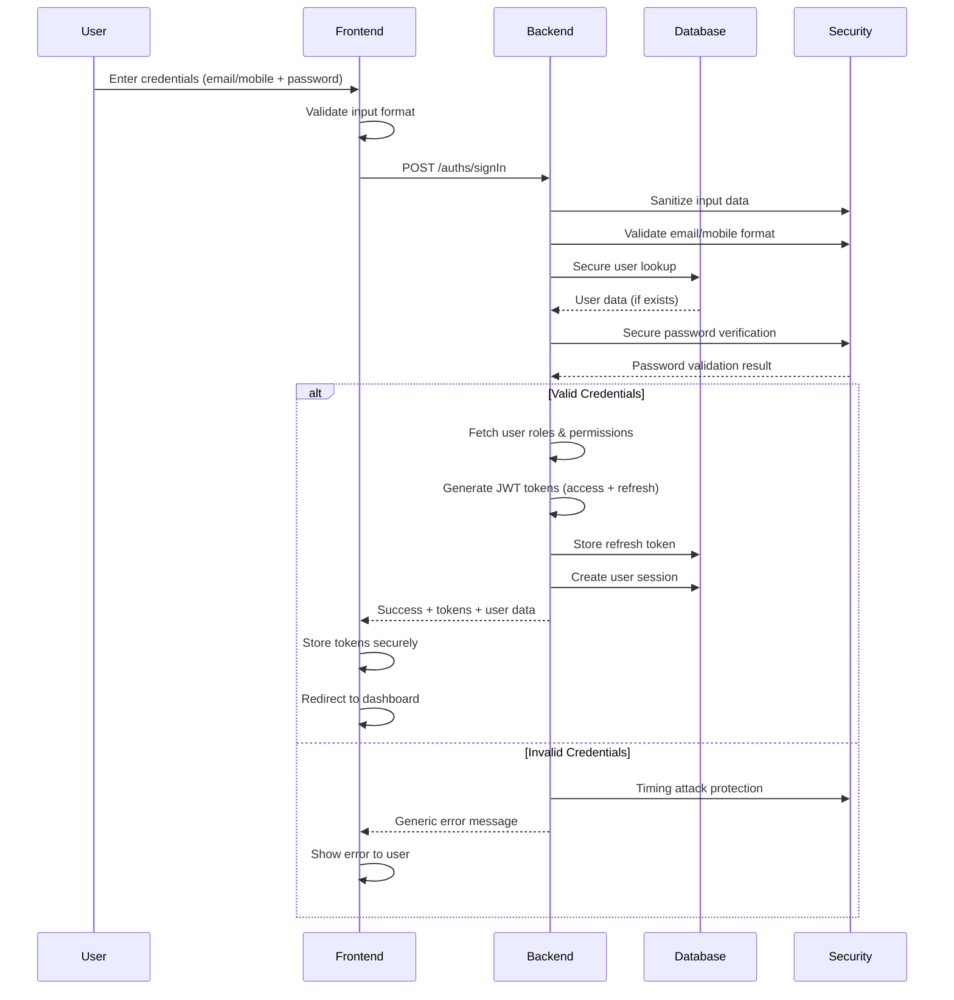

#### **Security Layers Diagram**

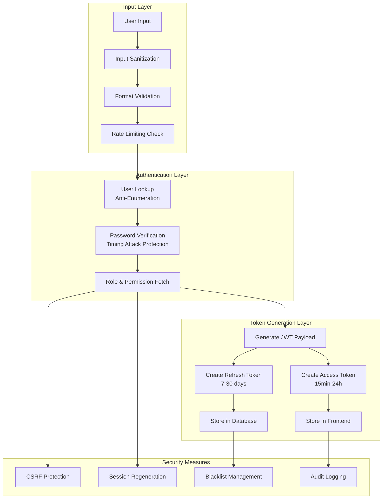

### **2. OTP-Based Authentication**

Secure one-time password authentication supporting both mobile and email delivery.

#### **OTP Generation & Verification Flow**

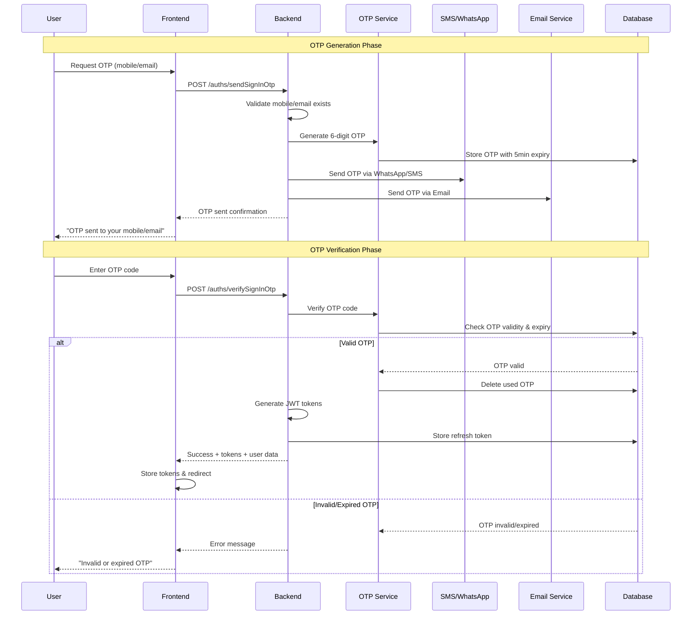

#### **OTP Delivery Channels Diagram**

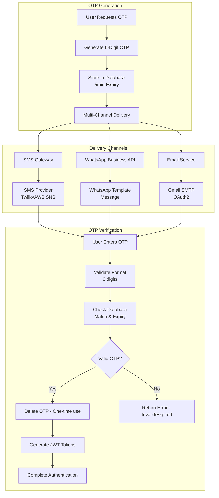

### **3. Google OAuth Authentication**

Seamless social authentication integration with Google OAuth 2.0.

#### **Google OAuth Flow**

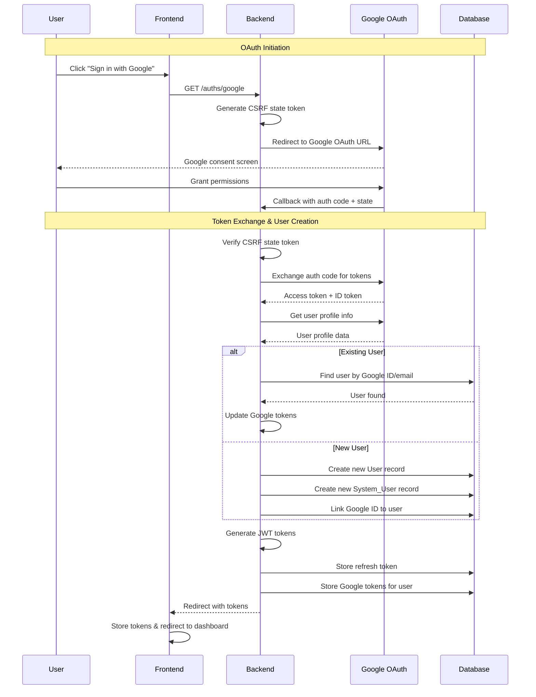

#### **Google OAuth Security Flow**

```mermaid
graph TB
    subgraph "OAuth Initiation"
        A[User Clicks<br/>'Sign in with Google'] --> B[Generate CSRF State Token]
        B --> C[Create OAuth URL<br/>with State Parameter]
        C --> D[Redirect to Google<br/>OAuth Consent Screen]
    end
    
    subgraph "Google Authorization"
        D --> E[User Grants Permissions<br/>on Google]
        E --> F[Google Redirects Back<br/>with Auth Code + State]
    end
    
    subgraph "Token Exchange & Validation"
        F --> G[Verify CSRF State Token<br/>🔒 Anti-CSRF Attack]
        G --> H[Exchange Auth Code<br/>for Access + ID Tokens]
        H --> I[Get User Profile<br/>from Google API]
    end
    
    subgraph "User Management"
        I --> J{User Exists?}
        J -->|Yes| K[Update Google ID<br/>Link Account]
        J -->|No| L[Create New User<br/>+ System_User Records]
        
        K --> M[Fetch User Roles<br/>& Permissions]
        L --> M
    end
    
    subgraph "JWT Token Generation"
        M --> N[Generate JWT Payload<br/>with Google ID]
        N --> O[Create Access Token<br/>15min-24h]
        N --> P[Create Refresh Token<br/>7-30 days]
        
        O --> Q[Store Google Tokens<br/>for Email Service]
        P --> R[Store Refresh Token<br/>in Database]
    end
    
    subgraph "Frontend Redirect"
        Q --> S[Redirect to Frontend<br/>with Tokens in URL]
        R --> S
        S --> T[Frontend Extracts Tokens<br/>& Stores Securely]
        T --> U[Navigate to Dashboard<br/>User Authenticated]
    end
```

---

## 🎫 JWT Token Management

ClassInTown implements a sophisticated JWT token system with enhanced security features including token rotation, blacklisting, and comprehensive validation.

### **Token Architecture**

ClassInTown uses a dual-token system with enhanced security features:

#### **🔑 Token Types**

| Token Type | Lifespan | Storage | Purpose |
|------------|----------|---------|---------|
| **Access Token** | 15 minutes - 24 hours | Frontend (Memory/LocalStorage) | API authentication, user context |
| **Refresh Token** | 7 - 30 days | Database (Encrypted) | Token renewal, long-term sessions |

#### **🔒 JWT Token Structure Diagram**

```mermaid
graph TB
    subgraph "Access Token Structure"
        A[Header<br/>Algorithm: HS256<br/>Type: JWT] --> B[Payload<br/>User Data + Claims]
        B --> C[Signature<br/>HMAC SHA256]
        
        B --> D[Standard Claims:<br/>• iss: ClassInTown<br/>• aud: ClassInTown-Users<br/>• iat: Issued At<br/>• exp: Expires At<br/>• nbf: Not Before<br/>• jti: Token ID]
        
        B --> E[User Claims:<br/>• user_id<br/>• email<br/>• user_type<br/>• user_role<br/>• permissions<br/>• institute_id]
    end
    
    subgraph "Refresh Token Structure"
        F[Header<br/>Algorithm: HS256<br/>Type: JWT] --> G[Payload<br/>Minimal Data + Claims]
        G --> H[Signature<br/>Different Secret Key]
        
        G --> I[Standard Claims:<br/>• iss: ClassInTown<br/>• aud: ClassInTown-Refresh<br/>• type: refresh<br/>• iat: Issued At<br/>• exp: Expires At<br/>• jti: Token ID]
        
        G --> J[User Claims:<br/>• user_id<br/>• email<br/>• user_type<br/>• user_role]
    end
    
    subgraph "Security Features"
        K[🔒 Unique JTI<br/>Blacklisting Support]
        L[🔒 Different Secrets<br/>Access vs Refresh]
        M[🔒 Audience Validation<br/>Prevents Token Misuse]
        N[🔒 Time Validation<br/>iat, exp, nbf checks]
    end
    
    D --> K
    I --> K
    C --> L
    H --> L
    D --> M
    I --> M
    D --> N
    I --> N
```

### **Token Lifecycle Management**

#### **🔄 Token Refresh Flow**

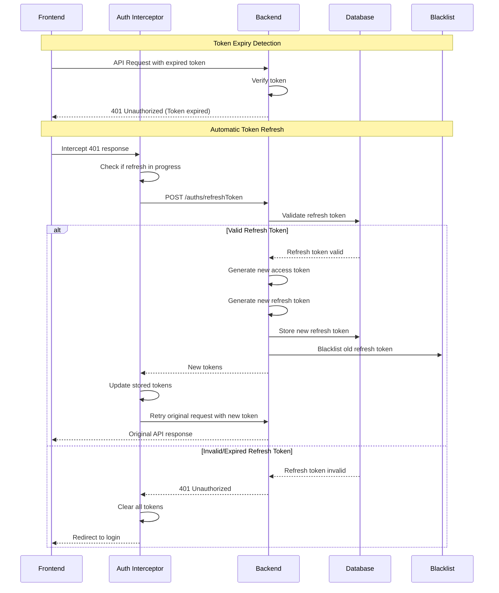

#### **Token Rotation Security Diagram**

```mermaid
graph TB
    subgraph "Token Rotation Process"
        A[Old Access Token<br/>Expires/Near Expiry] --> B[Frontend Detects<br/>401 Unauthorized]
        B --> C[Check Refresh Token<br/>Available & Valid]
        C --> D[Send Refresh Request<br/>with CSRF Protection]
        
        D --> E[Backend Validates<br/>Refresh Token]
        E --> F[Check Database<br/>Token Exists & Not Expired]
        F --> G[Fetch Fresh User Data<br/>Roles & Permissions]
        
        G --> H[Generate New Token Pair<br/>Access + Refresh]
        H --> I[Update Database<br/>New Refresh Token]
        I --> J[Blacklist Old Tokens<br/>JTI-based Tracking]
    end
    
    subgraph "Security Measures"
        K[🔒 Race Condition Prevention<br/>Single Refresh at a Time]
        L[🔒 Token Rotation<br/>Both Tokens Renewed]
        M[🔒 Immediate Blacklisting<br/>Old Tokens Invalid]
        N[🔒 Fresh User Context<br/>Latest Permissions]
    end
    
    subgraph "Frontend Handling"
        O[Store New Tokens<br/>Securely]
        P[Retry Failed Request<br/>with New Token]
        Q[Update Auth State<br/>Notify Components]
        R[Continue User Session<br/>Seamlessly]
    end
    
    B --> K
    H --> L
    J --> M
    G --> N
    
    J --> O
    O --> P
    P --> Q
    Q --> R
    
    subgraph "Failure Scenarios"
        S[Refresh Token Invalid<br/>or Expired]
        T[User Data Not Found<br/>Account Deleted]
        U[Database Error<br/>Service Unavailable]
        
        S --> V[Clear All Tokens<br/>Force Re-login]
        T --> V
        U --> V
        V --> W[Redirect to Login<br/>with Return URL]
    end
    
    E --> S
    F --> T
    I --> U
```

### **🚫 Token Blacklisting System**

ClassInTown implements comprehensive token blacklisting for enhanced security:

#### **Blacklisting Scenarios**
- User logout
- Password change
- Account suspension
- Security breach detection
- Token refresh (old tokens)

#### **Token Blacklisting Architecture**

```mermaid
graph TB
    subgraph "Blacklisting Triggers"
        A[User Logout] --> E[Blacklist Token]
        B[Password Change] --> E
        C[Account Suspension] --> E
        D[Security Breach] --> E
        F[Token Refresh] --> E
        G[Session Timeout] --> E
    end
    
    subgraph "Blacklisting Process"
        E --> H[Decode JWT Token<br/>Extract JTI and Expiry]
        H --> I[Create Blacklist Entry<br/>in Database]
        I --> J[Store Token Details<br/>with Reason and Expiry]
        J --> K[Auto-Cleanup<br/>After Token Expiry]
    end
    
    subgraph "Token Validation Flow"
        L[Incoming API Request<br/>with JWT Token] --> M[Extract Token<br/>from Headers/Cookies]
        M --> N[Check Blacklist Database<br/>Token or JTI Match?]
        
        N -->|Found| O[❌ Token Blacklisted<br/>Return 401 Unauthorized]
        N -->|Not Found| P[✅ Verify JWT Signature<br/>and Claims]
        
        P --> Q[Attach User Context<br/>to Request]
        Q --> R[Continue to<br/>Protected Route]
    end
    
    subgraph "Database Schema"
        S[Black_Listed_Token Collection<br/>Fields: token, jti, user_id,<br/>reason, expiresAt, created_at]
        
        T[Auto-Expiry Index<br/>TTL on expiresAt field<br/>Automatic Cleanup]
    end
    
    I --> S
    K --> T
    N --> S
    
    subgraph "Security Benefits"
        U[🔒 Immediate Revocation<br/>Compromised Tokens]
        V[🔒 Logout Enforcement<br/>Server-side Control]
        W[🔒 Breach Mitigation<br/>Mass Token Invalidation]
        X[🔒 Memory Efficient<br/>Auto-cleanup Expired]
    end
    
    E --> U
    O --> V
    D --> W
    T --> X
```

---

## 🛡️ Role-Based Access Control (RBAC)

ClassInTown implements a sophisticated RBAC system with hierarchical roles and granular permissions.

### **Role Hierarchy & Permissions Matrix**

| Role | Level | Permissions | Access Scope |
|------|-------|-------------|--------------|
| **Super Admin** | 5 | ALL | System-wide, all modules |
| **Admin** | 4 | CAN_ADD, CAN_EDIT, CAN_DELETE, CAN_VIEW, CAN_APPROVE | Institute-wide |
| **Instructor** | 3 | CAN_ADD, CAN_EDIT, CAN_VIEW | Own classes, students |
| **HR** | 3 | CAN_ADD, CAN_EDIT, CAN_VIEW | Staff management |
| **Accountant** | 3 | CAN_VIEW, CAN_EDIT | Financial data |
| **Receptionist** | 2 | CAN_VIEW, CAN_ADD | Basic operations |
| **Parent** | 2 | CAN_VIEW | Own children's data |
| **Student** | 1 | CAN_VIEW | Own data only |
| **User** | 1 | CAN_VIEW | Basic access |

### **Permission Implementation**

### **Permission Validation Flow**

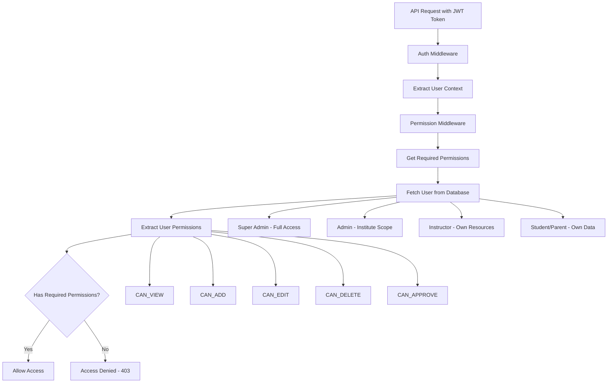

---

## 🔒 Security Features

ClassInTown implements multiple layers of security protection:

### **🚦 Rate Limiting**

#### **Multi-Layer Rate Limiting System**

```mermaid
graph TB
    subgraph "Rate Limiting Layers"
        A[Incoming Request] --> B[IP-Based Rate Limiting<br/>Global Protection]
        B --> C[Endpoint-Specific Limits<br/>Operation-Based]
        C --> D[Account-Specific Limits<br/>User-Based Protection]
        D --> E[Progressive Delays<br/>Increasing Penalties]
    end
    
    subgraph "Rate Limit Categories"
        F[🔴 Strict Rate Limit<br/>15 requests / 15 minutes<br/>Password Reset, OTP Generation]
        G[🟡 Moderate Rate Limit<br/>10 requests / 15 minutes<br/>Login, Signup, Token Refresh]
        H[🟢 Gentle Rate Limit<br/>15 requests / 5 minutes<br/>OTP Verification, Profile Updates]
        I[⚫ Account Rate Limit<br/>5 attempts / 30 minutes<br/>Per-User Account Protection]
    end
    
    subgraph "Storage & Tracking"
        J[MongoDB Store<br/>Distributed Rate Limiting]
        K[Memory Store<br/>Single Instance Fallback]
        L[Rate Limit Collection<br/>IP, User, Endpoint, Timestamp]
    end
    
    subgraph "Protection Mechanisms"
        M[🛡️ DDoS Protection<br/>IP-based Blocking]
        N[🛡️ Brute Force Prevention<br/>Account Lockouts]
        O[🛡️ API Abuse Prevention<br/>Endpoint Throttling]
        P[🛡️ Resource Protection<br/>Server Load Management]
    end
    
    C --> F
    C --> G
    C --> H
    D --> I
    
    B --> J
    B --> K
    J --> L
    
    F --> M
    I --> N
    G --> O
    H --> P
    
    subgraph "Rate Limit Response"
        Q[429 Too Many Requests<br/>Standard Headers<br/>Retry-After Information]
        R[Progressive Backoff<br/>Increasing Wait Times<br/>Exponential Delays]
        S[Whitelist Support<br/>Trusted IPs<br/>Admin Overrides]
    end
    
    E --> Q
    E --> R
    B --> S
```

### **🛡️ Input Sanitization & Validation**

#### **Input Security Pipeline**

```mermaid
graph TB
    subgraph "Input Processing Pipeline"
        A[Raw User Input] --> B[Type Validation<br/>String, Number, Object]
        B --> C[Length Validation<br/>Min/Max Constraints]
        C --> D[Format Validation<br/>Regex Patterns]
        D --> E[Content Sanitization<br/>Remove Malicious Code]
        E --> F[Business Logic Validation<br/>Domain-Specific Rules]
    end
    
    subgraph "Sanitization Rules"
        G[HTML Tag Removal<br/>Strip < > characters]
        H[JavaScript Prevention<br/>Remove javascript: protocol]
        I[Event Handler Removal<br/>Strip on* attributes]
        J[SQL Injection Prevention<br/>Parameterized Queries]
        K[XSS Prevention<br/>Encode Special Characters]
    end
    
    subgraph "Validation Types"
        L[📧 Email Validation<br/>RFC 5322 Compliant<br/>Domain Verification]
        M[📱 Mobile Validation<br/>10-digit Numbers<br/>Country Code Support]
        N[🔒 Password Validation<br/>8+ Characters<br/>Complexity Requirements]
        O[🆔 ID Validation<br/>MongoDB ObjectId<br/>UUID Format]
    end
    
    subgraph "Security Measures"
        P[🛡️ User Enumeration Prevention<br/>Generic Error Messages<br/>Timing Attack Protection]
        Q[🛡️ Data Integrity<br/>Checksum Validation<br/>Hash Verification]
        R[🛡️ Input Length Limits<br/>Prevent Buffer Overflow<br/>DoS Protection]
        S[🛡️ Character Encoding<br/>UTF-8 Normalization<br/>Unicode Security]
    end
    
    E --> G
    E --> H
    E --> I
    E --> J
    E --> K
    
    D --> L
    D --> M
    D --> N
    D --> O
    
    F --> P
    F --> Q
    C --> R
    B --> S
    
    subgraph "Validation Results"
        T[✅ Valid Input<br/>Proceed to Processing]
        U[❌ Invalid Input<br/>Return Validation Error]
        V[⚠️ Suspicious Input<br/>Log Security Event]
    end
    
    F --> T
    F --> U
    F --> V
```

### **🔐 CSRF Protection**

#### **CSRF Protection Flow**

```mermaid
graph TB
    subgraph "CSRF Token Generation"
        A[User Login/Session Start] --> B[Generate Random CSRF Token<br/>32-byte Hex String]
        B --> C[Store Token in Session<br/>Server-side Storage]
        C --> D[Send Token to Frontend<br/>Response Header/Body]
    end
    
    subgraph "Frontend Token Handling"
        D --> E[Store CSRF Token<br/>Memory/SessionStorage]
        E --> F[Include Token in Requests<br/>Header: X-CSRF-Token]
        F --> G[Attach to State-Changing<br/>POST, PUT, DELETE, PATCH]
    end
    
    subgraph "Backend Validation"
        G --> H[Extract CSRF Token<br/>from Request Header]
        H --> I[Retrieve Session Token<br/>from Server Session]
        I --> J{Tokens Match?}
        
        J -->|Yes| K[✅ Valid CSRF Token<br/>Continue Processing]
        J -->|No| L[❌ Invalid CSRF Token<br/>Return 403 Forbidden]
    end
    
    subgraph "Protection Scenarios"
        M[🛡️ Cross-Site Request Forgery<br/>Malicious Site Attacks]
        N[🛡️ State-Changing Operations<br/>Unauthorized Actions]
        O[🛡️ Session Hijacking<br/>Token Validation]
        P[🛡️ Clickjacking<br/>Hidden Form Submissions]
    end
    
    subgraph "Implementation Details"
        Q[Token Rotation<br/>New Token per Session]
        R[Secure Headers<br/>SameSite Cookies]
        S[Double Submit Pattern<br/>Cookie + Header]
        T[Origin Validation<br/>Referer Header Check]
    end
    
    K --> M
    K --> N
    K --> O
    K --> P
    
    B --> Q
    C --> R
    F --> S
    H --> T
    
    subgraph "Security Benefits"
        U[🔒 Prevents Automated Attacks<br/>Requires Valid Session]
        V[🔒 Validates Request Origin<br/>Legitimate User Action]
        W[🔒 Protects Sensitive Operations<br/>Password Change, Payments]
        X[🔒 Complements Authentication<br/>Additional Security Layer]
    end
    
    K --> U
    K --> V
    K --> W
    K --> X
```

---

## 🖥️ Frontend Integration

### **Angular Authentication Services**

**Primary Auth Service:**
```typescript
@Injectable({ providedIn: 'root' })
export class AuthService {
  private readonly apiUrl = environment.apiUrl;
  private tokenSubject = new BehaviorSubject<string | null>(null);
  
  constructor(private http: HttpClient) {
    // Initialize token from storage
    const token = this.getToken();
    this.tokenSubject.next(token);
  }

  // Secure token storage
  setToken(token: string): void {
    localStorage.setItem('accessToken', token);
    this.tokenSubject.next(token);
  }

  getToken(): string | null {
    return localStorage.getItem('accessToken');
  }

  // Authentication methods
  signIn(credentials: LoginCredentials): Observable<AuthResponse> {
    return this.http.post<AuthResponse>(`${this.apiUrl}/auths/signIn`, credentials)
      .pipe(
        map(response => {
          if (response.status === 'success' && response.data) {
            this.setToken(response.data.accessToken);
            this.setRefreshToken(response.data.refreshToken);
            this.setUserData(response.data.user);
            return response.data;
          }
          throw new Error('Invalid response format');
        })
      );
  }

  logout(): Observable<any> {
    return this.http.post(`${this.apiUrl}/auths/signOut`, {})
      .pipe(
        finalize(() => {
          this.clearAllClientData();
        })
      );
  }

  isLoggedIn(): boolean {
    return !!this.getToken();
  }
}
```

### **Auth Guards**

**Route Protection:**
```typescript
@Injectable({ providedIn: 'root' })
export class AuthGuard implements CanActivate {
  constructor(
    private authService: AuthService,
    private router: Router
  ) {}

  canActivate(route: ActivatedRouteSnapshot, state: RouterStateSnapshot): boolean {
    if (this.authService.isLoggedIn()) {
      // Check role-based access if required
      const requiredRoles = route.data['roles'] as string[];
      if (requiredRoles) {
        const userRole = this.authService.getUserRole();
        if (!requiredRoles.includes(userRole)) {
          this.router.navigate(['/unauthorized']);
          return false;
        }
      }
      return true;
    }

    // Redirect to login with return URL
    this.router.navigate(['/auth/login'], { 
      queryParams: { returnUrl: state.url } 
    });
    return false;
  }
}
```

### **HTTP Interceptors**

**Token Injection & Refresh:**
```typescript
@Injectable()
export class AuthenticationInterceptor implements HttpInterceptor {
  private isRefreshing = false;
  private refreshTokenSubject = new BehaviorSubject<any>(null);

  constructor(private authService: AuthService) {}

  intercept(req: HttpRequest<any>, next: HttpHandler): Observable<HttpEvent<any>> {
    // Add auth header
    const authReq = this.addAuthenticationHeaders(req);

    return next.handle(authReq).pipe(
      catchError(error => {
        if (error instanceof HttpErrorResponse && error.status === 401) {
          return this.handle401Error(authReq, next);
        }
        return throwError(() => error);
      })
    );
  }

  private addAuthenticationHeaders(request: HttpRequest<any>): HttpRequest<any> {
    const token = this.authService.getToken();
    
    if (token) {
      return request.clone({
        setHeaders: {
          Authorization: `Bearer ${token}`,
          'Content-Type': 'application/json'
        }
      });
    }
    
    return request;
  }

  private handle401Error(request: HttpRequest<any>, next: HttpHandler): Observable<HttpEvent<any>> {
    if (!this.isRefreshing) {
      this.isRefreshing = true;
      this.refreshTokenSubject.next(null);

      return this.authService.refreshToken().pipe(
        switchMap(() => {
          this.isRefreshing = false;
          this.refreshTokenSubject.next(this.authService.getToken());
          return next.handle(this.addAuthenticationHeaders(request));
        }),
        catchError(error => {
          this.isRefreshing = false;
          this.authService.logout();
          return throwError(() => error);
        })
      );
    }

    return this.refreshTokenSubject.pipe(
      filter(token => token !== null),
      take(1),
      switchMap(() => next.handle(this.addAuthenticationHeaders(request)))
    );
  }
}
```

---

## ⏰ Session Management

### **Real-time Session Monitoring**

**Session Monitor Service:**
```typescript
@Injectable({ providedIn: 'root' })
export class SessionMonitorService implements OnDestroy {
  private sessionTimer: any;
  private warningTimer: any;
  private isDestroyed = false;

  constructor(
    private authService: AuthService,
    private dialog: MatDialog
  ) {
    this.startSessionMonitoring();
  }

  private startSessionMonitoring(): void {
    // Monitor token expiration
    this.authService.tokenSubject$.subscribe(token => {
      if (token) {
        this.resetSessionTimer();
      } else {
        this.clearTimers();
      }
    });
  }

  private resetSessionTimer(): void {
    this.clearTimers();
    
    const token = this.authService.getToken();
    if (!token) return;

    try {
      const decoded = jwt_decode(token) as any;
      const expirationTime = decoded.exp * 1000;
      const currentTime = Date.now();
      const timeUntilExpiry = expirationTime - currentTime;
      const warningTime = timeUntilExpiry - (10 * 60 * 1000); // 10 minutes before

      if (warningTime > 0) {
        this.warningTimer = setTimeout(() => {
          this.showSessionWarning();
        }, warningTime);
      }

      this.sessionTimer = setTimeout(() => {
        this.handleSessionExpiry();
      }, timeUntilExpiry);
    } catch (error) {
      console.error('Error parsing token for session monitoring:', error);
    }
  }

  private showSessionWarning(): void {
    const dialogRef = this.dialog.open(SessionWarningComponent, {
      width: '400px',
      disableClose: true,
      data: { timeRemaining: 10 * 60 } // 10 minutes in seconds
    });

    dialogRef.afterClosed().subscribe(result => {
      if (result === 'extend') {
        this.extendSession();
      } else {
        this.authService.logout();
      }
    });
  }

  private extendSession(): void {
    this.authService.refreshToken().subscribe({
      next: () => {
        console.log('Session extended successfully');
      },
      error: (error) => {
        console.error('Failed to extend session:', error);
        this.authService.logout();
      }
    });
  }

  private handleSessionExpiry(): void {
    console.log('Session expired - logging out user');
    this.authService.logout();
  }

  ngOnDestroy(): void {
    this.isDestroyed = true;
    this.clearTimers();
  }

  private clearTimers(): void {
    if (this.sessionTimer) {
      clearTimeout(this.sessionTimer);
      this.sessionTimer = null;
    }
    if (this.warningTimer) {
      clearTimeout(this.warningTimer);
      this.warningTimer = null;
    }
  }
}
```

---

## 📚 API Reference

### **Authentication Endpoints**

| Method | Endpoint | Description | Rate Limit |
|--------|----------|-------------|------------|
| POST | `/auths/signIn` | Email/Mobile login | Moderate |
| POST | `/auths/signOut` | User logout | None |
| POST | `/auths/signUp` | User registration | Strict |
| POST | `/auths/sendSignInOtp` | Send login OTP | Strict |
| POST | `/auths/verifySignInOtp` | Verify login OTP | Gentle |
| POST | `/auths/refreshToken` | Refresh access token | Moderate |
| GET | `/auths/google` | Google OAuth initiation | None |
| GET | `/auths/google/callback` | Google OAuth callback | None |
| POST | `/auths/forgetPassword` | Password reset request | Strict |
| PATCH | `/auths/resetPassword` | Reset password with OTP | Strict |

### **Request/Response Examples**

**Login Request:**
```json
POST /auths/signIn
{
  "identifierType": "Email",
  "email": "instructor@example.com",
  "password": "SecurePass123!",
  "rememberMe": true
}
```

**Login Response:**
```json
{
  "status": "success",
  "message": "Sign in successful",
  "data": {
    "accessToken": "eyJhbGciOiJIUzI1NiIs...",
    "refreshToken": "eyJhbGciOiJIUzI1NiIs...",
    "user": {
      "_id": "64f7b1234567890abcdef123",
      "fullName": "John Instructor",
      "email": "instructor@example.com",
      "user_type": "Instructor",
      "user_role": "Instructor",
      "permissions": ["CAN_ADD", "CAN_EDIT", "CAN_VIEW"]
    }
  }
}
```

---

## 🔧 Troubleshooting

### **Common Issues & Solutions**

#### **Token Expired Errors**
**Problem**: Users getting 401 errors despite being logged in
**Solution**: 
1. Check token refresh implementation
2. Verify interceptor is handling 401s correctly
3. Ensure refresh token is valid and not expired

#### **CORS Issues**
**Problem**: Authentication requests failing due to CORS
**Solution**:
```javascript
// Backend CORS configuration
app.use(cors({
  origin: [process.env.FRONTEND_URL, 'http://localhost:4200'],
  credentials: true,
  methods: ['GET', 'POST', 'PUT', 'DELETE', 'PATCH', 'OPTIONS'],
  allowedHeaders: ['Content-Type', 'Authorization', 'X-CSRF-Token']
}));
```

#### **Session Not Persisting**
**Problem**: Users logged out after browser refresh
**Solution**: 
1. Verify token storage (localStorage vs sessionStorage)
2. Check token retrieval on app initialization
3. Ensure auth state is properly restored

#### **OTP Not Received**
**Problem**: Users not receiving OTP messages
**Solution**:
1. Check SMS/WhatsApp service configuration
2. Verify mobile number format
3. Check rate limiting on OTP endpoints
4. Validate OTP expiration settings

### **Debug Logging**

Enable detailed authentication logging:
```javascript
// Backend logging
console.log(`[Auth] ${operation} - User: ${userId}, IP: ${req.ip}, Success: ${success}`);

// Frontend logging
console.log('[AuthService] Token refresh:', { success: true, expiresAt: newExpiresAt });
```

---

## 📊 Security Best Practices

### **Production Checklist**

- ✅ **JWT Secrets**: Use strong, unique secrets for production
- ✅ **HTTPS Only**: Enforce HTTPS in production
- ✅ **Token Expiration**: Set appropriate token lifespans
- ✅ **Rate Limiting**: Implement comprehensive rate limiting
- ✅ **Input Validation**: Sanitize all user inputs
- ✅ **CSRF Protection**: Enable CSRF tokens for state-changing operations
- ✅ **Session Security**: Implement session monitoring and cleanup
- ✅ **Audit Logging**: Log all authentication events
- ✅ **Error Handling**: Use generic error messages to prevent information disclosure
- ✅ **Database Security**: Use parameterized queries and proper indexing

### **Monitoring & Alerting**

Set up monitoring for:
- Failed login attempts
- Token refresh failures
- Unusual authentication patterns
- Rate limit violations
- Session anomalies

---

*This documentation covers the complete ClassInTown authentication system. For additional support or questions, please refer to the development team or create an issue in the project repository.*
