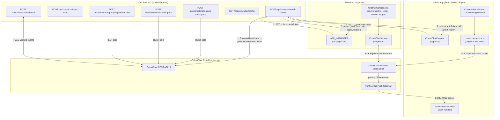
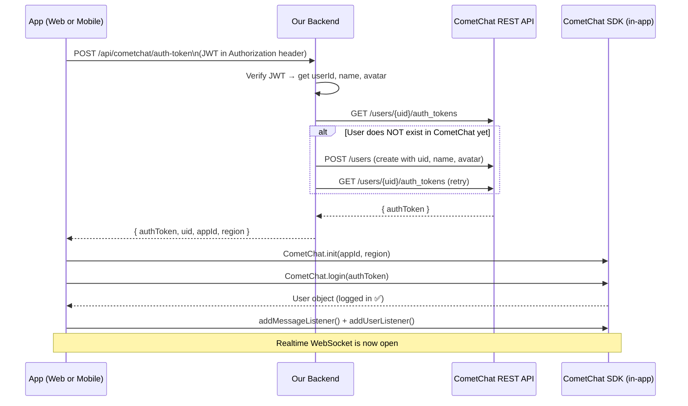
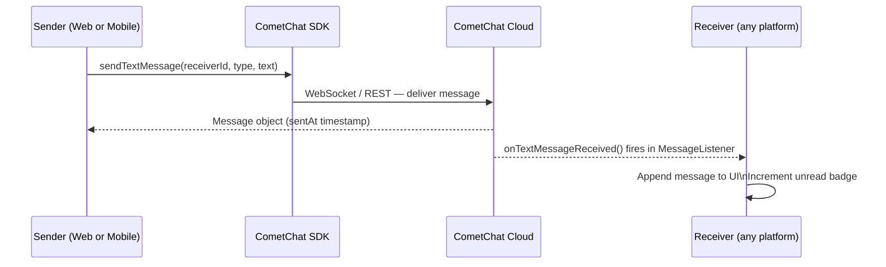
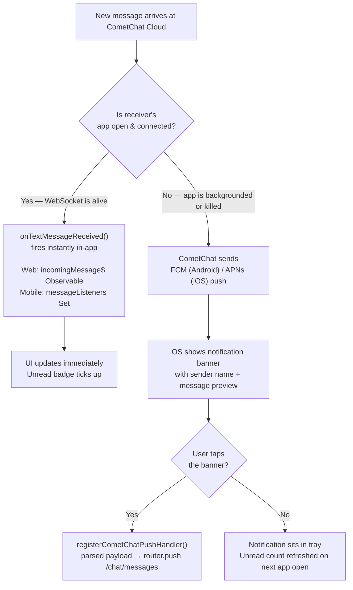
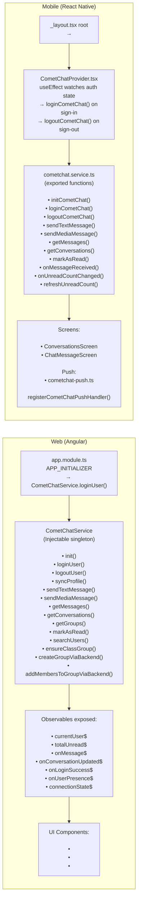
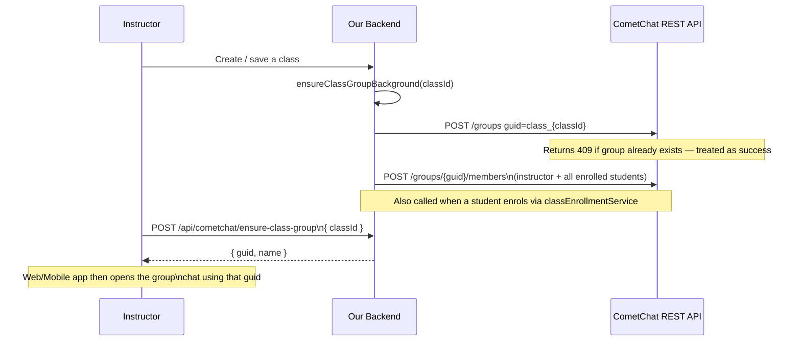
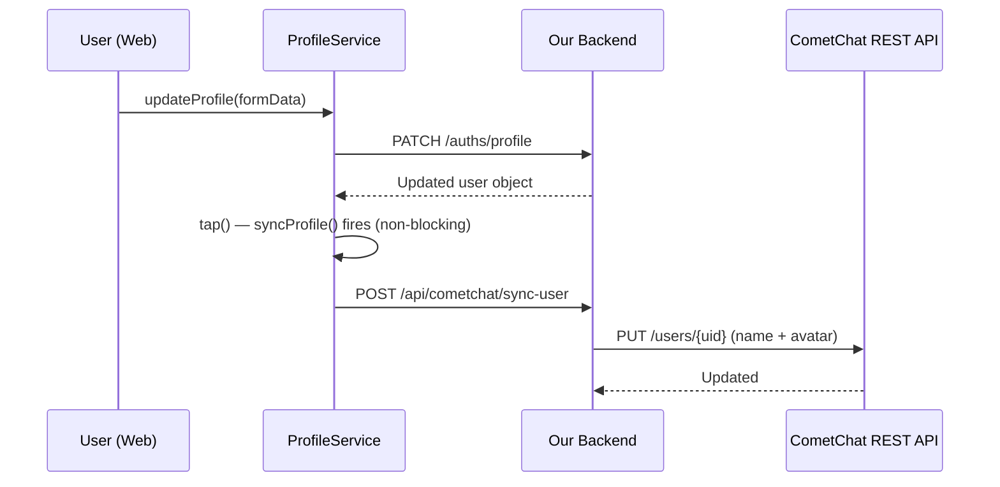

# CometChat Integration — End-to-End Guide

> For **Web developers** (Angular) and **Mobile developers** (React Native / Expo).  
> Read this to understand how chat works, which APIs are called, and how both platforms stay in sync.

---

## 1. Big Picture — How Everything Connects



---

## 2. Auth Flow — Step by Step

> This runs **once per user session** on both platforms.



---

## 3. Sending a Message



---

## 4. Receiving Messages — Realtime vs Push

This is the most important part to understand.



### When do you get a notification?

| Situation | What happens |
|-----------|-------------|
| App is open (foreground) | Message arrives via WebSocket — **no push banner** (you're already in the app) |
| App is in background | CometChat sends a push via FCM/APNs — **banner appears** |
| App is closed / killed | CometChat sends a push via FCM/APNs — **banner appears** |
| User is on web, mobile is off | Mobile gets push; web gets realtime if tab is open |
| Both platforms open | Both receive the WebSocket message simultaneously |

> **Note:** Push only works for mobile. The web app uses the always-on WebSocket — there is no web push notification currently.

---

## 5. Web vs Mobile — Side by Side



### Key Differences

| | Web (Angular) | Mobile (React Native) |
|---|---|---|
| Login trigger | `APP_INITIALIZER` on page load | `CometChatProvider` watches Zustand auth store |
| Service pattern | `@Injectable` singleton class | Exported async functions + singleton state |
| Realtime delivery | RxJS `Subject` Observables | `Set<listener>` callback pattern |
| Push notifications | Not applicable (WebSocket only) | FCM + APNs via CometChat Dashboard |
| Push tap navigation | Not applicable | `registerCometChatPushHandler()` → `router.push` |
| Profile sync | `ProfileService.updateProfile()` → `syncProfile()` | Done automatically via `sync-user` endpoint |
| Logout | `LogoutService.postLogoutCleanup()` + `ProfileService.handleSignOut()` | `CometChatProvider` useEffect on auth state |
| SDK package | `@cometchat/chat-sdk-javascript` | `@cometchat/chat-sdk-react-native` |

---

## 6. Class Group Provisioning

Every class automatically gets a CometChat group chat so all students and the instructor can message together.



---

## 7. Profile Sync

When a user updates their name or photo, CometChat is kept in sync automatically.



---

## 8. Full API Reference

### Our Backend Endpoints (all under `/api/cometchat/`)

| Method | Path | Auth | What it does |
|--------|------|------|-------------|
| `GET` | `/config` | None | Returns `{ appId, region }` — public, never exposes keys |
| `POST` | `/auth-token` | JWT | Creates CometChat user if new, returns short-lived `authToken` |
| `POST` | `/sync-user` | JWT | Pushes updated name + avatar to CometChat |
| `POST` | `/ensure-class-group` | JWT | Creates group for a class, adds instructor + all enrolled students |
| `POST` | `/create-group` | JWT | Creates a custom private group with specified members |
| `POST` | `/groups/:guid/members` | JWT | Adds new members to an existing group |
| `POST` | `/webhook` | HMAC | Receives CometChat events (`after_message`, `after_group_member_joined`, etc.) |

### CometChat SDK Methods Used

| Method | Used on | What it does |
|--------|---------|-------------|
| `CometChat.init(appId, settings)` | Both | One-time SDK initialisation |
| `CometChat.login(authToken)` | Both | Authenticate user with server-issued token |
| `CometChat.logout()` | Both | End session, close socket |
| `CometChat.sendMessage(message)` | Both | Send text or media message |
| `CometChat.MessagesRequest.fetchPrevious()` | Both | Load message history |
| `CometChat.ConversationsRequest.fetchNext()` | Both | Load conversation list |
| `CometChat.markAsRead()` | Both | Mark messages read (shows double-tick) |
| `CometChat.getUnreadMessageCount()` | Both | Fetch total unread across all conversations |
| `CometChat.addMessageListener()` | Both | Subscribe to realtime incoming messages |
| `CometChat.addUserListener()` | Both | Subscribe to online/offline presence |
| `CometChat.getLoggedinUser()` | Both | Check if already logged in (e.g. after page refresh) |
| `CometChat.searchUsers()` | Web | Search by name to start a new DM |
| `CometChat.createGroup()` | Web | Create group directly via SDK (fallback) |

---

## 9. Environment Variables

Set these in `backend/environments/local.env`:

```
COMETCHAT_APP_ID=         # Dashboard → Apps → App ID
COMETCHAT_REGION=in       # Region where your app is hosted (in / us / eu)
COMETCHAT_AUTH_KEY=       # Dashboard → API & Auth Keys → Auth Only key
COMETCHAT_REST_API_KEY=   # Dashboard → API & Auth Keys → Full Access key
COMETCHAT_WEBHOOK_SECRET= # Dashboard → Webhooks → your webhook → Secret
                          # Leave blank for local dev (verification is skipped)
```

> The `AUTH_KEY` is used only server-side to generate auth tokens.  
> The client **never** receives the auth key — it only gets the short-lived `authToken`.

---

## 10. Where Each File Lives

```
backend/
  routes/cometchat.routes.js              ← route definitions
  controllers/cometchat/cometchat.controller.js  ← request handlers
  services/cometchat/cometchat.service.js ← CometChat REST API calls
  scripts/migrate-users-to-cometchat.js   ← one-time bulk user import

frontend/src/app/
  services/core/cometchat/cometchat.service.ts   ← Angular singleton
  components/chat/
    cometchat.module.ts                   ← NgModule
    cometchat-page/                       ← page shell (conversations + chat side by side)
    cometchat-conversations/              ← conversation list + new chat / group UI
    cometchat-chat/                       ← message thread
  services/common/auth/logout.service.ts  ← calls logoutUser() on sign-out
  services/common/profile/profile.service.ts ← calls syncProfile() on profile save

mobile-development-react-native-frontend/
  services/cometchat/
    CometChatProvider.tsx                 ← React context, ties login to auth store
    cometchat.service.ts                  ← all SDK functions
    cometchat-push.ts                     ← push tap → navigate to chat
  services/notifications/
    NotificationsProvider.tsx             ← registers push handler on boot
  features/chat/screens/
    ConversationsScreen.tsx               ← conversation list
    ChatMessageScreen.tsx                 ← message thread
```
