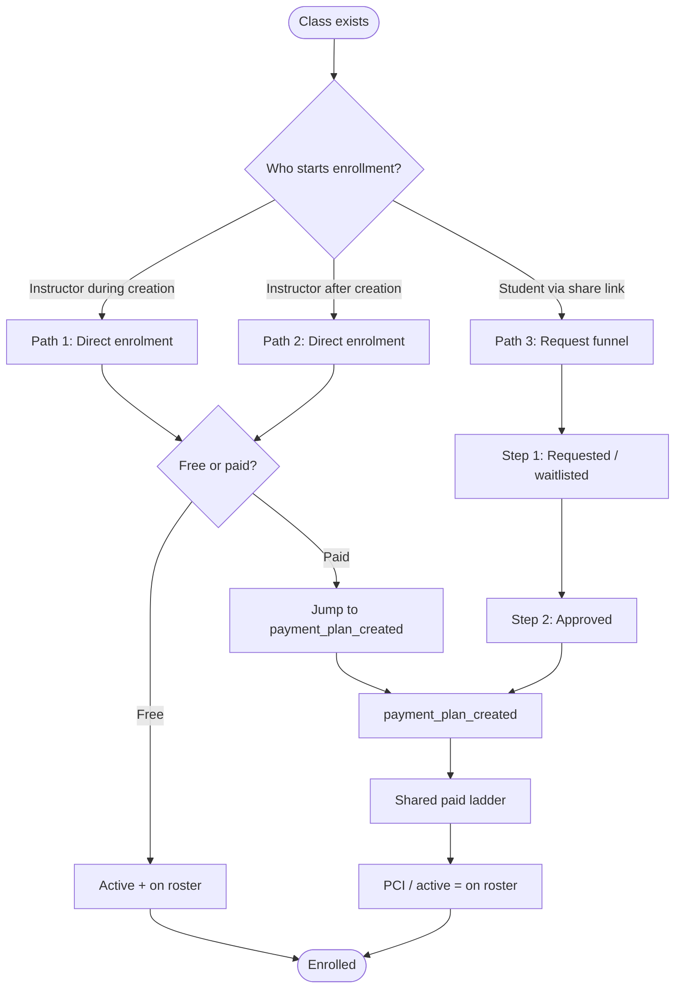
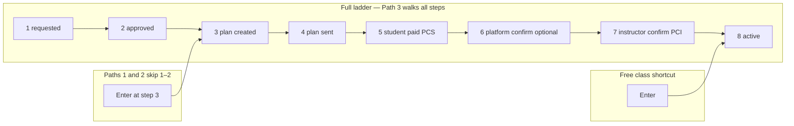
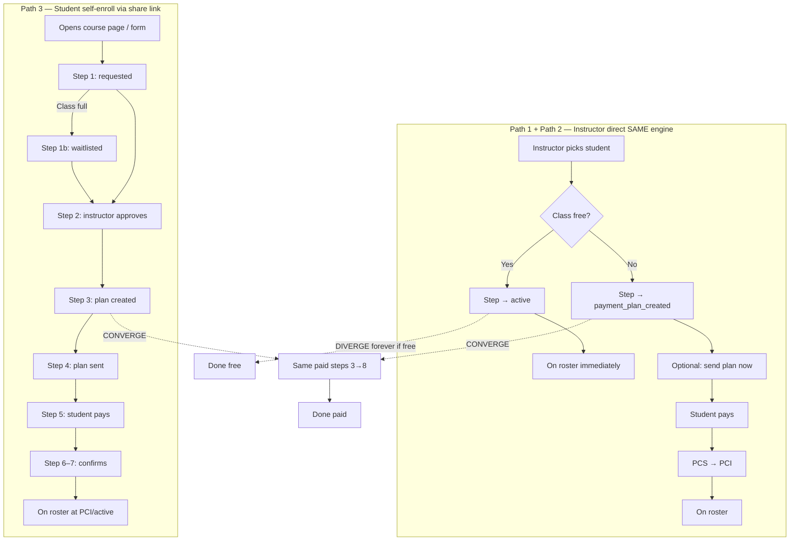

```mermaid
flowchart TD
    START(["Class exists"]) --> CHOICE{"Who starts enrollment?"}

    CHOICE -->|"Instructor during creation"| P1["Path 1: Direct enrolment"]
    CHOICE -->|"Instructor after creation"| P2["Path 2: Direct enrolment"]
    CHOICE -->|"Student via share link"| P3["Path 3: Request funnel"]

    P1 --> FREEPAID1{"Free or paid?"}
    P2 --> FREEPAID1
    P3 --> S1["Step 1: Requested / waitlisted"]

    FREEPAID1 -->|"Free"| ROSTER_FREE["Active + on roster"]
    FREEPAID1 -->|"Paid"| JUMP["Jump to payment_plan_created"]

    S1 --> S2["Step 2: Approved"]
    S2 --> JOIN["payment_plan_created"]

    JUMP --> JOIN
    JOIN --> SHARED["Shared paid ladder"]
    SHARED --> ROSTER_PAID["PCI / active = on roster"]

    ROSTER_FREE --> DONE(["Enrolled"])
    ROSTER_PAID --> DONE


```

```mermaid

flowchart LR
  subgraph FULL["Full ladder — Path 3 walks all steps"]
    A[1 requested] --> B[2 approved]
    B --> C[3 plan created]
    C --> D[4 plan sent]
    D --> E[5 student paid PCS]
    E --> F[6 platform confirm optional]
    F --> G[7 instructor confirm PCI]
    G --> H[8 active]
  end

  subgraph SKIP["Paths 1 and 2 skip 1–2"]
    X[Enter at step 3] --> C
  end

  subgraph FREE["Free class shortcut"]
    Y[Enter] --> H
  end
```

```mermaid

flowchart TD
  subgraph PATH12["Path 1 + Path 2 — Instructor direct SAME engine"]
    I0[Instructor picks student] --> I1{Class free?}
    I1 -->|Yes| I2[Step → active]
    I2 --> I3[On roster immediately]
    I1 -->|No| I4[Step → payment_plan_created]
    I4 --> I5[Optional: send plan now]
    I5 --> I6[Student pays]
    I6 --> I7[PCS → PCI]
    I7 --> I8[On roster]
  end

  subgraph PATH3["Path 3 — Student self-enroll via share link"]
    S0[Opens course page / form] --> S1[Step 1: requested]
    S1 -->|Class full| S1b[Step 1b: waitlisted]
    S1b --> S2
    S1 --> S2[Step 2: instructor approves]
    S2 --> S3[Step 3: plan created]
    S3 --> S4[Step 4: plan sent]
    S4 --> S5[Step 5: student pays]
    S5 --> S6[Step 6–7: confirms]
    S6 --> S7[On roster at PCI/active]
  end

  I4 -.->|CONVERGE| CONV[Same paid steps 3→8]
  S3 -.->|CONVERGE| CONV
  I2 -.->|DIVERGE forever if free| DONE_F[Done free]
  CONV --> DONE_P[Done paid]

```
