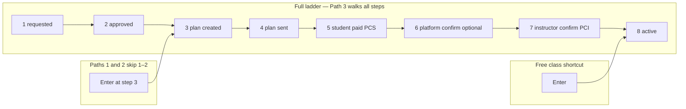

```mermaid
flowchart TD
    START(["Class exists"]) --> CHOICE{"Who starts enrollment?"}

    CHOICE -->|"Instructor during creation"| P1["Path 1: Direct enrolment"]
    CHOICE -->|"Instructor after creation"| P2["Path 2: Direct enrolment"]
    CHOICE -->|"Student via share link"| P3["Path 3: Request funnel"]

    P1 --> FREEPAID1{"Free or paid?"}
    P2 --> FREEPAID1
    P3 --> S1["Step 1: Requested / waitlisted"]

    FREEPAID1 -->|"Free"| ROSTER_FREE["Active + on roster"]
    FREEPAID1 -->|"Paid"| JUMP["Jump to payment_plan_created"]

    S1 --> S2["Step 2: Approved"]
    S2 --> JOIN["payment_plan_created"]

    JUMP --> JOIN
    JOIN --> SHARED["Shared paid ladder"]
    SHARED --> ROSTER_PAID["PCI / active = on roster"]

    ROSTER_FREE --> DONE(["Enrolled"])
    ROSTER_PAID --> DONE


```

```mermaid

flowchart LR
  subgraph FULL["Full ladder — Path 3 walks all steps"]
    A[1 requested] --> B[2 approved]
    B --> C[3 plan created]
    C --> D[4 plan sent]
    D --> E[5 student paid PCS]
    E --> F[6 platform confirm optional]
    F --> G[7 instructor confirm PCI]
    G --> H[8 active]
  end

  subgraph SKIP["Paths 1 and 2 skip 1–2"]
    X[Enter at step 3] --> C
  end

  subgraph FREE["Free class shortcut"]
    Y[Enter] --> H
  end
```

