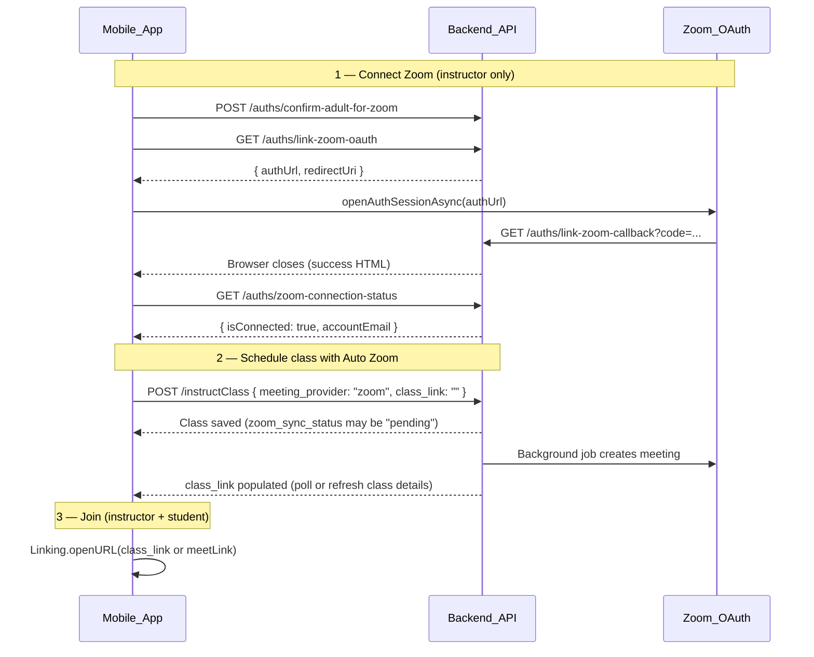

# Zoom Integration — Mobile Team Guide

This document is **only for the mobile team** (`mobile-development-react-native-frontend`). Backend Zoom OAuth, meeting creation, and token refresh are already implemented. Your job is to bring the React Native app to **parity with the website** for instructor Zoom linking and Auto Zoom class scheduling — without breaking existing Google Meet, manual links, or student flows.

For backend/env details and E2E matrix, see:
- [backend/configs/zoom/E2E_CHECKLIST.md](../backend/configs/zoom/E2E_CHECKLIST.md)
- Website user guide: `/docs/zoom-integration` on the web app

---

## What you are building

When an **instructor** schedules an **online** class on mobile, they should be able to:

1. See **Auto Zoom** as a meeting provider (when the backend has Zoom enabled for that environment)
2. **Connect / disconnect** their Zoom account inside the app (OAuth — no website redirect)
3. Confirm they are **18+** before starting Zoom OAuth (Zoom Marketplace requirement)
4. Create a class with `meeting_provider: "zoom"` — backend creates the Zoom meeting asynchronously
5. **Join** sessions via the stored `zoom.us` link (students and instructors)
6. **Retry** Zoom meeting creation when sync fails

**Students never connect Zoom.** They only open the join link the instructor’s class provides.

---

## Current state (code audit — Aug 2026)

| Area | Status | Notes |
|---|---|---|
| Connection status API | ✅ Partial | `getConferenceConnectionStatusApi("zoom")` → `GET /auths/zoom-connection-status` |
| Schedule guard | ✅ Partial | Blocks submit when `meetingProvider === "zoom"` and not connected |
| Zoom in provider dropdown | ❌ Missing | Create flow only offers `manual` + `google_meet`. Zoom appears only when **editing** an existing Zoom class |
| In-app Connect Zoom | ❌ Missing | UI says *“Connect it on the website”* — no OAuth |
| OAuth APIs wired | ❌ Missing | No calls to `confirm-adult-for-zoom`, `link-zoom-oauth`, `disconnect-zoom`, `refresh-zoom-token` |
| `expo-web-browser` | ✅ Installed | Use for OAuth (already in `package.json`) |
| Create class payload | ✅ Ready | Sends `meeting_provider: "zoom"` and empty `class_link` when Zoom selected |
| Join class (student/instructor) | ✅ Works | Opens `class_link` / `meetLink` URLs — `zoom.us` links work today |
| Zoom retry | ❌ Missing | Backend: `POST /instructClass/:id/retry-zoom-meeting` — not called from mobile |
| Feature flag (`enabled`) | ❌ Missing | Web hides Zoom unless `zoom-connection-status.enabled === true` |

**Safe baseline:** Manual meeting links and Google Meet scheduling are unaffected until you add Zoom UI behind the `enabled` flag.

---

## Architecture (high level)



---

## API base URL

Same as the rest of the app:

```
EXPO_PUBLIC_API_BASE_URL + /api/v1
```

Example (dev): `https://dev.classintown.com/api/v1`

All Zoom endpoints require the instructor’s normal **JWT** in `Authorization: Bearer <token>` except the OAuth callback (handled in the browser).

---

## Step 1 — Add Zoom linking service

Create `features/auth/api/zoomLinkingApi.ts` (or similar) mirroring the website’s `ZoomLinkingService`.

### A) Check connection status

```
GET /api/v1/auths/zoom-connection-status
Authorization: Bearer <instructor JWT>
```

**Success (200):**

```json
{
  "success": true,
  "data": {
    "enabled": true,
    "testMode": false,
    "isConnected": true,
    "hasRefreshToken": true,
    "hasAccessToken": true,
    "isExpired": false,
    "needsConnection": false,
    "needsReconnect": false,
    "expiryDate": "2026-08-27T12:00:00.000Z",
    "scope": "meeting:write:meeting ...",
    "status": "connected",
    "accountEmail": "instructor@example.com"
  }
}
```

**When Zoom is disabled in env:** `enabled: false` — hide all Zoom UI.

**Linked-account logic (match website):**

```typescript
// Mirror frontend ZoomLinkingService.isAccountLinked
function isZoomAccountLinked(status: ZoomConnectionStatus): boolean {
  if (!status?.enabled) return false;
  if (status.needsReconnect) return false;
  return status.isConnected === true;
}
```

If `isExpired && hasRefreshToken`, call refresh before treating as disconnected:

```
POST /api/v1/auths/refresh-zoom-token
Authorization: Bearer <instructor JWT>
```

### B) Confirm 18+ (required before OAuth)

```
POST /api/v1/auths/confirm-adult-for-zoom
Authorization: Bearer <instructor JWT>
```

**Success:** `{ "success": true, "data": { "confirmed": true, "confirmed_adult_at": "..." } }`

**403:** Instructor under 18 or not an instructor account.

### C) Start OAuth

```
GET /api/v1/auths/link-zoom-oauth
Authorization: Bearer <instructor JWT>
```

**Success:**

```json
{
  "success": true,
  "data": {
    "authUrl": "https://zoom.us/oauth/authorize?...",
    "state": "abc123...",
    "redirectUri": "https://dev.classintown.com/api/v1/auths/link-zoom-callback"
  }
}
```

**Mock env only:** `mockLinked: true` with no `authUrl` — treat as immediately connected and refetch status.

### D) Disconnect

```
POST /api/v1/auths/disconnect-zoom
Authorization: Bearer <instructor JWT>
```

---

## Step 2 — OAuth in React Native (`expo-web-browser`)

The website opens a popup and listens for `postMessage`. **Mobile must not rely on `postMessage`** — use `WebBrowser.openAuthSessionAsync` instead.

```typescript
import * as WebBrowser from "expo-web-browser";

WebBrowser.maybeCompleteAuthSession(); // call once at app entry

async function connectZoom(authUrl: string, redirectUri: string) {
  const result = await WebBrowser.openAuthSessionAsync(authUrl, redirectUri);
  // result.type === "success" when redirectUri is reached
  // result.type === "cancel" if user dismisses
  return result;
}
```

**Flow:**

1. Show modal: checkbox *“I confirm I am 18 years of age or older”*
2. `POST confirm-adult-for-zoom`
3. `GET link-zoom-oauth` → read `authUrl` + `redirectUri`
4. `openAuthSessionAsync(authUrl, redirectUri)`
5. On return (any type except hard failure), **refetch** `zoom-connection-status`
6. If `isZoomAccountLinked(status)` → show success; else show retry message

**Important:**
- Instructor must stay logged into ClassInTown (JWT on steps 1–3)
- User must complete OAuth in the **same browser session** started from the app (do not share the Zoom Marketplace test URL out of band)
- Callback URL is always backend-hosted (`…/api/v1/auths/link-zoom-callback`) — **no new deep link required for OAuth**

---

## Step 3 — Show Zoom in Schedule Class UI

Files to update (existing parity layer):

| File | Change |
|---|---|
| `features/class/components/schedule/ScheduleClassParityCards.tsx` | Add `{ key: "zoom", value: "Zoom" }` to provider options when `zoomStatus.enabled` |
| Same file | Replace “Connect on website” with **Connect Zoom** button → open Step 2 modal |
| `features/class/hooks/useScheduleClassForm.ts` | Fetch Zoom status when `isOnline` (not only when provider is already zoom) |
| New: `ZoomConnectionModal.tsx` | 18+ checkbox + Connect + loading/error states (mirror web modal) |

**Feature gating (match website):**

```typescript
const showZoomProvider = zoomStatus?.enabled === true;
// Optional: if testMode, pre-select zoom like web does in dev
```

**Provider change behavior (match website):**

- Selecting **Zoom** → clear `classLink`, turn off auto-generate Meet
- Selecting **Google Meet** → keep existing Meet auto-generate behavior
- Selecting **manual** → user pastes link (unchanged)

**Do not change** `ScheduleDetailsStep` Google Meet toggle or manual link validation for non-Zoom paths.

---

## Step 4 — Create / update class with Auto Zoom

Existing payload in `useScheduleClassForm` is correct:

```typescript
{
  is_online: true,
  meeting_provider: "zoom",
  class_link: "",  // backend fills join URL
  // ... schedules, pricing, etc.
}
```

**After save:**

- Backend enqueues Zoom meeting creation (async)
- `zoom_sync_status` on class may be: `pending` | `synced` | `failed`
- `class_link` becomes a `https://zoom.us/j/...` join URL when sync succeeds
- Instructor **start** URL is `zoom_start_url` (returned on slot `meetLink` for instructors when available)

**Poll / refresh:** After create, refetch class details until `class_link` is set or `zoom_sync_status === "failed"`.

### Retry failed Zoom sync

```
POST /api/v1/instructClass/{classId}/retry-zoom-meeting
Authorization: Bearer <instructor JWT>
```

Show a **Retry Zoom** button on class details when `meeting_provider === "zoom"` and `zoom_sync_status === "failed"`.

---

## Step 5 — Join class (already works — verify only)

No Zoom SDK required. Join opens the system browser or Zoom app via URL.

| Role | URL source | API field |
|---|---|---|
| Student | Join link | `class_link` on schedule item |
| Instructor | Start link (preferred) | `meetLink` on slot (uses `zoom_start_url` when Zoom) |

Existing code paths:

- `StudentClassSchedulesScreen` → `normalizeExternalClassUrl` + `Linking.openURL`
- `ClassAgendaCard` → **Join Class**
- `calendarFilters.ts` already recognizes `zoom.us`

**Regression check:** After Zoom work, re-test Google Meet and manual `https://` links.

---

## Step 6 — Error handling (user-friendly)

| HTTP | Meaning | Mobile UX |
|---|---|---|
| 403 on confirm-adult | Under 18 / not instructor | Explain age requirement; hide Connect |
| 403 on link-zoom-oauth | Same | Same |
| 400 `Zoom integration is not enabled` | Env flag off | Hide Zoom provider entirely |
| OAuth cancelled | User closed browser | “Zoom connection cancelled” — no error toast |
| OAuth done but status still disconnected | Token/store issue | “Could not verify Zoom. Try Connect again while logged in.” |
| Class save OK, `zoom_sync_status: failed` | Async Zoom error | Show Retry + support email |
| 403 on retry | Wrong instructor | Standard not-authorized message |

**Retries:** Use exponential backoff only for **read** endpoints (status, class details). OAuth and disconnect are **not** idempotent — do not auto-retry writes.

---

## Step 7 — Performance & scalability notes

| Practice | Why |
|---|---|
| Cache connection status 60s (`staleTime` — already in `useGetConferenceConnectionStatus`) | Avoid hammering `/zoom-connection-status` on every keystroke |
| Fetch Zoom status only when `isOnline === true` | Skip work for in-person classes |
| Debounce refetch after OAuth (300–500ms) | Backend needs a moment to persist tokens |
| Do not poll connection status in a tight loop | Single refetch after OAuth + manual pull-to-refresh is enough |
| Poll class details after Zoom create at 2s / 5s / 10s max 3 times | Meeting creation is async; stop when `class_link` or `failed` |

---

## Step 8 — Testing checklist

Ask backend for a **dev instructor account** with Zoom enabled (`ZOOM_INTEGRATION_ENABLED=true` on dev).

| # | Test | Pass criteria |
|---|---|---|
| 1 | Zoom disabled env | No Zoom option in schedule UI; Meet + manual still work |
| 2 | Zoom enabled, not connected | Zoom option visible; submit blocked with clear message |
| 3 | Connect Zoom (18+ checked) | Status shows connected + account email |
| 4 | OAuth cancel | App returns gracefully; no crash |
| 5 | Create online class, Auto Zoom | Class saves; join URL appears (may take a few seconds) |
| 6 | Student Join Class | Opens `zoom.us` link |
| 7 | Instructor Join from agenda/calendar | Opens start URL when available |
| 8 | Disconnect Zoom | Status disconnected; cannot submit new Zoom class |
| 9 | Reconnect Zoom | Works after disconnect |
| 10 | Edit existing Zoom class | Provider stays Zoom; link preserved |
| 11 | Google Meet class | Unchanged — auto-generate + submit still work |
| 12 | Manual link class | Paste URL + submit still work |
| 13 | Failed sync + Retry | Retry button calls API; link appears after success |
| 14 | Student app | Never sees Connect Zoom anywhere |
| 15 | Under-18 instructor (if test account exists) | 403 on confirm-adult |

---

## What we need from you (summary)

| # | Action |
|---|---|
| 1 | Add `zoomLinkingApi` + `useZoomConnection` hook |
| 2 | Implement `ZoomConnectionModal` (18+ + OAuth via `expo-web-browser`) |
| 3 | Show Zoom provider when `enabled: true` |
| 4 | Wire Connect / Disconnect buttons in schedule flow |
| 5 | Align `isZoomAccountLinked` with website (refresh token handling) |
| 6 | Add Retry Zoom on class details when sync failed |
| 7 | Run testing checklist on dev + one prod smoke after release |
| 8 | Confirm no student-facing Zoom OAuth UI |

---

## What backend provides

| Item | Details |
|---|---|
| OAuth callback | `https://<env>/api/v1/auths/link-zoom-callback` (registered in Zoom Marketplace) |
| Token refresh | Automatic server-side; optional `POST /auths/refresh-zoom-token` |
| Meeting lifecycle | Create on class save, delete on archive/end (no mobile work) |
| Env flags | `ZOOM_INTEGRATION_ENABLED`, `ZOOM_TEST_MODE` per environment |
| E2E checklist | [backend/configs/zoom/E2E_CHECKLIST.md](../backend/configs/zoom/E2E_CHECKLIST.md) |
| Test instructor | Backend team can provision dev account for QA |

---

## Non-breaking change guardrails

1. **Gate Zoom UI** behind `zoom-connection-status.enabled` — never show provider if backend disabled
2. **Do not modify** student screens except verifying Join still works
3. **Do not change** `meeting_provider` values — use exactly `"zoom"`, `"google_meet"`, `"manual"`, `"none"`
4. **Do not send** `class_link` when provider is `zoom` (empty string) — backend overwrites
5. **Keep** existing Google connection status + Meet auto-generate logic untouched
6. **Instructor-only** routes — all `/auths/*zoom*` endpoints return 403 for students

---

## Documentation standards (backend → mobile handoff)

This guide follows common API integration practice:

| Standard | How this doc applies |
|---|---|
| **Contract-first** | Exact paths, methods, and JSON shapes copied from live backend code |
| **Copy-paste examples** | TypeScript snippets for OAuth and connection checks |
| **Environment table** | Dev / QA / Prod base URLs via `EXPO_PUBLIC_API_BASE_URL` |
| **Error matrix** | HTTP codes → user-visible behavior |
| **Regression scope** | Explicit list of flows that must not break |
| **Test checklist** | Device-verifiable pass/fail criteria |
| **Separation of concerns** | Mobile steps only; backend owns OAuth secrets and Zoom Marketplace |

---

## Suggested file layout (mobile)

```
features/auth/
  api/zoomLinkingApi.ts
  hooks/useZoomConnection.ts
  components/ZoomConnectionModal.tsx

features/class/
  api/scheduleClassApi.ts          # already has getConferenceConnectionStatusApi
  components/schedule/
    ScheduleClassParityCards.tsx   # add Zoom provider + Connect button
  hooks/useScheduleClassForm.ts    # gate + refetch after connect
  api/classApi.ts                  # add retryZoomMeetingApi (optional)
```

---

## Questions?

Contact the web/backend team if:

- `zoom-connection-status` returns `enabled: false` on dev but should be on
- OAuth completes in browser but status stays disconnected (check instructor email matches Zoom account)
- `retry-zoom-meeting` returns 500 after a fresh connect
- Join link missing after 30+ seconds and retry fails
