# 🍎 APPLE SIGN-IN INTEGRATION: COMPREHENSIVE ANALYSIS

**Document Version:** 1.0  
**Last Updated:** December 9, 2024  
**Status:** Strategic Planning  
**Author:** System Architecture Team

---

## 📋 TABLE OF CONTENTS

1. [Executive Summary](#executive-summary)
2. [Detailed Pros & Cons Analysis](#detailed-pros--cons-analysis)
3. [Architecture Impact Analysis](#architecture-impact-analysis)
4. [Visual Architecture Diagrams](#visual-architecture-diagrams)
5. [Feature Capability Matrix](#feature-capability-matrix)
6. [Integration Scenarios](#integration-scenarios)
7. [Implementation Roadmap](#implementation-roadmap)
8. [Risk Assessment](#risk-assessment)
9. [Decision Framework](#decision-framework)
10. [Recommendations](#recommendations)

---

## 🎯 EXECUTIVE SUMMARY

This document provides a comprehensive analysis of integrating Apple Sign-In into the ClassInTown platform alongside existing Google OAuth. The analysis covers technical feasibility, architectural impact, feature limitations, and strategic recommendations.

### Quick Facts

| Aspect | Assessment | Details |
|--------|------------|---------|
| **Technical Feasibility** | ✅ HIGH | Existing OAuth patterns can be replicated |
| **Implementation Effort** | 🟡 MEDIUM | ~3 days, minimal code changes |
| **Breaking Changes** | ✅ NONE | Plug-and-play architecture |
| **Feature Parity** | ❌ LIMITED | Apple lacks Calendar/Email APIs |
| **User Experience** | ✅ EXCELLENT | Better iOS UX, Face ID support |
| **Strategic Value** | ✅ HIGH | iOS market penetration, App Store compliance |

---

## 📊 DETAILED PROS & CONS ANALYSIS

### ✅ PROS: Why Add Apple Sign-In

#### 1. **User Experience Benefits**

| Benefit | Impact | Details |
|---------|--------|---------|
| **Face ID / Touch ID** | 🟢 HIGH | Instant authentication on iOS devices |
| **Privacy-First** | 🟢 HIGH | Users can hide email (Private Relay) |
| **Faster Sign-In** | 🟢 MEDIUM | No password typing required |
| **Native iOS Integration** | 🟢 HIGH | Seamless iOS/macOS experience |
| **Single Sign-On** | 🟢 MEDIUM | Works across Apple ecosystem |

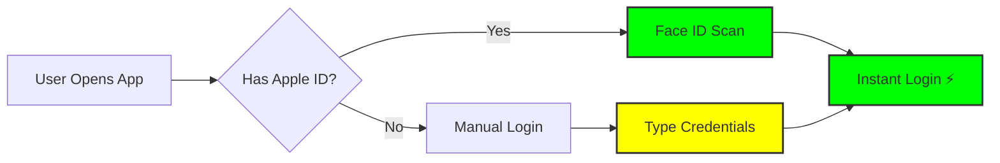

#### 2. **Business & Strategic Benefits**

| Benefit | Impact | Reasoning |
|---------|--------|-----------|
| **App Store Requirement** | 🟢 CRITICAL | Required if you offer Google Sign-In |
| **iOS Market Share** | 🟢 HIGH | ~27% global, ~60% in premium segment |
| **Trust & Credibility** | 🟢 MEDIUM | Apple's reputation for privacy |
| **Competitive Parity** | 🟢 MEDIUM | Standard feature in modern apps |
| **User Acquisition** | 🟢 MEDIUM | Reduces signup friction on iOS |

#### 3. **Technical Benefits**

| Benefit | Impact | Why It Matters |
|---------|--------|----------------|
| **Zero Breaking Changes** | 🟢 CRITICAL | No impact on existing users |
| **Proven Architecture** | 🟢 HIGH | Mirrors existing Google OAuth |
| **Parallel Implementation** | 🟢 HIGH | Can develop without touching Google code |
| **Scalable Design** | 🟢 MEDIUM | Easy to add more providers later |
| **Security** | 🟢 HIGH | Apple's robust security standards |

#### 4. **Privacy Benefits**

| Benefit | Impact | Details |
|---------|--------|---------|
| **Private Email Relay** | 🟢 HIGH | Users control email visibility |
| **Minimal Data Collection** | 🟢 MEDIUM | Apple shares minimal user data |
| **No Tracking** | 🟢 MEDIUM | Apple doesn't track user behavior |
| **User Control** | 🟢 HIGH | Users can revoke access anytime |

---

### ❌ CONS: Challenges & Limitations

#### 1. **API & Feature Limitations**

| Limitation | Impact | Workaround Complexity |
|------------|--------|----------------------|
| **No Calendar API** | 🔴 CRITICAL | HIGH - Requires Google fallback |
| **No Email API** | 🔴 CRITICAL | HIGH - Requires Gmail fallback |
| **No Access Token** | 🟡 MEDIUM | MEDIUM - Use refresh token pattern |
| **6-Month Token Expiry** | 🟡 MEDIUM | MEDIUM - Require re-auth |
| **Name Only on First Sign-In** | 🟡 LOW | LOW - Cache in database |

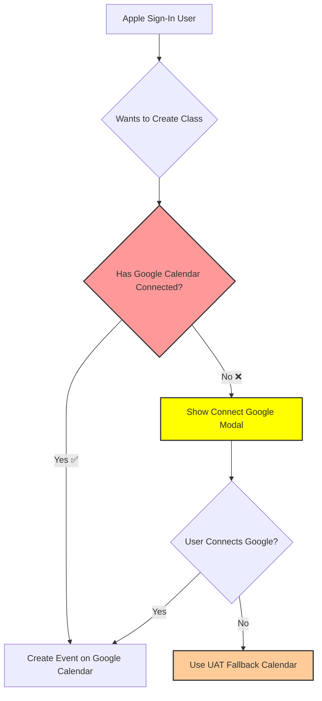

#### 2. **Implementation Challenges**

| Challenge | Complexity | Time Impact |
|-----------|------------|-------------|
| **Apple Developer Setup** | 🟡 MEDIUM | 2-4 hours |
| **P8 Key Management** | 🟡 MEDIUM | Requires secure storage |
| **POST vs GET Callback** | 🟡 LOW | Different from Google |
| **Private Relay Emails** | 🟡 MEDIUM | Must handle proxy emails |
| **Testing on iOS Devices** | 🟡 MEDIUM | Requires Apple hardware |

#### 3. **Operational Challenges**

| Challenge | Impact | Mitigation |
|-----------|--------|-----------|
| **Two OAuth Providers** | 🟡 MEDIUM | Need dual token management |
| **Token Refresh Complexity** | 🟡 MEDIUM | Different expiration patterns |
| **User Confusion** | 🟡 LOW | Clear UI/UX design needed |
| **Support Complexity** | 🟡 LOW | More authentication paths to debug |

#### 4. **Business Risks**

| Risk | Probability | Impact | Mitigation Strategy |
|------|-------------|--------|---------------------|
| **Feature Expectation Gap** | 🟡 MEDIUM | 🔴 HIGH | Clear messaging: "Connect Google for full features" |
| **User Frustration** | 🟡 MEDIUM | 🟡 MEDIUM | Seamless Google linking flow |
| **Development Time** | 🟢 LOW | 🟡 MEDIUM | Well-defined architecture |
| **Maintenance Overhead** | 🟢 LOW | 🟡 MEDIUM | Automated testing |

---

## 🏗️ ARCHITECTURE IMPACT ANALYSIS

### Current Architecture (Before Apple)

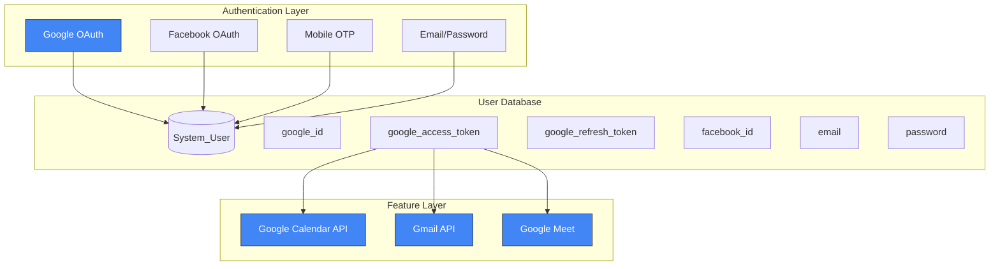

### Proposed Architecture (With Apple)

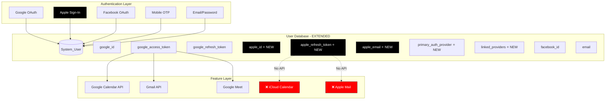

### Multi-Provider Architecture (Recommended)

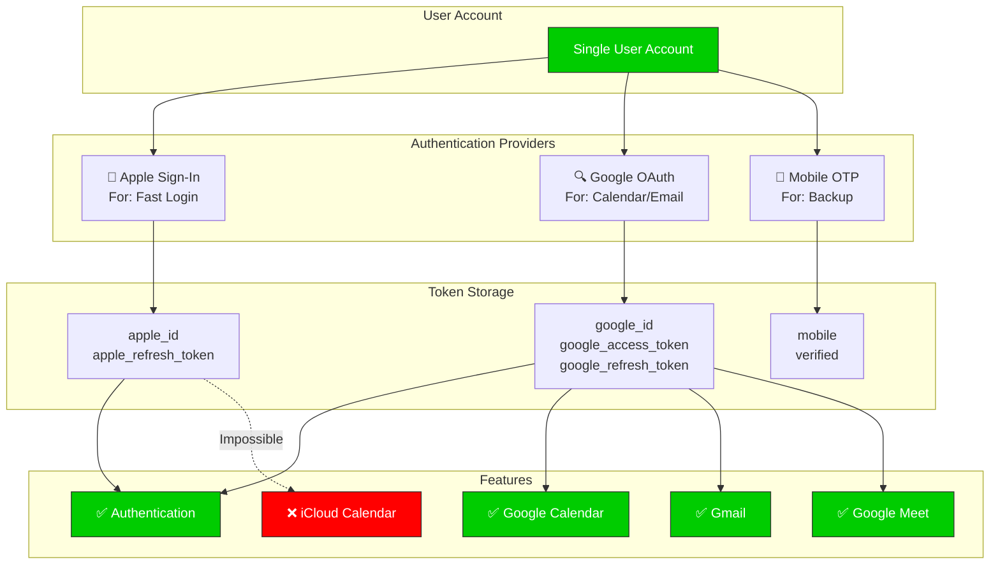

### Database Schema Changes

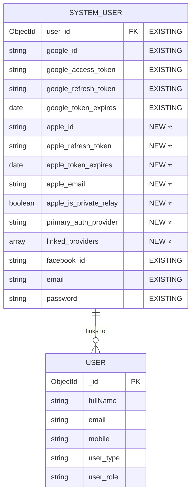

---

## 🎨 VISUAL ARCHITECTURE DIAGRAMS

### 1. Authentication Flow Comparison

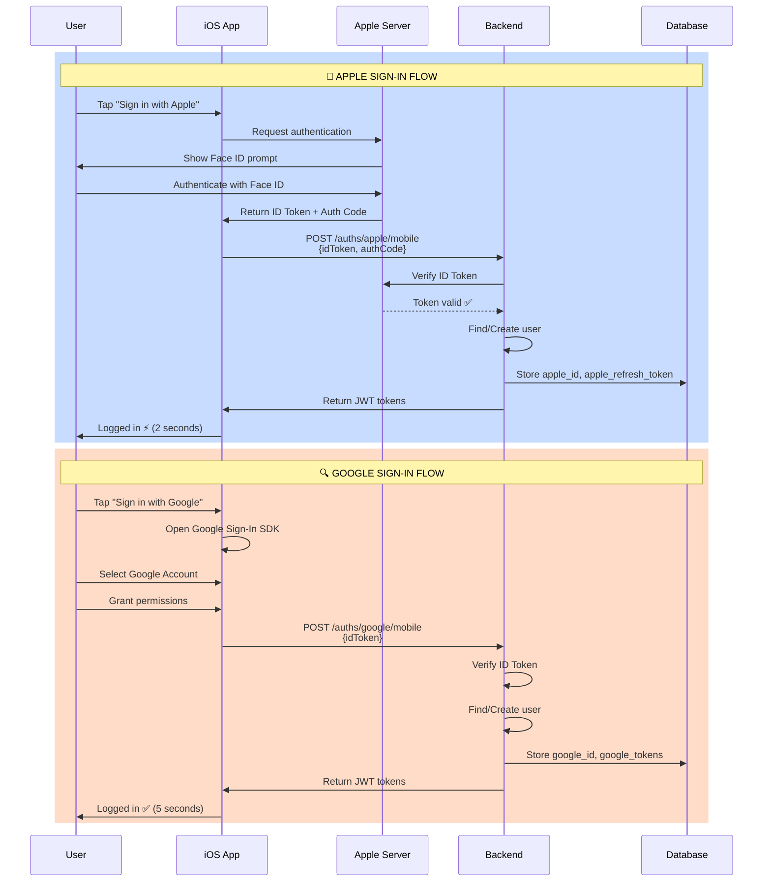

### 2. Multi-Provider User Journey

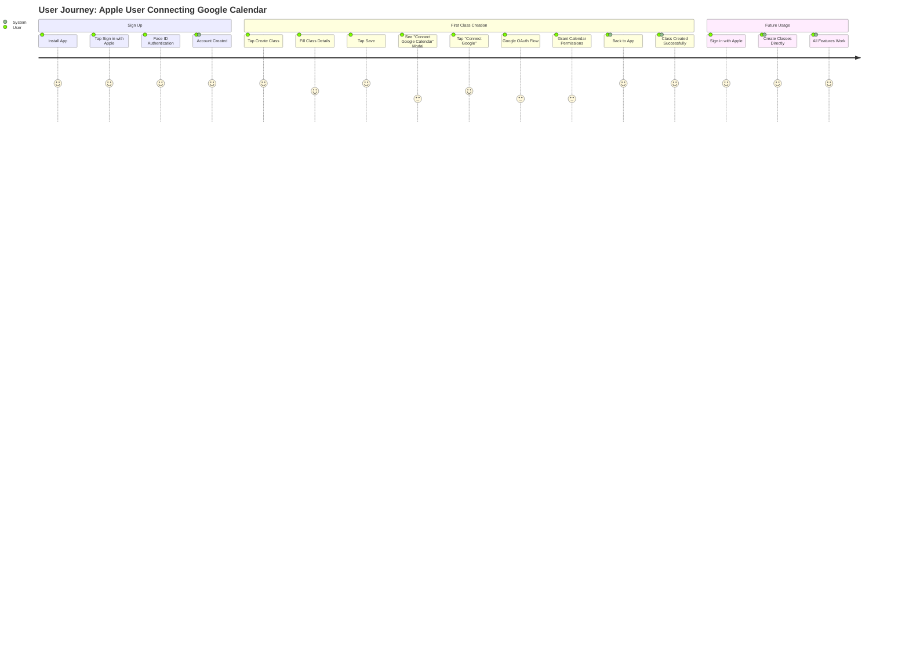

### 3. Feature Availability Decision Tree

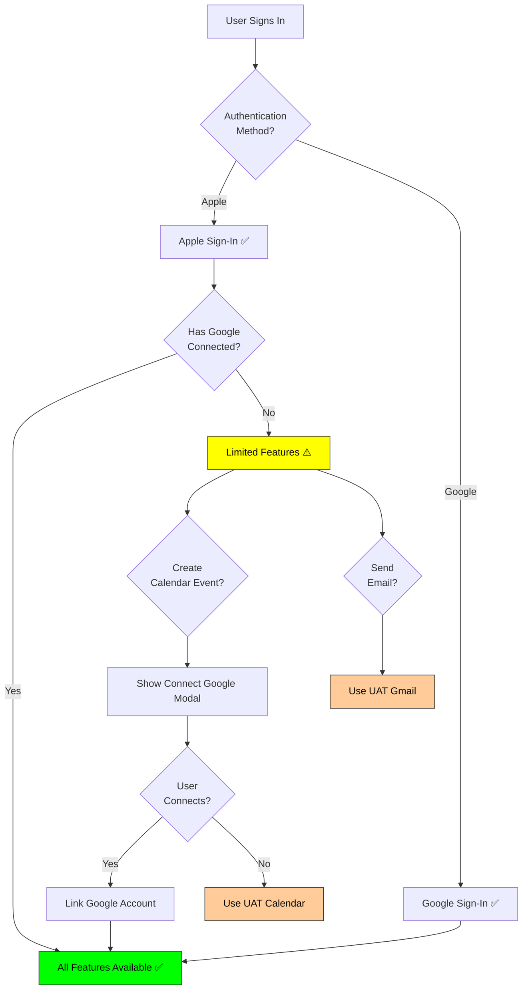

### 4. Token Lifecycle Comparison

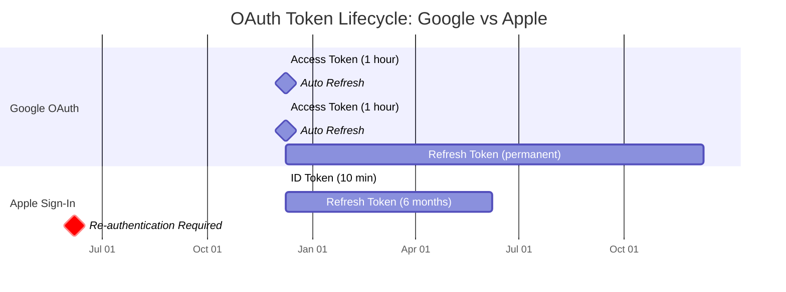

### 5. Class Creation Flow with Mixed Providers

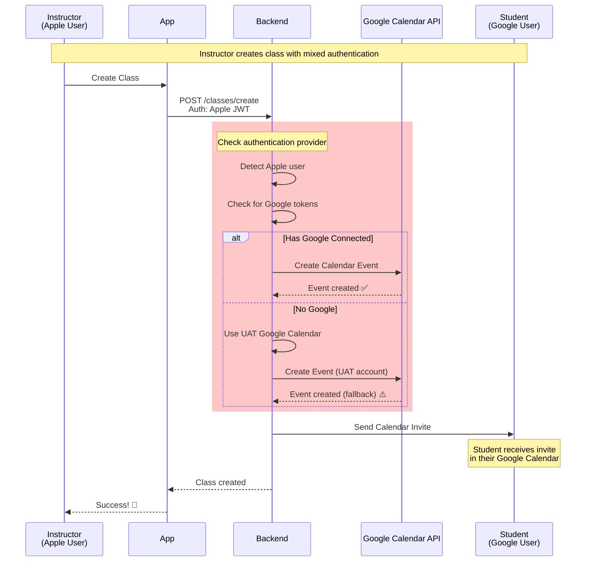

### 6. System Architecture Layers

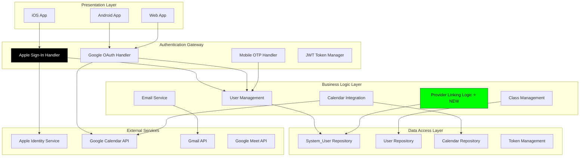

---

## 📋 FEATURE CAPABILITY MATRIX

### Authentication Features

| Feature | Google | Apple | Mobile OTP | Email/Password |
|---------|--------|-------|------------|----------------|
| **Sign In** | ✅ Yes | ✅ Yes | ✅ Yes | ✅ Yes |
| **Sign Up** | ✅ Yes | ✅ Yes | ✅ Yes | ✅ Yes |
| **Face ID / Touch ID** | ❌ No | ✅ Yes | ❌ No | ❌ No |
| **Biometric Auth** | ❌ No | ✅ Yes | ❌ No | ❌ No |
| **Password Required** | ❌ No | ❌ No | ❌ No | ✅ Yes |
| **Email Verified** | ✅ Yes | ✅ Yes | ⚠️ Optional | ✅ Yes |
| **Mobile Verified** | ❌ No | ❌ No | ✅ Yes | ❌ No |
| **Offline Access** | ✅ Yes (tokens) | ⚠️ Limited | ❌ No | ✅ Yes |

### Platform Support

| Feature | Web | iOS | Android | Desktop |
|---------|-----|-----|---------|---------|
| **Google Sign-In** | ✅ Yes | ✅ Yes | ✅ Yes | ✅ Yes |
| **Apple Sign-In** | ⚠️ Limited | ✅ Yes | ❌ No | ⚠️ macOS Only |
| **Mobile OTP** | ✅ Yes | ✅ Yes | ✅ Yes | ✅ Yes |
| **Email/Password** | ✅ Yes | ✅ Yes | ✅ Yes | ✅ Yes |

### API & Integration Features

| Feature | Google | Apple | Fallback |
|---------|--------|-------|----------|
| **Calendar API** | ✅ Full Access | ❌ No API | ✅ UAT Google |
| **Email API** | ✅ Gmail API | ❌ No API | ✅ UAT Gmail |
| **Video Conferencing** | ✅ Google Meet | ❌ No API | ✅ UAT Meet |
| **Contacts API** | ✅ Full Access | ⚠️ Limited | ❌ N/A |
| **Storage API** | ✅ Drive API | ❌ No API | ❌ N/A |
| **Token Refresh** | ✅ Automatic | ⚠️ Manual (6mo) | ❌ N/A |
| **Offline Access** | ✅ Yes | ⚠️ Limited | ❌ N/A |

### User Data Access

| Data Type | Google | Apple | Notes |
|-----------|--------|-------|-------|
| **Email** | ✅ Always | ⚠️ Optional | Apple: User can hide |
| **Name** | ✅ Always | ⚠️ First time only | Apple: Cache required |
| **Profile Photo** | ✅ Yes | ❌ No | Apple: Not provided |
| **Birthday** | ⚠️ If granted | ❌ No | Requires extra scope |
| **Phone Number** | ❌ No | ❌ No | Must be added separately |
| **User ID** | ✅ Permanent | ✅ Permanent | Both are stable |

---

## 🎭 INTEGRATION SCENARIOS

### Scenario 1: Pure Apple User (Instructor)

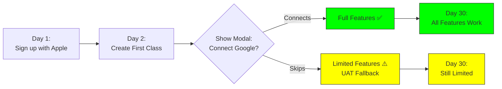

**Timeline:**
- **Day 1:** Apple Sign-In → Account created (30 seconds)
- **Day 2:** Create class → "Connect Google Calendar" prompt
  - **Option A:** Connect Google → Full features forever ✅
  - **Option B:** Skip → UAT fallback, limited features ⚠️
- **Day 30:** 
  - Option A users: Happy, all features work
  - Option B users: May get frustrated, will connect later

**User Experience:**
- ✅ Fast sign-in with Face ID
- ⚠️ One-time Google connection needed for full features
- ✅ After connection, seamless experience

---

### Scenario 2: Pure Google User (Student)

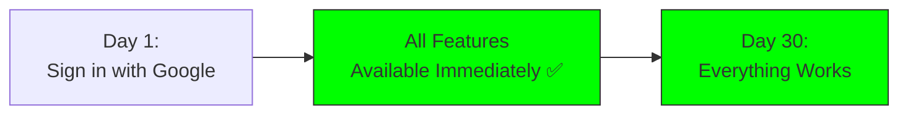

**Timeline:**
- **Day 1:** Google Sign-In → All features available immediately
- **Day 30:** Still working perfectly

**User Experience:**
- ✅ Complete feature access from day 1
- ✅ No additional setup required
- ✅ Calendar, email, everything works

---

### Scenario 3: Mixed Classroom (Most Common)

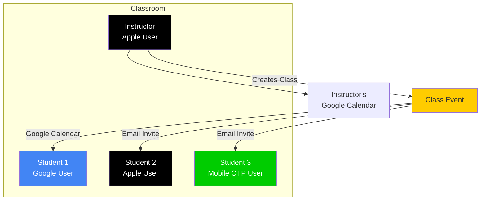

**How It Works:**
1. **Instructor (Apple user):**
   - Signs in with Apple (Face ID)
   - Connects Google for calendar features
   - Creates class → Event created on Google Calendar
   - Students receive invites

2. **Student 1 (Google user):**
   - Signs in with Google
   - Gets calendar invite automatically
   - Event appears in their calendar

3. **Student 2 (Apple user):**
   - Signs in with Apple
   - Gets email invite
   - Can add to calendar manually

4. **Student 3 (Mobile OTP user):**
   - Signs in with mobile OTP
   - Gets email invite
   - Can add to calendar manually

**Result:** ✅ Everyone can participate, regardless of authentication method

---

### Scenario 4: User Switches Between Devices

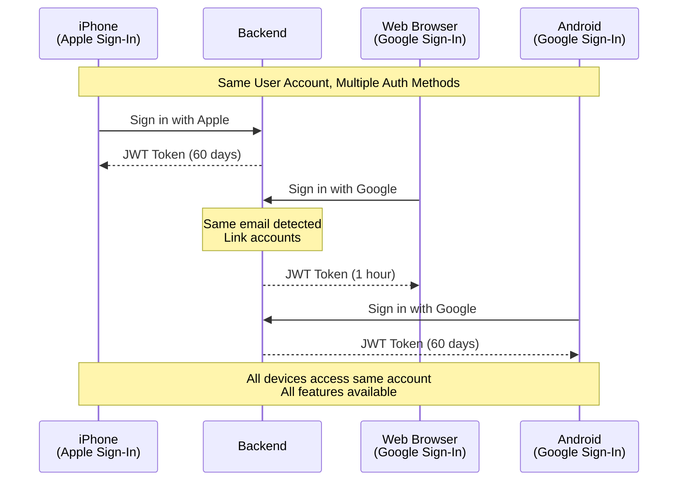

**Scenario:**
- User has Apple Sign-In on iPhone
- Later signs in on web browser with Google
- System detects same email → Links accounts
- Now user has both Apple + Google tokens
- All features work everywhere

**Benefits:**
- ✅ Seamless cross-device experience
- ✅ Best authentication method per platform
- ✅ Full feature access everywhere

---

## 🗺️ IMPLEMENTATION ROADMAP

### Phase 1: Foundation (Week 1)

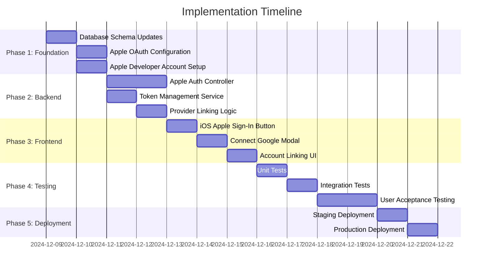

### Detailed Task Breakdown

#### Week 1: Backend Foundation

| Day | Task | Deliverable | Hours |
|-----|------|-------------|-------|
| **Mon** | Database schema updates | Updated `system_user.model.js` | 2h |
| **Mon** | Apple OAuth config | `apple/OAuth2.config.js` | 3h |
| **Tue** | Apple auth controller | `mobileAppleSignIn()` | 4h |
| **Wed** | Token management | Apple token refresh service | 3h |
| **Thu** | Provider linking | Multi-provider support | 4h |
| **Fri** | Backend testing | Unit + integration tests | 4h |

#### Week 2: Frontend & Integration

| Day | Task | Deliverable | Hours |
|-----|------|-------------|-------|
| **Mon** | iOS Sign-In button | Apple Sign-In UI | 3h |
| **Tue** | Connect Google modal | Link account flow | 4h |
| **Wed** | Account settings | Manage providers | 3h |
| **Thu** | Integration testing | End-to-end tests | 4h |
| **Fri** | UAT & bug fixes | Production-ready code | 4h |

---

## ⚠️ RISK ASSESSMENT

### Technical Risks

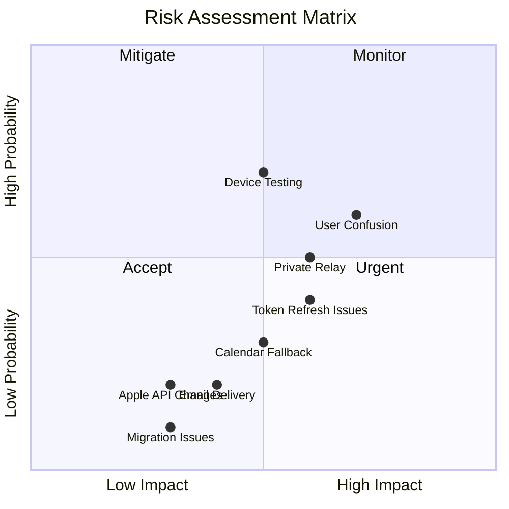

### Risk Mitigation Strategies

| Risk | Probability | Impact | Mitigation | Owner |
|------|-------------|--------|------------|-------|
| **Feature Gap User Frustration** | 🟡 Medium | 🔴 High | Clear messaging + easy Google linking | Product |
| **Token Refresh Failures** | 🟡 Medium | 🟡 Medium | Retry logic + graceful degradation | Backend |
| **Private Relay Email Issues** | 🟡 Medium | 🟡 Medium | Accept proxy emails + email verification | Backend |
| **iOS-Only Support** | 🟢 Low | 🟢 Low | Document platform limitations | Product |
| **Development Delays** | 🟡 Medium | 🟡 Medium | Well-defined scope + parallel work | PM |
| **Testing Device Access** | 🟡 Medium | 🟢 Low | Use TestFlight + simulator | QA |

---

## 🎯 DECISION FRAMEWORK

### Should You Implement Apple Sign-In?

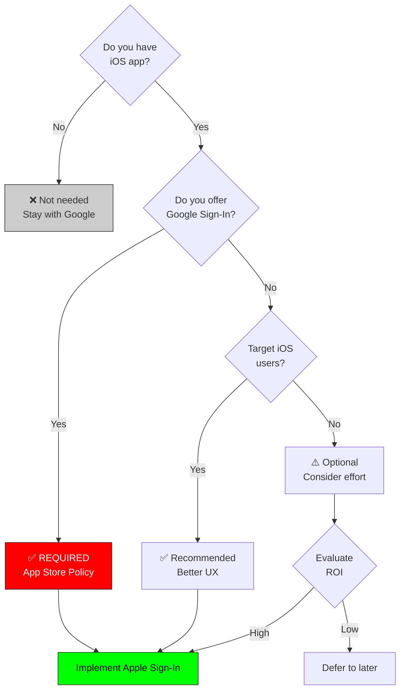

### Decision Criteria Checklist

Use this checklist to make your decision:

- [ ] **App Store Requirement:** Do you offer Google Sign-In in iOS app?
  - ✅ Yes → MUST implement Apple Sign-In
  - ❌ No → Optional

- [ ] **User Base:** What % of users are on iOS?
  - ✅ >30% → High priority
  - ⚠️ 10-30% → Medium priority
  - ❌ <10% → Low priority

- [ ] **Development Resources:** Do you have 3 days for implementation?
  - ✅ Yes → Go ahead
  - ❌ No → Defer

- [ ] **Feature Requirements:** Can you accept calendar/email limitations?
  - ✅ Yes (with Google fallback) → Acceptable
  - ❌ No → Reconsider

- [ ] **User Experience:** Is Face ID authentication valuable to users?
  - ✅ Yes → High value
  - ⚠️ Maybe → Medium value
  - ❌ No → Low value

**Scoring:**
- **5 Yes:** Definitely implement
- **3-4 Yes:** Probably implement
- **1-2 Yes:** Consider deferring

---

## 📊 COMPARISON SUMMARY

### Side-by-Side Feature Comparison

| Aspect | Google OAuth | Apple Sign-In | Winner |
|--------|--------------|---------------|--------|
| **Authentication** | ✅ Excellent | ✅ Excellent | 🤝 Tie |
| **Calendar API** | ✅ Full API | ❌ No API | 🏆 Google |
| **Email API** | ✅ Gmail API | ❌ No API | 🏆 Google |
| **Face ID Support** | ❌ No | ✅ Yes | 🏆 Apple |
| **Privacy** | ⚠️ Good | ✅ Excellent | 🏆 Apple |
| **Token Lifetime** | ✅ Permanent refresh | ⚠️ 6 months | 🏆 Google |
| **Platform Support** | ✅ All platforms | ⚠️ iOS/Mac only | 🏆 Google |
| **User Trust** | ✅ High | ✅ Very High | 🏆 Apple |
| **Setup Complexity** | ⚠️ Medium | ⚠️ Medium | 🤝 Tie |
| **Maintenance** | ✅ Easy | ✅ Easy | 🤝 Tie |

### Recommended Strategy

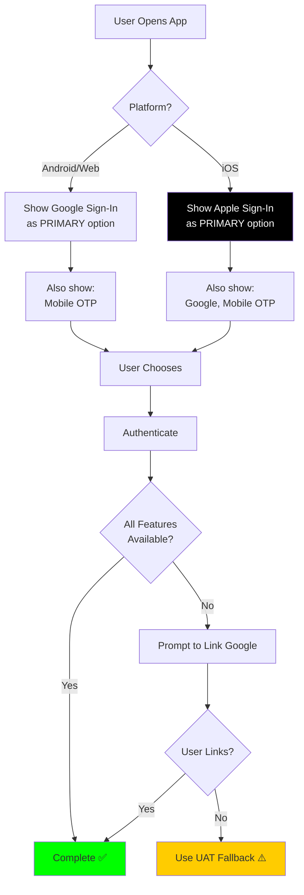

---

## ✅ RECOMMENDATIONS

### 🎯 Primary Recommendation: **IMPLEMENT with Hybrid Approach**

**Why:**
1. ✅ App Store requirement (if you have Google Sign-In)
2. ✅ Better iOS user experience (Face ID)
3. ✅ Maintains feature parity (via Google fallback)
4. ✅ Minimal risk (parallel implementation)
5. ✅ Future-proof architecture

### 📋 Implementation Strategy

```mermaid
graph LR
    A[Phase 1:<br/>Apple Auth Only] --> B[Phase 2:<br/>Add Provider Linking]
    B --> C[Phase 3:<br/>Optimize UX]
    C --> D[Phase 4:<br/>Monitor & Iterate]
    
    style A fill:#90EE90
    style B fill:#90EE90
    style C fill:#FFD700
    style D fill:#FFD700
```

**Phase 1: Core Authentication (Week 1)**
- Implement Apple Sign-In
- Use UAT fallback for features
- Deploy to TestFlight

**Phase 2: Provider Linking (Week 2)**
- Add "Connect Google" flow
- Implement account linking
- Deploy to production

**Phase 3: UX Optimization (Week 3-4)**
- A/B test connection prompts
- Optimize messaging
- Add analytics

**Phase 4: Monitor & Iterate (Ongoing)**
- Track adoption rates
- Monitor user feedback
- Iterate based on data

### 🚨 Critical Success Factors

1. **Clear User Communication**
   - Explain why Google connection is needed
   - Show value proposition
   - Make linking process smooth

2. **Seamless Fallback**
   - UAT account always works
   - No feature failures
   - Transparent to users

3. **Smooth Migration Path**
   - Existing users unaffected
   - New users get best experience
   - Easy account linking

4. **Comprehensive Testing**
   - Test all authentication paths
   - Test provider combinations
   - Test failure scenarios

### 📈 Success Metrics

Track these metrics to measure success:

| Metric | Target | Measurement Period |
|--------|--------|-------------------|
| Apple Sign-In Adoption (iOS) | >60% | 3 months |
| Google Connection Rate (Apple users) | >70% | 1 month |
| Authentication Success Rate | >99% | Ongoing |
| User Satisfaction (Auth) | >4.5/5 | 3 months |
| Feature Access (Apple users) | >90% | 1 month |

---

## 🎬 CONCLUSION

### Final Decision Matrix

```mermaid
mindmap
  root((Apple Sign-In<br/>Decision))
    Technical
      ✅ Feasible
      ✅ Proven Patterns
      ✅ Low Risk
    Business
      ✅ App Store Required
      ✅ Better iOS UX
      ⚠️ Feature Gaps
    User
      ✅ Face ID
      ✅ Privacy
      ⚠️ Need Google Link
    Implementation
      ✅ 3 Days
      ✅ No Breaking Changes
      ✅ Plug-and-Play
```

### The Verdict

**✅ RECOMMENDED: Implement Apple Sign-In with Hybrid Approach**

**Reasoning:**
1. **Required** if you have Google Sign-In on iOS (App Store policy)
2. **Minimal Risk** - Parallel implementation, no breaking changes
3. **High Value** - Better iOS UX, Face ID, privacy
4. **Manageable Limitations** - Google fallback solves feature gaps
5. **Future-Proof** - Positions you for iOS market growth

**Next Steps:**
1. Review this document with team
2. Approve the hybrid architecture
3. Start Phase 1 implementation
4. Deploy to TestFlight in Week 1
5. Gather user feedback
6. Iterate and improve

---

## 📚 APPENDIX

### Useful Resources

- [Apple Sign-In Documentation](https://developer.apple.com/sign-in-with-apple/)
- [App Store Review Guidelines](https://developer.apple.com/app-store/review/guidelines/#sign-in-with-apple)
- [Google Calendar API](https://developers.google.com/calendar)
- [OAuth 2.0 Best Practices](https://tools.ietf.org/html/rfc6749)

### Glossary

| Term | Definition |
|------|------------|
| **ID Token** | Short-lived token proving user identity |
| **Refresh Token** | Long-lived token for getting new access tokens |
| **Access Token** | Token for accessing APIs (Google has, Apple doesn't) |
| **Private Relay** | Apple's email hiding feature |
| **UAT Account** | ClassInTown's fallback Google account |
| **Provider Linking** | Connecting multiple auth methods to one account |

---

**Document Status:** ✅ Complete  
**Last Updated:** December 9, 2024  
**Next Review:** After implementation


