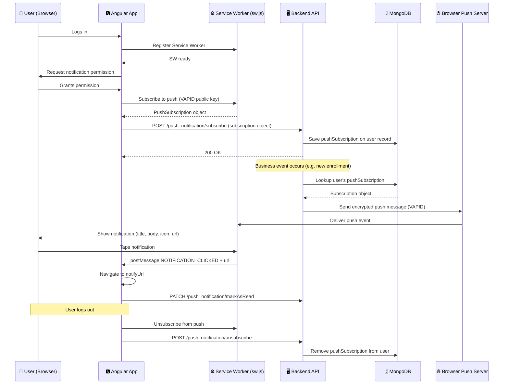
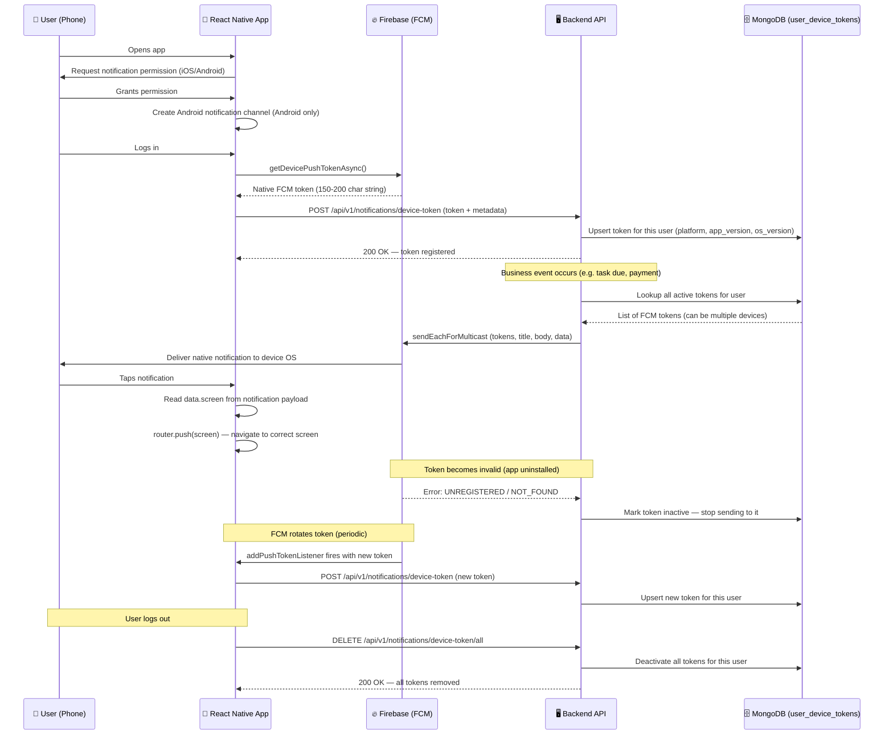
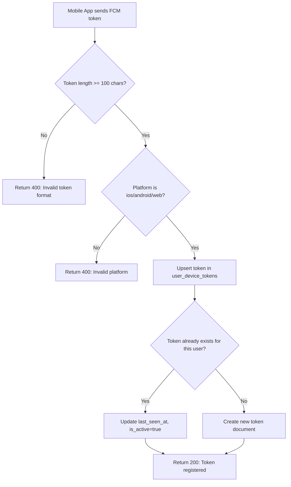
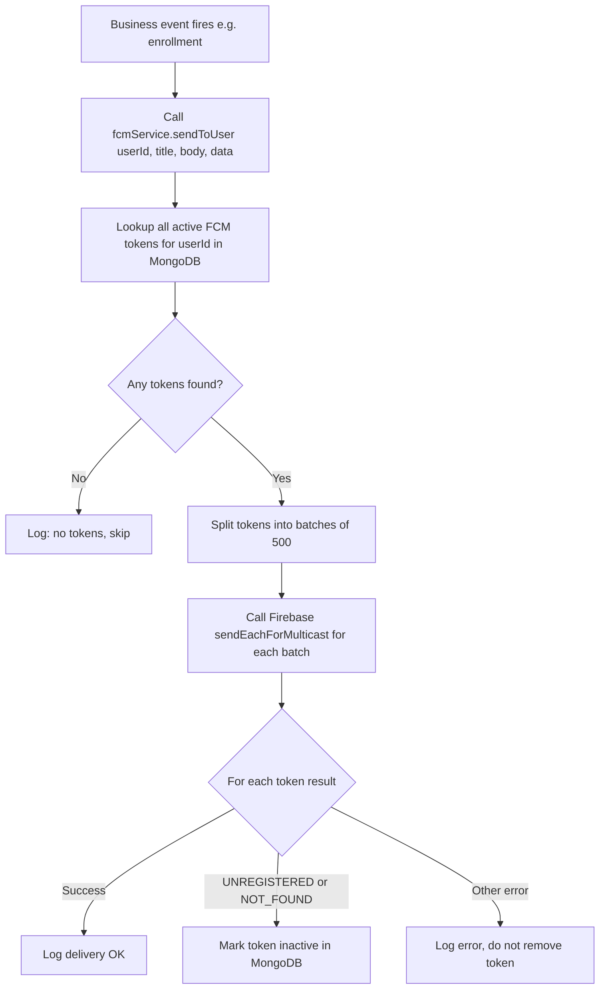

# 📲 Push Notification & FCM — End-to-End Documentation

> Plain-language guide covering how push notifications work across all three platforms:
> **Web Frontend (Angular)**, **Mobile Frontend (React Native)**, and **Backend (Node.js)**.

---

## 🗺️ Overview — Two Separate Systems

ClassInTown runs **two parallel push notification systems** depending on which client is being used:

| | Web (Angular) | Mobile (React Native) |
|---|---|---|
| **Protocol** | Web Push API (VAPID) | Firebase Cloud Messaging (FCM) |
| **Delivery** | Browser Service Worker | Firebase → iOS/Android OS |
| **Token stored in** | User's `pushSubscription` field in MongoDB | `user_device_tokens` collection in MongoDB |
| **Backend service** | `notification.service.js` | `fcm.service.js` |

They are **independent** — a user on the web gets VAPID notifications, a user on the mobile app gets FCM notifications. A user logged in on both receives both.

---

## 🔵 SYSTEM 1 — Web Frontend (Angular + VAPID)

### How It Works in Plain Language

1. When the user logs in on the browser, the Angular app asks the browser for **notification permission**.
2. If the user grants it, the browser generates a unique **push subscription** (an object containing an endpoint URL and encryption keys). This is handled by the **Service Worker** (`sw.js`).
3. The Angular app sends this subscription object to the backend, which **saves it on the user's record** in MongoDB.
4. When the backend wants to notify this user (e.g. a new enrollment), it reads their push subscription from MongoDB and sends an encrypted message to **that browser's push server** (Google, Firefox, etc.) using the VAPID keys.
5. The browser's push server delivers the message to the **Service Worker** running in the background.
6. The Service Worker **displays the notification** on the user's screen, even if the browser tab is closed.
7. When the user **taps the notification**, the Service Worker posts a message to the Angular app, which navigates to the relevant screen and marks the notification as read.
8. When the user **logs out**, the browser is unsubscribed from push and the subscription is removed from the backend.

### Key Files

| File | Role |
|---|---|
| `frontend/src/sw.js` | Service Worker — receives push events, shows notifications, handles clicks |
| `frontend/src/app/services/core/push_notification/push-notification.service.ts` | Angular service — registers/unsubscribes, fetches in-app notifications |
| `frontend/src/app/app.component.ts` | Triggers push subscription setup after login |
| `frontend/src/app/services/common/auth/auth.service.ts` | Calls unsubscribe on logout |
| `frontend/src/app/services/common/auth/secure-auth.service.ts` | Also calls unsubscribe on logout |
| `frontend/src/app/shared/common-components/headers/headers.component.ts` | Listens for notification click events from the Service Worker, navigates user |
| `backend/notification.service.js` | Sends VAPID push notifications; manages web subscriptions |

---

## 🟠 SYSTEM 2 — Mobile Frontend (React Native + FCM)

### How It Works in Plain Language

1. When the app starts, it asks the user for **notification permission** (iOS prompt / Android 13+ prompt).
2. On Android, it also creates a **notification channel** (with sound, vibration, max importance) so the OS knows how to display notifications.
3. After the user logs in, the app calls Firebase to get a **native device token** — a unique string that identifies this specific device with FCM.
4. This token is sent to the backend (`POST /api/v1/notifications/device-token`) along with metadata: platform, app version, OS version, device model.
5. The backend **saves this token** in the `user_device_tokens` MongoDB collection, linked to the user.
6. When the backend wants to notify this user (same events: enrollments, tasks, payments, etc.), it looks up all their active device tokens and uses **Firebase Admin SDK** to send a notification to each token via FCM servers.
7. FCM servers deliver the notification to the **device's operating system**, which displays it as a native notification.
8. If the user **taps the notification**, the app reads the `screen` field from the notification's data payload and **navigates to that screen** automatically.
9. If the user **receives a notification while the app is open** (foreground), the app displays it as an alert (sound + badge + alert).
10. When a **token becomes invalid** (user uninstalled app, token expired), FCM tells the backend, and the backend **removes that stale token** automatically.
11. When the user **logs out**, the app calls `DELETE /api/v1/notifications/device-token/all` to deregister all their device tokens so they stop receiving notifications.
12. If FCM **rotates a token** (this happens periodically), the app detects this and automatically **re-registers the new token** with the backend.

### Key Files

| File | Role |
|---|---|
| `services/notifications/notificationApi.ts` | Gets native FCM token from device; calls backend registration/deregistration endpoints |
| `services/notifications/notificationService.ts` | Requests permissions, sets up foreground handler, handles notification tap navigation, token refresh listener |
| `services/notifications/index.ts` | Barrel — exports everything from both files above |
| `features/auth/store/authStore.ts` | Calls token registration on login (`setSession`); calls token cleanup on logout (`signOut`) |
| `app/_layout.tsx` | Initialises push permissions on app startup; mounts the `usePushNotifications` hook |
| `android/app/google-services.json` | Android Firebase config (required at build time) |
| `ios/ClassInTown/GoogleService-Info.plist` | iOS Firebase config (required at build time) |
| `backend/services/push/fcm.service.js` | Sends FCM notifications via Firebase Admin SDK; handles multi-device, batching, stale token cleanup |
| `backend/controllers/push/deviceToken.controller.js` | REST controller for token register/deregister/list/test endpoints |
| `backend/models/push/user_device_token.model.js` | MongoDB schema for device tokens |
| `backend/routes/notifications.routes.js` | Route definitions for all push notification endpoints |

---

## 🟢 BACKEND — Shared Logic

### How the Backend Decides What to Send

The backend has a concept of a **unified notification trigger** — any time a business event happens (class enrolled, task due, payment made, etc.), the backend calls both:
- `notification.service.js` → sends VAPID push to web subscribers
- `fcm.service.js` → sends FCM push to mobile device tokens

Both receive the same message content. The user gets it on whichever device they are currently active on.

### Token Validation

The backend validates every FCM token before saving it:
- It must be a string
- It must be at least 100 characters long (native FCM tokens are typically 150–200 chars)

If a token fails this check, the backend returns a `400` error and the token is not saved.

### Stale Token Cleanup

When FCM reports a token as invalid (device uninstalled app, token expired), the backend:
1. Receives the error back from Firebase
2. Immediately marks that token as inactive in MongoDB
3. Never sends to it again

This keeps the token list clean automatically without any manual work.

---

## 🔁 End-to-End Flow Diagrams

### Web Push — Full Flow

---

### Mobile FCM — Full Flow

---

### Backend — Token Registration Detail

---

### Backend — Sending FCM to a User

---

## 🔑 Key Concepts Glossary

| Term | Meaning |
|---|---|
| **FCM Token** | A unique string that identifies one device installation. Firebase uses it to route a notification to exactly that device. Changes when the user reinstalls the app. |
| **VAPID** | A security standard for Web Push. The server signs each message with a private key so the browser trusts the push. |
| **PushSubscription** | A browser-generated object (endpoint URL + encryption keys) used to deliver Web Push messages to that specific browser tab/profile. |
| **Service Worker** | A background script in the browser that runs independently of the web page. It receives push events from the push server and displays notifications even when the tab is closed. |
| **Expo Push Token** | An Expo-managed token (`ExponentPushToken[...]`) — this is NOT used here. We use the raw native FCM token instead, which is what `firebase-admin` requires. |
| **Upsert** | Insert if new, update if already exists. Used for token registration so a device doesn't create duplicate records. |
| **Stale Token** | A token that no longer maps to a real device install. FCM returns an error when you try to send to it, and the backend removes it automatically. |
| **Multicast** | Sending one notification payload to many tokens in a single Firebase API call (up to 500 at once). Efficient for class-wide broadcasts. |
| **Notification Channel** | An Android-specific category that controls sound, vibration, and importance of notifications. Required on Android 8+. ClassInTown uses `MAX` importance. |

---

## ✅ Readiness Status

| Layer | Status | Notes |
|---|---|---|
| **Backend FCM** | ✅ Ready | Token management, send, stale cleanup, topic support all implemented |
| **Backend Web Push (VAPID)** | ✅ Ready | Full notification suite covering all business events |
| **Mobile — permissions** | ✅ Ready | iOS + Android handled |
| **Mobile — token registration** | ✅ Ready | Native FCM token sent to backend on login |
| **Mobile — token refresh** | ✅ Ready | Automatically re-registers when FCM rotates token |
| **Mobile — logout cleanup** | ✅ Ready | All tokens deregistered on logout |
| **Mobile — notification tap** | ✅ Ready | Navigates to `data.screen` from payload |
| **Web — subscription** | ✅ Ready | Subscribed after login, unsubscribed on logout |
| **Web — notification display** | ✅ Ready | Service Worker shows notification with correct details |
| **Web — notification tap** | ✅ Ready | SW posts message to Angular; Angular navigates + marks as read |
| **Web — grouping (chat)** | ✅ Ready | Chat notifications correctly grouped and counter incremented |
