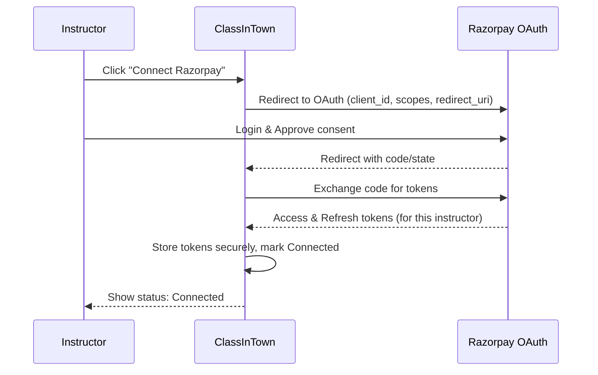
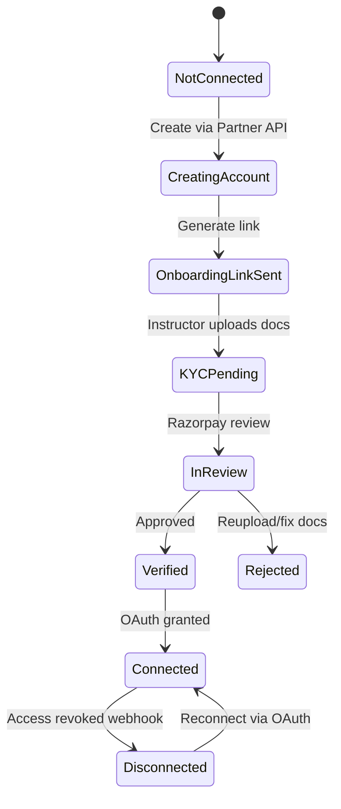
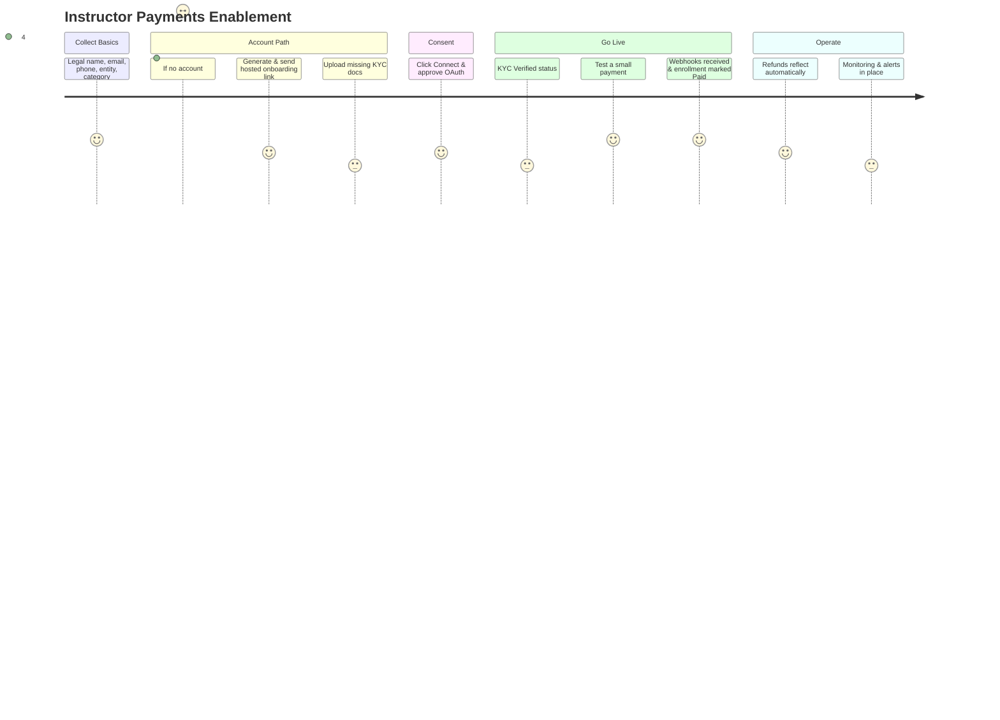

### ClassInTown × Razorpay Technology Partner

A complete end-to-end roadmap for onboarding instructors to Razorpay via Technology Partner OAuth, creating accounts on their behalf (when needed), finishing KYC, handling consent, and running payments, refunds, and operations with clarity on when to act vs when to wait.


---

### Quick Legend
- **ACT**: Your team or system should do this now.
- **WAIT**: Pause until Razorpay or the instructor finishes something.
- **INFO**: Guidance and context for the step.


---

### Overview Diagram — Big Picture
```mermaid
flowchart TB
  subgraph Platform Setup (One-time)
    P0[Phase 0: Business Rules]
    P1[Phase 1: Become Technology Partner]
    P2[Phase 2: Design Onboarding]
    P3[Phase 3: Data & UX]
    P4[Phase 4: Tokens & Security]
    P5[Phase 5: Payments]
    P6[Phase 6: Reconciliation]
    P7[Phase 7: Support]
    P8[Phase 8: Testing & Launch]
    P9[Phase 9: Monitoring]
  end

  P0 --> P1 --> P2 --> P3 --> P4 --> P5 --> P6 --> P7 --> P8 --> P9

  subgraph Instructor Journey (Per Instructor)
    J0[Start]
    J1{Has Razorpay Account?}
    J2A[Path A: OAuth Connect]
    J2B[Path B: Create Account]
    J3B[Hosted Onboarding Link (KYC)]
    J4[OAuth Consent]
    J5[Status: KYC Pending → Verified]
    J6[Checkout: Create Order using Instructor Tokens]
    J7[Capture & Webhooks]
    J8[Enrollments & Refunds]
  end

  J0 --> J1
  J1 -- Yes --> J2A --> J4 --> J5 --> J6 --> J7 --> J8
  J1 -- No  --> J2B --> J3B --> J4 --> J5 --> J6 --> J7 --> J8
```


---

### Phase 0 — Decide Business Rules (One-time)
- **ACT**: Finalize revenue split, refund policy, and invoicing authority.
- **INFO**: Define commission %, taxes (GST), cancellation/refund rules. Decide who issues student invoices (in OAuth model, typically the instructor). Decide how you collect commission (invoice monthly or consider Route later).


---

### Phase 1 — Become a Razorpay Technology Partner (One-time)
- **ACT**: Apply/enable Partner access with Razorpay.
- **WAIT**: For partner approval and dashboard access.
- **OUTPUT**: Access to Partner Dashboard & Partner APIs.


---

### Phase 2 — Create an OAuth Application (One-time)
- **ACT**: In Partner Dashboard, create an OAuth Application.
- **CAPTURE**: `client_id`, `client_secret`, allowed `redirect_uri`, and requested scopes.
- **SECURE**: Store credentials safely; plan token storage per instructor.


---

### Phase 3 — Data & UX You’ll Build (Platform Foundation)
- **ACT**: Implement a minimal profile form to collect from instructor:
  - Legal name, email, phone
  - Business type (Individual / Sole-prop / LLP / Company)
  - Business category (Education → Coaching/Tutoring)
  - Trading/brand name (optional)
  - Settlement bank details (or defer to onboarding link)
- **ACT**: Build a `Payments Setup` screen with connection states:
  - Connection: Not Connected / Connected
  - KYC: Not Started / In Progress / Pending Review / Verified
  - Actions: Create/Connect, Resume Onboarding, Reconnect, Update Bank
- **INFO**: Keep copy friendly and short; prefill onboarding to reduce drop-off.


---

### Phase 4 — Tokens, Permissions & Security
- **ACT**: Handle OAuth callback; store `access_token`/`refresh_token` per instructor; track expiry and auto-refresh.
- **ACT**: Subscribe to `account.app.authorization_revoked` webhook. On revoke, mark connection as Disconnected and prompt Reconnect.
- **SECURITY**: Encrypt tokens at rest; rotate secrets; strict access control.


---

### Phase 5 — Payment & Enrollment Flow
- **ACT**: At checkout, create Razorpay Order using the instructor’s tokens (not platform keys).
- **ACT**: Launch Razorpay Checkout for the student with that Order.
- **WAIT**: For payment completion and webhook delivery (`payment.captured`, `order.paid`).
- **ACT**: On success, mark enrollment Paid and send confirmations.
- **ACT**: Handle refunds on the same instructor account; sync status via webhooks.


---

### Phase 6 — Reconciliation, Finance & Compliance
- **ACT**: For each enrollment, store:
  - Instructor account id, order id, payment id, payer details
  - Fee/tax breakdown (commission, GST if applicable)
- **ACT**: Provide payouts/reports page per instructor.
- **ACT**: Decide invoicing model (instructor invoices student; you invoice instructor for commission monthly or adopt Route later).


---

### Phase 7 — Operations & Support
- **ACT**: Prepare playbooks and self-serve buttons: Resume Onboarding, Reconnect, Update Bank, Download report.
- **ACT**: Create alerting on revoked access and webhook failures.


---

### Phase 8 — Testing & Launch
- **ACT**: Sandbox end-to-end for both paths (existing vs create-on-behalf).
- **ACT**: Simulate webhooks, expired tokens, revoked access.
- **ACT**: Pilot with 3–5 instructors; gather feedback.


---

### Phase 9 — Monitoring & Continuous Improvement
- **ACT**: Track dashboards: % onboarding completion, time to verification, payment success %, refund rate, webhook failures.
- **ACT**: Optimize friction points (e.g., add examples for commonly rejected docs).


---

### Instructor Path Decision — Flowchart
```mermaid
flowchart LR
  A[Start Payments Setup] --> B{Does Instructor have
  a Razorpay Account?}
  B -- Yes --> C[Connect via OAuth]
  B -- No  --> D[Create Account (Partner API)]
  D --> E[Generate Hosted Onboarding Link]
  C --> F[Consent Given]
  E --> G[Instructor Uploads Docs]
  G --> H{KYC Verified?}
  H -- No --> E
  H -- Yes --> F
  F --> I[Ready for Live Payments]
```


---

### OAuth Consent — Sequence Diagram



---

### Create-on-Behalf + Hosted Onboarding — Sequence Diagram
```mermaid
sequenceDiagram
  participant I as Instructor
  participant CIT as ClassInTown (Partner)
  participant RZ as Razorpay Partner API

  I->>CIT: Submit basic profile (name, email, phone, entity)
  CIT->>RZ: Create Account on behalf (server-to-server)
  RZ-->>CIT: New Account ID (acc_xxx)
  CIT->>RZ: Generate Hosted Onboarding Link (prefilled)
  CIT-->>I: Show/Send link (in-app + email/WhatsApp)
  I->>RZ: Upload KYC documents on hosted page
  RZ-->>CIT: Webhook/Event updates (status changes)
  CIT-->>I: Show status (In Progress → Pending → Verified)
  I->>CIT: Click "Authorize" (OAuth)
  CIT->>RZ: OAuth flow → get tokens
  RZ-->>CIT: Access tokens stored per instructor
  CIT-->>I: Status: Connected; KYC: Verified
```


---

### Checkout & Webhooks — Sequence Diagram
```mermaid
sequenceDiagram
  participant S as Student
  participant CIT as ClassInTown
  participant RZ as Razorpay (Instructor Account)

  S->>CIT: Start checkout for class
  CIT->>RZ: Create Order (using instructor tokens)
  RZ-->>CIT: Order ID
  CIT-->>S: Open Razorpay Checkout with order
  S->>RZ: Pay (card/UPI/etc.)
  RZ-->>CIT: Webhook payment.captured / order.paid
  CIT->>CIT: Mark enrollment Paid; send confirmations
  CIT-->>S: Receipt/confirmation
  Note over CIT,RZ: Refunds: Initiate on same account → webhook → reverse enrollment state
```


---

### Instructor Status States — State Diagram



---

### Gantt — Suggested Project Timeline (Illustrative)
```mermaid
gantt
  dateFormat  YYYY-MM-DD
  title Razorpay Partner Integration Roadmap
  section Foundation
  Phase 0: Business Rules      :done,    p0, 2025-09-01, 3d
  Phase 1: Partner Approval    :active,  p1, 2025-09-04, 7d
  Phase 2: OAuth App Setup     :         p2, after p1, 2d
  section Build & UX
  Phase 3: Data + UI           :         p3, after p2, 5d
  Phase 4: Tokens + Webhooks   :         p4, after p3, 4d
  section Payments & Ops
  Phase 5: Checkout + Orders   :         p5, after p4, 4d
  Phase 6: Reconciliation      :         p6, after p5, 3d
  Phase 7: Support Playbooks   :         p7, after p6, 2d
  section Launch
  Phase 8: Sandbox + Pilot     :         p8, after p7, 7d
  Phase 9: Monitoring          :         p9, after p8, 999d
```


---

### What You’ll Collect Up Front (Minimal Form)
- Legal name (e.g., Riya Shah)
- Email address
- Mobile number (+91…)
- Business type: Individual / Sole Proprietor / LLP / Company
- Business category: Education → Coaching/Tutoring
- Trading/brand name (optional)
- Bank details (or defer to onboarding link)


---

### KYC Documents (Typical)
- Individual / Sole Proprietor:
  - PAN (person’s PAN)
  - ID + address proof (Aadhaar / Passport / DL / Voter ID)
  - Bank proof (cancelled cheque or passbook first page or statement)
  - Optional business proof if registered (shop & establishment, GST)
- LLP / Company / Partnership:
  - Registration docs (COI / LLP Agreement / Partnership Deed)
  - PAN of entity
  - Authorized signatory ID + PAN
  - Registered address proof
  - Bank proof; GST if applicable


---

### Payments Setup — UI Copy You Can Reuse
- Header: “Get paid directly to your bank via Razorpay”
- Step 1 button: “Create/Connect your Razorpay account”
- Subtext: “Takes ~5–10 minutes. Keep your PAN, ID proof, and bank proof handy.”
- Status Cards:
  - Connection: Not Connected / Connected
  - KYC: Not Started / In Progress / Pending Review / Verified
- Actions: Resume Onboarding | Reconnect | Update Bank
- Empty State: “No Razorpay account found. Click Create/Connect to start. We’ll pre-fill what we know and guide you step by step.”
- Error State (examples):
  - “We couldn’t finish your connection because Razorpay needs one more document (bank proof). Click Resume Onboarding.”
  - “Access revoked on Razorpay. Click Reconnect to continue accepting payments.”
- Tooltip: “You control your own account. You can disconnect ClassInTown anytime from your Razorpay Dashboard.”


---

### Operational Checklist (Team)
- Before launch
  - ☐ Technology Partner access enabled
  - ☐ OAuth Application created; Client ID/Secret stored securely
  - ☐ Redirect URL tested (Razorpay → Your app → success message)
  - ☐ Onboarding link flow confirmed (create → hosted link → upload docs → status visible)
  - ☐ Webhooks subscribed: `payment.captured`, `order.paid`, `refund.processed`, `account.app.authorization_revoked`
  - ☐ Support playbooks ready
- During onboarding
  - ☐ Store per instructor: name, email, phone, entity type, account ID, connection status, KYC status
  - ☐ Nudge stalled users: “Please upload bank proof to finish activation.”
- Before live payments
  - ☐ Test cycle complete: connect test sub-merchant, run payment, receive webhooks


---

### Support Playbooks (Ready-to-Say Guidance)
- What is “bank proof”?
  - “A cancelled cheque or the first page of your passbook or a recent bank statement showing your name and account number is fine.”
- KYC rejected — what now?
  - “Razorpay needs a clearer document or a different type. Click Resume Onboarding and re-upload. If you’re unsure, reply with a photo of what you have—we’ll advise the best fit.”
- Disconnected by mistake?
  - “No problem. Click Reconnect on ClassInTown → you’ll see a Razorpay page → press Allow.”
- When do I get my money?
  - “The money settles directly from Razorpay to your bank per Razorpay’s standard timelines. Check settlement status in your Razorpay Dashboard.”
- Refund a student?
  - “Do it from your Razorpay Dashboard (same account that received the payment) or ask us to initiate. We’ll reflect the status automatically.”


---

### Common Pitfalls → Fixes
- No webhook for revoked access → You’ll try charging disconnected accounts.
  - Fix: Subscribe to `account.app.authorization_revoked` and flag Disconnected immediately.
- Asking every document up front → High drop-off.
  - Fix: Use hosted onboarding link and prefill; only missing items are asked.
- Ambiguous commission/invoicing → Disputes later.
  - Fix: Publish commission/refund policy clearly inside Payments Setup.
- No “Resume Onboarding” button → Users get stuck.
  - Fix: Always provide a way back into the hosted onboarding flow.


---

### FAQs
- Do I have to create a Razorpay account myself?
  - No. ClassInTown can create it for you and send a link to upload remaining documents.
- Who holds my money?
  - Razorpay settles directly to your bank account. ClassInTown never holds your funds.
- Can I disconnect later?
  - Yes. Revoke access in your Razorpay Dashboard anytime. We’ll notify you and pause payments here until you reconnect.
- I already have Razorpay — what do I do?
  - Click Connect and approve access — done.


---

### Glossary
- Technology Partner: Razorpay partner type enabling platform-to-client operations via OAuth.
- OAuth: Secure authorization for ClassInTown to act on an instructor’s account with consent.
- Onboarding (KYC): Document and verification process required before payouts.
- Webhook: Event notifications sent by Razorpay (payment captured, access revoked, etc.).


---

### One-Page Visual Checklist (Per Instructor)



---

### When to ACT vs When to WAIT (At-a-Glance)
- ACT
  - Create Partner OAuth app; store credentials
  - Build Payments Setup UI; collect minimal data
  - Create instructor account (if needed); generate onboarding link
  - Handle OAuth; store tokens; subscribe to webhooks
  - Create order using instructor tokens; open checkout; update enrollment
  - Reconciliation, reports, support playbooks, alerts
- WAIT
  - Partner approval from Razorpay
  - Instructor uploading KYC
  - Razorpay KYC review (Pending Review)
  - Webhook deliveries after payments/refunds


---

### Notes
- Start with OAuth + direct settlement to instructor. Add Route later if you want automated commission splits; until then, invoice instructors periodically for your commission.
- Keep onboarding copy empathetic and short; only ask what’s necessary up front; prefer prefill. 
