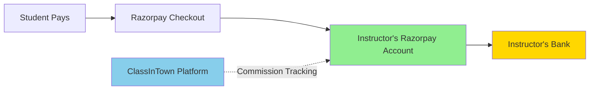

# Razorpay Integration Complete Roadmap
## ClassInTown Instructor Payment Gateway Setup

---

## 📋 Table of Contents

1. [Overview & Goal](#overview--goal)
2. [High-Level Integration Flow](#high-level-integration-flow)
3. [Phase 0: Business Rules & Prerequisites](#phase-0-business-rules--prerequisites)
4. [Phase 1: Technology Partner Setup](#phase-1-technology-partner-setup)
5. [Phase 2: OAuth Application Setup](#phase-2-oauth-application-setup)
6. [Phase 3: Instructor Data Collection](#phase-3-instructor-data-collection)
7. [Phase 4: Instructor Onboarding Paths](#phase-4-instructor-onboarding-paths)
8. [Phase 5: KYC Document Management](#phase-5-kyc-document-management)
9. [Phase 6: Payment Flow Implementation](#phase-6-payment-flow-implementation)
10. [Phase 7: Webhook Integration](#phase-7-webhook-integration)
11. [Phase 8: UI/UX Implementation](#phase-8-uiux-implementation)
12. [Phase 9: Testing & Launch](#phase-9-testing--launch)
13. [Phase 10: Support & Operations](#phase-10-support--operations)
14. [Troubleshooting & FAQs](#troubleshooting--faqs)

---

## Overview & Goal

### 🎯 What We're Building

**ClassInTown** will enable instructors to receive student payments directly into their own Razorpay accounts. We will:

- ✅ Create or connect instructor Razorpay accounts
- ✅ Handle KYC verification with minimal friction
- ✅ Obtain OAuth consent to operate on their behalf
- ✅ Process student payments directly to instructor accounts
- ✅ Track commissions separately (off-ledger initially)

### 💡 Why This Approach?

**Benefits:**
- Instructors control their own funds
- No money handling liability for ClassInTown
- Transparent payment flow
- Scalable for 1000s of instructors

---

## High-Level Integration Flow

### ⏱️ Estimated Timeline

| Phase | Duration | Type |
|-------|----------|------|
| Phase 0-2: Platform Setup | 1-2 weeks | One-time |
| Phase 3-4: Per Instructor Setup | 5-10 minutes | Per instructor |
| KYC Verification Wait Time | 1-3 days | External dependency |
| Phase 6-7: Payment Integration | 2-3 weeks | One-time |
| Phase 8: UI/UX | 1-2 weeks | One-time |
| Phase 9: Testing | 1 week | One-time |

--- 
