# Razorpay Integration Complete Roadmap
## ClassInTown Instructor Payment Gateway Setup

---

## 📋 Table of Contents

1. [Overview & Goal](#overview--goal)
2. [High-Level Integration Flow](#high-level-integration-flow)
3. [Phase 0: Business Rules & Prerequisites](#phase-0-business-rules--prerequisites)
4. [Phase 1: Technology Partner Setup](#phase-1-technology-partner-setup)
5. [Phase 2: OAuth Application Setup](#phase-2-oauth-application-setup)
6. [Phase 3: Instructor Data Collection](#phase-3-instructor-data-collection)
7. [Phase 4: Instructor Onboarding Paths](#phase-4-instructor-onboarding-paths)
8. [Phase 5: KYC Document Management](#phase-5-kyc-document-management)
9. [Phase 6: Payment Flow Implementation](#phase-6-payment-flow-implementation)
10. [Phase 7: Webhook Integration](#phase-7-webhook-integration)
11. [Phase 8: UI/UX Implementation](#phase-8-uiux-implementation)
12. [Phase 9: Testing & Launch](#phase-9-testing--launch)
13. [Phase 10: Support & Operations](#phase-10-support--operations)
14. [Troubleshooting & FAQs](#troubleshooting--faqs)

---

## Overview & Goal

### 🎯 What We're Building

**ClassInTown** will enable instructors to receive student payments directly into their own Razorpay accounts. We will:

- ✅ Create or connect instructor Razorpay accounts
- ✅ Handle KYC verification with minimal friction
- ✅ Obtain OAuth consent to operate on their behalf
- ✅ Process student payments directly to instructor accounts
- ✅ Track commissions separately (off-ledger initially)

### 💡 Why This Approach?


**Benefits:**
- Instructors control their own funds
- No money handling liability for ClassInTown
- Transparent payment flow
- Scalable for 1000s of instructors

---

## High-Level Integration Flow


### ⏱️ Estimated Timeline

| Phase | Duration | Type |
|-------|----------|------|
| Phase 0-2: Platform Setup | 1-2 weeks | One-time |
| Phase 3-4: Per Instructor Setup | 5-10 minutes | Per instructor |
| KYC Verification Wait Time | 1-3 days | External dependency |
| Phase 6-7: Payment Integration | 2-3 weeks | One-time |
| Phase 8: UI/UX | 1-2 weeks | One-time |
| Phase 9: Testing | 1 week | One-time |

--- 

---

## Phase 0: Business Rules & Prerequisites

### 📝 Decision Framework

Before touching any code or Razorpay settings, **decide and document** these business rules:


### ✅ Checklist: Business Decisions

| Decision Point | Options | Your Choice | Notes |
|---------------|---------|-------------|-------|
| **Who issues invoice to student?** | Platform / Instructor | ⬜ | OAuth model → typically instructor |
| **Commission %** | Fixed % | ⬜ | e.g., 10-20% |
| **Commission billing method** | Monthly invoice / Auto-deduct / Route splits | ⬜ | Start with monthly invoice |
| **Refund approval** | Platform / Instructor / Both | ⬜ | Define clear policy |
| **Commission on refunded payments** | Keep / Return / Partial | ⬜ | Document for disputes |
| **GST applicability** | Yes / No | ⬜ | Consult finance/legal |
| **Instructor contract terms** | - | ⬜ | Payment terms, liabilities |

### 📄 Document to Create

Create a **one-page policy document** with:

1. **Payment Terms:**
   - "Payments go directly to your Razorpay account"
   - "Settlement timing: per Razorpay's standard (T+2 or T+3 days)"
   
2. **Commission:**
   - "ClassInTown charges X% platform fee"
   - "Invoiced monthly via [method]"
   
3. **Refunds:**
   - "Refunds initiated by [who]"
   - "Platform fee: [kept/returned/partial]"
   
4. **Responsibilities:**
   - "Instructor issues tax invoice to student"
   - "ClassInTown provides payment infrastructure"

### ⏸️ **WAIT:** Do not proceed until this document is approved by finance & legal teams.

---

## Phase 1: Technology Partner Setup

### 🎯 Goal
Get approved as a Razorpay Technology Partner to access Partner APIs and OAuth capabilities.

### 📍 Status States

```mermaid
stateDiagram-v2
    [*] --> NotApplied
    NotApplied --> ApplicationSubmitted: Submit partner request
    ApplicationSubmitted --> UnderReview: Razorpay reviews
    UnderReview --> Approved: ✅ Approved
    UnderReview --> MoreInfoNeeded: ❓ Clarification needed
    MoreInfoNeeded --> UnderReview: Provide info
    Approved --> PartnerAccessEnabled: Access granted
    PartnerAccessEnabled --> [*]: Ready for Phase 2
    
    note right of Approved
        You receive Partner
        Dashboard credentials
    end note
```



### 📋 Step-by-Step Actions

#### Step 1.1: Prepare Your Application

**What you need ready:**

| Item | Description | Example |
|------|-------------|---------|
| Company Name | Legal entity name | ClassInTown Private Limited |
| Website URL | Live production URL | https://classintown.com |
| Business Model | Brief description | "Marketplace connecting students with instructors" |
| Use Case | Why you need Partner access | "To enable instructors to receive payments in their own accounts" |
| Expected Volume | Monthly GMV estimate | "₹10 lakh - ₹50 lakh/month" |
| Contact Person | Technical lead | Name, Email, Phone |

#### Step 1.2: Apply for Partner Access

**🔗 Action:** 

1. Visit: [Razorpay Partner Program](https://razorpay.com/partners/)
2. Click **"Become a Partner"** or **"Technology Partner"**
3. Fill the application form with data from Step 1.1
4. Submit

**⏸️ WAIT:** Razorpay will review (typically 3-5 business days)

#### Step 1.3: Respond to Queries

**Razorpay may ask:**
- Details about your tech stack
- How many merchants (instructors) you expect
- Security measures you have in place

**✅ Action:** Respond promptly via email/call with your tech lead

#### Step 1.4: Access Granted

**📧 You will receive:**
- Partner Dashboard URL
- Login credentials
- Partner Account ID (e.g., `partner_XXXXXXXX`)

**✅ Action:** 
1. Log in to Partner Dashboard
2. Bookmark the URL
3. Save credentials in your password manager
4. Note down your Partner Account ID

### 🎉 Completion Criteria

- ✅ Partner Dashboard access confirmed
- ✅ Partner Account ID saved
- ✅ Team has access to dashboard
- ✅ Ready to create OAuth application

**📸 Screenshot to keep:** Your Partner Dashboard home page showing your partner ID

--- 

---

## Phase 2: OAuth Application Setup

### 🎯 Goal
Create an OAuth application in Partner Dashboard to obtain Client ID, Client Secret, and configure redirect URLs.

### 🔐 What is OAuth?


### 📋 Step-by-Step Actions

#### Step 2.1: Plan Your Redirect URLs

**What is a redirect URL?**
After an instructor approves access on Razorpay, they're sent back to your app at this URL.

**Examples:**

| Environment | Redirect URL | When to use |
|-------------|--------------|-------------|
| Development | `http://localhost:4200/auth/razorpay/callback` | Local testing |
| Staging | `https://staging.classintown.com/auth/razorpay/callback` | QA testing |
| Production | `https://classintown.com/auth/razorpay/callback` | Live instructors |

**✅ Action:** Write down your redirect URLs for all environments

#### Step 2.2: Choose Required Scopes

**Scopes** = permissions your app needs on the instructor's Razorpay account.

| Scope | What it allows | Needed? |
|-------|----------------|---------|
| `read_write` | Create orders, read payments | ✅ Yes |
| `read_only` | Only view transactions | ❌ No |
| `refunds` | Process refunds | ✅ Yes |
| `settlements` | View settlement data | ⚠️ Optional |

**✅ Action:** Select scopes: `read_write` + `refunds` (minimum)

#### Step 2.3: Create OAuth Application

**🔗 Action:**

1. Log in to **Razorpay Partner Dashboard**
2. Navigate to: **Settings** → **OAuth Applications** or **API** section
3. Click **"Create New Application"**
4. Fill the form:

```
┌──────────────────────────────────────────────┐
│  Create OAuth Application                    │
├──────────────────────────────────────────────┤
│                                              │
│  Application Name:                           │
│  ┌────────────────────────────────────────┐ │
│  │ ClassInTown Instructor Payments        │ │
│  └────────────────────────────────────────┘ │
│                                              │
│  Description: (optional)                     │
│  ┌────────────────────────────────────────┐ │
│  │ Enables instructors to receive         │ │
│  │ student payments directly              │ │
│  └────────────────────────────────────────┘ │
│                                              │
│  Redirect URLs: (one per line)              │
│  ┌────────────────────────────────────────┐ │
│  │ https://classintown.com/auth/callback  │ │
│  │ https://staging.classintown.com/...    │ │
│  └────────────────────────────────────────┘ │
│                                              │
│  Scopes:                                     │
│  ☑ read_write                                │
│  ☑ refunds                                   │
│  ☐ settlements                               │
│                                              │
│          [Cancel]  [Create Application]      │
└──────────────────────────────────────────────┘
```

5. Click **"Create Application"**

**⏸️ WAIT:** Application is created instantly

#### Step 2.4: Save Credentials Securely

**📧 You will see:**

```
┌──────────────────────────────────────────────┐
│  Application Created Successfully!           │
├──────────────────────────────────────────────┤
│                                              │
│  Client ID:                                  │
│  ┌────────────────────────────────────────┐ │
│  │ client_NrK8xxxxxxxxxxxxxxxxxxx         │ │ ← Copy this
│  └────────────────────────────────────────┘ │
│                                              │
│  Client Secret:                              │
│  ┌────────────────────────────────────────┐ │
│  │ secret_L9Pyxxxxxxxxxxxxxxxxxxxxxxxxxx  │ │ ← Copy this (shown once!)
│  └────────────────────────────────────────┘ │
│                                              │
│  ⚠️ Store Client Secret securely.            │
│     You won't be able to see it again.      │
│                                              │
└──────────────────────────────────────────────┘
```

**✅ Action:**

1. **Copy Client ID** → paste into password manager
2. **Copy Client Secret** → paste into password manager (⚠️ won't show again!)
3. Store in your environment variables:
   ```
   RAZORPAY_CLIENT_ID=client_NrK8xxxxxxxxxxxxxxxxxxx
   RAZORPAY_CLIENT_SECRET=secret_L9Pyxxxxxxxxxxxxxxxxxxxxxxxxxx
   ```

#### Step 2.5: Test the OAuth URLs

**Authorization URL format:**
```
https://auth.razorpay.com/authorize
  ?client_id={YOUR_CLIENT_ID}
  &redirect_uri={YOUR_REDIRECT_URL}
  &scope=read_write,refunds
  &response_type=code
  &state={RANDOM_STRING}
```

**✅ Action:** Construct your URL and test in browser (you should see Razorpay login page)

### 🎉 Completion Criteria

- ✅ OAuth Application created
- ✅ Client ID saved securely
- ✅ Client Secret saved securely
- ✅ Redirect URLs configured
- ✅ Test URL loads Razorpay auth page
- ✅ Credentials added to your backend `.env` file

---

## Phase 3: Instructor Data Collection

### 🎯 Goal
Design a simple, friendly form to collect minimum data needed to create/connect a Razorpay account.

### 🧩 Data Architecture


### 📝 Data You Need to Collect

#### Minimum Fields (Required)

| Field | Type | Example | Why Needed |
|-------|------|---------|------------|
| **Full Legal Name** | Text | Riya Shah | Account creation, KYC |
| **Email Address** | Email | riya@example.com | Login, notifications |
| **Mobile Number** | Phone | +91 9876543210 | OTP, verification |
| **Business Type** | Dropdown | Individual / Sole Proprietor / Partnership / LLP / Company | KYC requirements differ |
| **Business Category** | Dropdown | Education → Coaching / Tutoring | Razorpay category |

#### Optional Fields (Helpful)

| Field | Type | Example | Why Helpful |
|-------|------|---------|-------------|
| **Trading Name** | Text | Riya's Music Classes | Display name (if different from legal) |
| **PAN Number** | Text | ABCDE1234F | Prefill KYC |
| **GST Number** | Text | 27XXXXX... | If registered |

### 🎨 UI Form Design


### 📄 Form Copy (User-Friendly)

#### Banner Text (Before Connection)

```
┌─────────────────────────────────────────────────────────┐
│ 💰 Get Paid Directly to Your Bank                       │
│                                                          │
│ Connect your Razorpay account to receive student        │
│ payments directly. Setup takes 5-10 minutes.            │
│                                                          │
│             [🔗 Connect Razorpay Account]                │
│                                                          │
│ ℹ️ Don't have Razorpay? We'll create one for you.       │
└─────────────────────────────────────────────────────────┘
```

#### Form Fields

```html
┌─────────────────────────────────────────────────────────┐
│  Step 1: Your Basic Information                         │
├─────────────────────────────────────────────────────────┤
│                                                          │
│  Full Legal Name (as per PAN) *                         │
│  ┌────────────────────────────────────────────────┐    │
│  │ Riya Shah                                       │    │
│  └────────────────────────────────────────────────┘    │
│                                                          │
│  Email Address *                                         │
│  ┌────────────────────────────────────────────────┐    │
│  │ riya.shah@example.com                          │    │
│  └────────────────────────────────────────────────┘    │
│                                                          │
│  Mobile Number *                                         │
│  ┌────────────────────────────────────────────────┐    │
│  │ +91 9876543210                                 │    │
│  └────────────────────────────────────────────────┘    │
│                                                          │
│  Business Type *                                         │
│  ┌────────────────────────────────────────────────┐    │
│  │ Individual ▼                                    │    │
│  └────────────────────────────────────────────────┘    │
│    Options: Individual / Sole Proprietor / Partnership  │
│             / LLP / Private Limited / Public Limited    │
│                                                          │
│  Business Category *                                     │
│  ┌────────────────────────────────────────────────┐    │
│  │ Education → Coaching & Tutoring ▼              │    │
│  └────────────────────────────────────────────────┘    │
│                                                          │
│  Trading Name (if different from your name)              │
│  ┌────────────────────────────────────────────────┐    │
│  │ Riya's Music Academy                           │    │
│  └────────────────────────────────────────────────┘    │
│                                                          │
│  ━━━━━━━━━━━━━━━━━━━━━━━━━━━━━━━━━━━━━━━━━━━━━━━━    │
│                                                          │
│  ☐ I already have a Razorpay account                    │
│                                                          │
│         [← Back]              [Continue →]               │
│                                                          │
└─────────────────────────────────────────────────────────┘
```

### 🗄️ Database Schema Update

**Add table: `razorpay_connections`**

```sql
CREATE TABLE razorpay_connections (
  id INT PRIMARY KEY AUTO_INCREMENT,
  instructor_id INT NOT NULL,
  
  -- Basic info
  business_type VARCHAR(50),
  business_category VARCHAR(100),
  trading_name VARCHAR(255),
  
  -- Razorpay identifiers
  razorpay_account_id VARCHAR(100) UNIQUE,
  
  -- OAuth tokens
  access_token TEXT,
  refresh_token TEXT,
  token_expiry DATETIME,
  
  -- Status tracking
  connection_status ENUM('not_connected', 'pending', 'connected', 'revoked') DEFAULT 'not_connected',
  kyc_status ENUM('not_started', 'pending', 'under_review', 'verified', 'rejected') DEFAULT 'not_started',
  
  -- Onboarding
  onboarding_url TEXT,
  onboarding_completed_at DATETIME,
  
  -- Timestamps
  created_at DATETIME DEFAULT CURRENT_TIMESTAMP,
  updated_at DATETIME DEFAULT CURRENT_TIMESTAMP ON UPDATE CURRENT_TIMESTAMP,
  
  FOREIGN KEY (instructor_id) REFERENCES instructors(id) ON DELETE CASCADE,
  INDEX idx_instructor (instructor_id),
  INDEX idx_razorpay_account (razorpay_account_id)
);
```

### 🎉 Completion Criteria

- ✅ Form UI designed and implemented
- ✅ Database table created
- ✅ Validation rules added (email format, phone format, required fields)
- ✅ Friendly error messages written
- ✅ "Already have account" checkbox logic implemented
- ✅ Data saves to database before Razorpay API calls

--- 
