# Razorpay Integration Complete Roadmap
## ClassInTown Instructor Payment Gateway Setup

---

## 📋 Table of Contents

1. [Overview & Goal](#overview--goal)
2. [High-Level Integration Flow](#high-level-integration-flow)
3. [Phase 0: Business Rules & Prerequisites](#phase-0-business-rules--prerequisites)
4. [Phase 1: Technology Partner Setup](#phase-1-technology-partner-setup)
5. [Phase 2: OAuth Application Setup](#phase-2-oauth-application-setup)
6. [Phase 3: Instructor Data Collection](#phase-3-instructor-data-collection)
7. [Phase 4: Instructor Onboarding Paths](#phase-4-instructor-onboarding-paths)
8. [Phase 5: KYC Document Management](#phase-5-kyc-document-management)
9. [Phase 6: Payment Flow Implementation](#phase-6-payment-flow-implementation)
10. [Phase 7: Webhook Integration](#phase-7-webhook-integration)
11. [Phase 8: UI/UX Implementation](#phase-8-uiux-implementation)
12. [Phase 9: Testing & Launch](#phase-9-testing--launch)
13. [Phase 10: Support & Operations](#phase-10-support--operations)
14. [Troubleshooting & FAQs](#troubleshooting--faqs)

---

## Overview & Goal

### 🎯 What We're Building

**ClassInTown** will enable instructors to receive student payments directly into their own Razorpay accounts. We will:

- ✅ Create or connect instructor Razorpay accounts
- ✅ Handle KYC verification with minimal friction
- ✅ Obtain OAuth consent to operate on their behalf
- ✅ Process student payments directly to instructor accounts
- ✅ Track commissions separately (off-ledger initially)

### 💡 Why This Approach?


**Benefits:**
- Instructors control their own funds
- No money handling liability for ClassInTown
- Transparent payment flow
- Scalable for 1000s of instructors

---

## High-Level Integration Flow


### ⏱️ Estimated Timeline

| Phase | Duration | Type |
|-------|----------|------|
| Phase 0-2: Platform Setup | 1-2 weeks | One-time |
| Phase 3-4: Per Instructor Setup | 5-10 minutes | Per instructor |
| KYC Verification Wait Time | 1-3 days | External dependency |
| Phase 6-7: Payment Integration | 2-3 weeks | One-time |
| Phase 8: UI/UX | 1-2 weeks | One-time |
| Phase 9: Testing | 1 week | One-time |

--- 

---

## Phase 0: Business Rules & Prerequisites

### 📝 Decision Framework

Before touching any code or Razorpay settings, **decide and document** these business rules:


### ✅ Checklist: Business Decisions

| Decision Point | Options | Your Choice | Notes |
|---------------|---------|-------------|-------|
| **Who issues invoice to student?** | Platform / Instructor | ⬜ | OAuth model → typically instructor |
| **Commission %** | Fixed % | ⬜ | e.g., 10-20% |
| **Commission billing method** | Monthly invoice / Auto-deduct / Route splits | ⬜ | Start with monthly invoice |
| **Refund approval** | Platform / Instructor / Both | ⬜ | Define clear policy |
| **Commission on refunded payments** | Keep / Return / Partial | ⬜ | Document for disputes |
| **GST applicability** | Yes / No | ⬜ | Consult finance/legal |
| **Instructor contract terms** | - | ⬜ | Payment terms, liabilities |

### 📄 Document to Create

Create a **one-page policy document** with:

1. **Payment Terms:**
   - "Payments go directly to your Razorpay account"
   - "Settlement timing: per Razorpay's standard (T+2 or T+3 days)"
   
2. **Commission:**
   - "ClassInTown charges X% platform fee"
   - "Invoiced monthly via [method]"
   
3. **Refunds:**
   - "Refunds initiated by [who]"
   - "Platform fee: [kept/returned/partial]"
   
4. **Responsibilities:**
   - "Instructor issues tax invoice to student"
   - "ClassInTown provides payment infrastructure"

### ⏸️ **WAIT:** Do not proceed until this document is approved by finance & legal teams.

---

## Phase 1: Technology Partner Setup

### 🎯 Goal
Get approved as a Razorpay Technology Partner to access Partner APIs and OAuth capabilities.

### 📍 Status States

```mermaid
stateDiagram-v2
    [*] --> NotApplied
    NotApplied --> ApplicationSubmitted: Submit partner request
    ApplicationSubmitted --> UnderReview: Razorpay reviews
    UnderReview --> Approved: ✅ Approved
    UnderReview --> MoreInfoNeeded: ❓ Clarification needed
    MoreInfoNeeded --> UnderReview: Provide info
    Approved --> PartnerAccessEnabled: Access granted
    PartnerAccessEnabled --> [*]: Ready for Phase 2
    
    note right of Approved
        You receive Partner
        Dashboard credentials
    end note
```



### 📋 Step-by-Step Actions

#### Step 1.1: Prepare Your Application

**What you need ready:**

| Item | Description | Example |
|------|-------------|---------|
| Company Name | Legal entity name | ClassInTown Private Limited |
| Website URL | Live production URL | https://classintown.com |
| Business Model | Brief description | "Marketplace connecting students with instructors" |
| Use Case | Why you need Partner access | "To enable instructors to receive payments in their own accounts" |
| Expected Volume | Monthly GMV estimate | "₹10 lakh - ₹50 lakh/month" |
| Contact Person | Technical lead | Name, Email, Phone |

#### Step 1.2: Apply for Partner Access

**🔗 Action:** 

1. Visit: [Razorpay Partner Program](https://razorpay.com/partners/)
2. Click **"Become a Partner"** or **"Technology Partner"**
3. Fill the application form with data from Step 1.1
4. Submit

**⏸️ WAIT:** Razorpay will review (typically 3-5 business days)

#### Step 1.3: Respond to Queries

**Razorpay may ask:**
- Details about your tech stack
- How many merchants (instructors) you expect
- Security measures you have in place

**✅ Action:** Respond promptly via email/call with your tech lead

#### Step 1.4: Access Granted

**📧 You will receive:**
- Partner Dashboard URL
- Login credentials
- Partner Account ID (e.g., `partner_XXXXXXXX`)

**✅ Action:** 
1. Log in to Partner Dashboard
2. Bookmark the URL
3. Save credentials in your password manager
4. Note down your Partner Account ID

### 🎉 Completion Criteria

- ✅ Partner Dashboard access confirmed
- ✅ Partner Account ID saved
- ✅ Team has access to dashboard
- ✅ Ready to create OAuth application

**📸 Screenshot to keep:** Your Partner Dashboard home page showing your partner ID

--- 

---

## Phase 2: OAuth Application Setup

### 🎯 Goal
Create an OAuth application in Partner Dashboard to obtain Client ID, Client Secret, and configure redirect URLs.

### 🔐 What is OAuth?


### 📋 Step-by-Step Actions

#### Step 2.1: Plan Your Redirect URLs

**What is a redirect URL?**
After an instructor approves access on Razorpay, they're sent back to your app at this URL.

**Examples:**

| Environment | Redirect URL | When to use |
|-------------|--------------|-------------|
| Development | `http://localhost:4200/auth/razorpay/callback` | Local testing |
| Staging | `https://staging.classintown.com/auth/razorpay/callback` | QA testing |
| Production | `https://classintown.com/auth/razorpay/callback` | Live instructors |

**✅ Action:** Write down your redirect URLs for all environments

#### Step 2.2: Choose Required Scopes

**Scopes** = permissions your app needs on the instructor's Razorpay account.

| Scope | What it allows | Needed? |
|-------|----------------|---------|
| `read_write` | Create orders, read payments | ✅ Yes |
| `read_only` | Only view transactions | ❌ No |
| `refunds` | Process refunds | ✅ Yes |
| `settlements` | View settlement data | ⚠️ Optional |

**✅ Action:** Select scopes: `read_write` + `refunds` (minimum)

#### Step 2.3: Create OAuth Application

**🔗 Action:**

1. Log in to **Razorpay Partner Dashboard**
2. Navigate to: **Settings** → **OAuth Applications** or **API** section
3. Click **"Create New Application"**
4. Fill the form:

```
┌──────────────────────────────────────────────┐
│  Create OAuth Application                    │
├──────────────────────────────────────────────┤
│                                              │
│  Application Name:                           │
│  ┌────────────────────────────────────────┐ │
│  │ ClassInTown Instructor Payments        │ │
│  └────────────────────────────────────────┘ │
│                                              │
│  Description: (optional)                     │
│  ┌────────────────────────────────────────┐ │
│  │ Enables instructors to receive         │ │
│  │ student payments directly              │ │
│  └────────────────────────────────────────┘ │
│                                              │
│  Redirect URLs: (one per line)              │
│  ┌────────────────────────────────────────┐ │
│  │ https://classintown.com/auth/callback  │ │
│  │ https://staging.classintown.com/...    │ │
│  └────────────────────────────────────────┘ │
│                                              │
│  Scopes:                                     │
│  ☑ read_write                                │
│  ☑ refunds                                   │
│  ☐ settlements                               │
│                                              │
│          [Cancel]  [Create Application]      │
└──────────────────────────────────────────────┘
```

5. Click **"Create Application"**

**⏸️ WAIT:** Application is created instantly

#### Step 2.4: Save Credentials Securely

**📧 You will see:**

```
┌──────────────────────────────────────────────┐
│  Application Created Successfully!           │
├──────────────────────────────────────────────┤
│                                              │
│  Client ID:                                  │
│  ┌────────────────────────────────────────┐ │
│  │ client_NrK8xxxxxxxxxxxxxxxxxxx         │ │ ← Copy this
│  └────────────────────────────────────────┘ │
│                                              │
│  Client Secret:                              │
│  ┌────────────────────────────────────────┐ │
│  │ secret_L9Pyxxxxxxxxxxxxxxxxxxxxxxxxxx  │ │ ← Copy this (shown once!)
│  └────────────────────────────────────────┘ │
│                                              │
│  ⚠️ Store Client Secret securely.            │
│     You won't be able to see it again.      │
│                                              │
└──────────────────────────────────────────────┘
```

**✅ Action:**

1. **Copy Client ID** → paste into password manager
2. **Copy Client Secret** → paste into password manager (⚠️ won't show again!)
3. Store in your environment variables:
   ```
   RAZORPAY_CLIENT_ID=client_NrK8xxxxxxxxxxxxxxxxxxx
   RAZORPAY_CLIENT_SECRET=secret_L9Pyxxxxxxxxxxxxxxxxxxxxxxxxxx
   ```

#### Step 2.5: Test the OAuth URLs

**Authorization URL format:**
```
https://auth.razorpay.com/authorize
  ?client_id={YOUR_CLIENT_ID}
  &redirect_uri={YOUR_REDIRECT_URL}
  &scope=read_write,refunds
  &response_type=code
  &state={RANDOM_STRING}
```

**✅ Action:** Construct your URL and test in browser (you should see Razorpay login page)

### 🎉 Completion Criteria

- ✅ OAuth Application created
- ✅ Client ID saved securely
- ✅ Client Secret saved securely
- ✅ Redirect URLs configured
- ✅ Test URL loads Razorpay auth page
- ✅ Credentials added to your backend `.env` file

---

## Phase 3: Instructor Data Collection

### 🎯 Goal
Design a simple, friendly form to collect minimum data needed to create/connect a Razorpay account.

### 🧩 Data Architecture


### 📝 Data You Need to Collect

#### Minimum Fields (Required)

| Field | Type | Example | Why Needed |
|-------|------|---------|------------|
| **Full Legal Name** | Text | Riya Shah | Account creation, KYC |
| **Email Address** | Email | riya@example.com | Login, notifications |
| **Mobile Number** | Phone | +91 9876543210 | OTP, verification |
| **Business Type** | Dropdown | Individual / Sole Proprietor / Partnership / LLP / Company | KYC requirements differ |
| **Business Category** | Dropdown | Education → Coaching / Tutoring | Razorpay category |

#### Optional Fields (Helpful)

| Field | Type | Example | Why Helpful |
|-------|------|---------|-------------|
| **Trading Name** | Text | Riya's Music Classes | Display name (if different from legal) |
| **PAN Number** | Text | ABCDE1234F | Prefill KYC |
| **GST Number** | Text | 27XXXXX... | If registered |

### 🎨 UI Form Design


### 📄 Form Copy (User-Friendly)

#### Banner Text (Before Connection)

```
┌─────────────────────────────────────────────────────────┐
│ 💰 Get Paid Directly to Your Bank                       │
│                                                          │
│ Connect your Razorpay account to receive student        │
│ payments directly. Setup takes 5-10 minutes.            │
│                                                          │
│             [🔗 Connect Razorpay Account]                │
│                                                          │
│ ℹ️ Don't have Razorpay? We'll create one for you.       │
└─────────────────────────────────────────────────────────┘
```

#### Form Fields

```html
┌─────────────────────────────────────────────────────────┐
│  Step 1: Your Basic Information                         │
├─────────────────────────────────────────────────────────┤
│                                                          │
│  Full Legal Name (as per PAN) *                         │
│  ┌────────────────────────────────────────────────┐    │
│  │ Riya Shah                                       │    │
│  └────────────────────────────────────────────────┘    │
│                                                          │
│  Email Address *                                         │
│  ┌────────────────────────────────────────────────┐    │
│  │ riya.shah@example.com                          │    │
│  └────────────────────────────────────────────────┘    │
│                                                          │
│  Mobile Number *                                         │
│  ┌────────────────────────────────────────────────┐    │
│  │ +91 9876543210                                 │    │
│  └────────────────────────────────────────────────┘    │
│                                                          │
│  Business Type *                                         │
│  ┌────────────────────────────────────────────────┐    │
│  │ Individual ▼                                    │    │
│  └────────────────────────────────────────────────┘    │
│    Options: Individual / Sole Proprietor / Partnership  │
│             / LLP / Private Limited / Public Limited    │
│                                                          │
│  Business Category *                                     │
│  ┌────────────────────────────────────────────────┐    │
│  │ Education → Coaching & Tutoring ▼              │    │
│  └────────────────────────────────────────────────┘    │
│                                                          │
│  Trading Name (if different from your name)              │
│  ┌────────────────────────────────────────────────┐    │
│  │ Riya's Music Academy                           │    │
│  └────────────────────────────────────────────────┘    │
│                                                          │
│  ━━━━━━━━━━━━━━━━━━━━━━━━━━━━━━━━━━━━━━━━━━━━━━━━    │
│                                                          │
│  ☐ I already have a Razorpay account                    │
│                                                          │
│         [← Back]              [Continue →]               │
│                                                          │
└─────────────────────────────────────────────────────────┘
```

### 🗄️ Database Schema Update

**Add table: `razorpay_connections`**

```sql
CREATE TABLE razorpay_connections (
  id INT PRIMARY KEY AUTO_INCREMENT,
  instructor_id INT NOT NULL,
  
  -- Basic info
  business_type VARCHAR(50),
  business_category VARCHAR(100),
  trading_name VARCHAR(255),
  
  -- Razorpay identifiers
  razorpay_account_id VARCHAR(100) UNIQUE,
  
  -- OAuth tokens
  access_token TEXT,
  refresh_token TEXT,
  token_expiry DATETIME,
  
  -- Status tracking
  connection_status ENUM('not_connected', 'pending', 'connected', 'revoked') DEFAULT 'not_connected',
  kyc_status ENUM('not_started', 'pending', 'under_review', 'verified', 'rejected') DEFAULT 'not_started',
  
  -- Onboarding
  onboarding_url TEXT,
  onboarding_completed_at DATETIME,
  
  -- Timestamps
  created_at DATETIME DEFAULT CURRENT_TIMESTAMP,
  updated_at DATETIME DEFAULT CURRENT_TIMESTAMP ON UPDATE CURRENT_TIMESTAMP,
  
  FOREIGN KEY (instructor_id) REFERENCES instructors(id) ON DELETE CASCADE,
  INDEX idx_instructor (instructor_id),
  INDEX idx_razorpay_account (razorpay_account_id)
);
```

### 🎉 Completion Criteria

- ✅ Form UI designed and implemented
- ✅ Database table created
- ✅ Validation rules added (email format, phone format, required fields)
- ✅ Friendly error messages written
- ✅ "Already have account" checkbox logic implemented
- ✅ Data saves to database before Razorpay API calls

--- 

---

## Phase 4: Instructor Onboarding Paths

### 🎯 Goal
Handle two scenarios: instructors with existing Razorpay accounts (Path A) and instructors without accounts (Path B - your main case).

### 🔀 Path Decision Tree

```mermaid
flowchart TD
    Start([Instructor Submits Form]) --> A{Already has Razorpay?}
    
    A -->|✅ Yes - Checked box| PathA[PATH A: Connect Existing]
    A -->|❌ No - Unchecked| PathB[PATH B: Create New Account]
    
    PathA --> A1[Redirect to OAuth]
    A1 --> A2[Instructor Logs In]
    A2 --> A3[Approves Access]
    A3 --> A4[Receive Auth Code]
    A4 --> A5[Exchange for Token]
    A5 --> A6[Store Token]
    A6 --> A7{KYC Already Verified?}
    A7 -->|Yes| A8[✅ Ready for Payments]
    A7 -->|No| A9[Show KYC Pending Message]
    
    PathB --> B1[Create Account via API]
    B1 --> B2[Get Account ID]
    B2 --> B3[Generate Onboarding URL]
    B3 --> B4[Send URL to Instructor]
    B4 --> B5[Instructor Uploads Docs]
    B5 --> B6[⏸️ Wait for Verification]
    B6 --> B7{Verified?}
    B7 -->|No| B6
    B7 -->|Yes| B8[Request OAuth Access]
    B8 --> A1
    
    style PathA fill:#87CEEB
    style PathB fill:#98FB98
    style A8 fill:#90EE90
    style B6 fill:#FFE4B5
```



---

### 🅰️ PATH A: Connect Existing Razorpay Account

**When to use:** Instructor checked "I already have a Razorpay account"

#### Step A.1: Initiate OAuth Flow

**✅ Action (Your Backend):**

When instructor clicks "Connect Razorpay", generate authorization URL:

```javascript
const authUrl = `https://auth.razorpay.com/authorize?` +
  `client_id=${RAZORPAY_CLIENT_ID}` +
  `&redirect_uri=${REDIRECT_URL}` +
  `&scope=read_write,refunds` +
  `&response_type=code` +
  `&state=${uniqueStateToken}`; // Random string to prevent CSRF

// Redirect instructor to authUrl
```

**What instructor sees:**

```
┌──────────────────────────────────────────────┐
│  🔐 Razorpay Login                            │
├──────────────────────────────────────────────┤
│                                              │
│  Log in to authorize ClassInTown             │
│                                              │
│  Email/Phone:                                │
│  ┌────────────────────────────────────────┐ │
│  │ riya@example.com                       │ │
│  └────────────────────────────────────────┘ │
│                                              │
│  Password:                                   │
│  ┌────────────────────────────────────────┐ │
│  │ ••••••••••                             │ │
│  └────────────────────────────────────────┘ │
│                                              │
│              [Login & Continue]              │
│                                              │
└──────────────────────────────────────────────┘
```

**⏸️ WAIT:** Instructor logs in on Razorpay

#### Step A.2: Instructor Approves Access

**What instructor sees after login:**

```
┌──────────────────────────────────────────────┐
│  ClassInTown wants to access your account   │
├──────────────────────────────────────────────┤
│                                              │
│  ClassInTown is requesting permission to:   │
│                                              │
│  ✓ Create payment orders                    │
│  ✓ View payment details                     │
│  ✓ Process refunds                          │
│                                              │
│  You can revoke access anytime from your    │
│  Razorpay Dashboard settings.               │
│                                              │
│         [Deny]          [Allow Access]       │
│                                              │
└──────────────────────────────────────────────┘
```

**⏸️ WAIT:** Instructor clicks "Allow Access"

#### Step A.3: Handle OAuth Callback

**What happens:**

Razorpay redirects instructor back to your redirect URL:

```
https://classintown.com/auth/razorpay/callback
  ?code=auth_code_xxxxxxxxxxxxxx
  &state=your_state_token
```

**✅ Action (Your Backend):**

1. **Verify state token** (matches what you sent)
2. **Exchange authorization code for access token:**

```javascript
// POST to Razorpay token endpoint
POST https://auth.razorpay.com/token
Headers:
  Content-Type: application/json
Body:
{
  "grant_type": "authorization_code",
  "code": "auth_code_xxxxxxxxxxxxxx",
  "client_id": "your_client_id",
  "client_secret": "your_client_secret",
  "redirect_uri": "https://classintown.com/auth/razorpay/callback"
}

// Response:
{
  "access_token": "rzp_live_xxxxxxxxxxxxxxxxx",
  "refresh_token": "rzp_refresh_xxxxxxxxxxxxx",
  "expires_in": 3600,
  "token_type": "Bearer",
  "merchant_id": "acc_ABC123xyz"
}
```

3. **Store in database:**

```sql
UPDATE razorpay_connections
SET 
  razorpay_account_id = 'acc_ABC123xyz',
  access_token = 'encrypted_access_token',
  refresh_token = 'encrypted_refresh_token',
  token_expiry = NOW() + INTERVAL 3600 SECOND,
  connection_status = 'connected'
WHERE instructor_id = ?;
```

4. **Check KYC status** (optional immediate check):

```javascript
// GET merchant details
GET https://api.razorpay.com/v2/accounts/{merchant_id}
Authorization: Bearer {access_token}

// Response includes:
{
  "id": "acc_ABC123xyz",
  "status": "activated", // or "created", "under_review"
  "kyc": {
    "status": "verified" // or "pending", "under_review"
  }
}
```

5. **Update KYC status in your DB**

#### Step A.4: Show Success Message

**What instructor sees:**

```
┌──────────────────────────────────────────────┐
│  ✅ Razorpay Connected Successfully!         │
├──────────────────────────────────────────────┤
│                                              │
│  Account: acc_ABC123xyz                      │
│  Status: Connected                           │
│  KYC: Verified ✓                            │
│                                              │
│  You can now accept student payments.       │
│                                              │
│              [Go to Dashboard]               │
│                                              │
└──────────────────────────────────────────────┘
```

**Path A Complete!** ✅

---

### 🅱️ PATH B: Create New Razorpay Account

**When to use:** Instructor did NOT check "I already have a Razorpay account"


#### Step B.1: Create Razorpay Account on Behalf of Instructor

**✅ Action (Your Backend):**

Call Razorpay Partner API to create account:

```javascript
POST https://api.razorpay.com/v2/accounts
Authorization: Basic {base64(partner_key_id:partner_key_secret)}
Content-Type: application/json

Body:
{
  "email": "riya@example.com",
  "phone": "+919876543210",
  "type": "route", // Use "route" for partner accounts
  "legal_info": {
    "pan": "ABCDE1234F", // Optional, if collected
    "gst": "27XXXXX..." // Optional, if applicable
  },
  "brand": {
    "color": "#FF6B6B" // Your brand color (optional)
  },
  "notes": {
    "instructor_id": "123",
    "source": "ClassInTown"
  },
  "legal_business_name": "Riya Shah",
  "business_type": "individual", // or "partnership", "llp", etc.
  "contact_name": "Riya Shah",
  "profile": {
    "category": "education",
    "subcategory": "coaching_and_tutoring"
  }
}

// Response:
{
  "id": "acc_XYZ789abc",
  "type": "route",
  "status": "created",
  "email": "riya@example.com",
  "created_at": 1640000000
}
```

**⏸️ WAIT:** API responds (usually < 2 seconds)

**✅ Action:** Save account ID to database:

```sql
UPDATE razorpay_connections
SET 
  razorpay_account_id = 'acc_XYZ789abc',
  connection_status = 'pending',
  kyc_status = 'not_started'
WHERE instructor_id = ?;
```

#### Step B.2: Generate Hosted Onboarding Link

**✅ Action (Your Backend):**

Request custom onboarding URL:

```javascript
POST https://api.razorpay.com/v2/accounts/{account_id}/onboarding
Authorization: Basic {base64(partner_key_id:partner_key_secret)}
Content-Type: application/json

Body:
{
  "send_sms": false, // We'll send the link ourselves
  "send_email": false, // We'll send the link ourselves
  "custom_branding": true,
  "redirect_url": "https://classintown.com/payments/onboarding-success"
}

// Response:
{
  "url": "https://onboarding.razorpay.com/abcd1234xyz",
  "expires_at": 1640086400
}
```

**✅ Action:** Save URL and show to instructor:

```sql
UPDATE razorpay_connections
SET 
  onboarding_url = 'https://onboarding.razorpay.com/abcd1234xyz',
  kyc_status = 'pending'
WHERE instructor_id = ?;
```

#### Step B.3: Send Onboarding Link to Instructor

**Via In-App Notification:**

```
┌──────────────────────────────────────────────┐
│  📝 Complete Your Payment Setup              │
├──────────────────────────────────────────────┤
│                                              │
│  We've created your Razorpay account!       │
│                                              │
│  Next step: Upload your documents           │
│  (PAN, ID proof, bank details)              │
│                                              │
│  This takes 5-10 minutes.                   │
│                                              │
│         [Complete KYC Documents →]           │
│                                              │
│  Link expires in 7 days.                    │
│                                              │
└──────────────────────────────────────────────┘
```

**Via Email:**

```
Subject: Complete Your Razorpay Setup - ClassInTown

Hi Riya,

Your payment account is almost ready! 

Click below to upload your documents and start receiving payments:

[Complete Setup] → https://onboarding.razorpay.com/abcd1234xyz

What you'll need:
• PAN card
• ID proof (Aadhaar/Passport/Driving License)
• Bank account proof (Cancelled cheque or statement)

This should take about 5-10 minutes.

Once verified, student payments will flow directly to your bank account.

Need help? Reply to this email.

- ClassInTown Team
```

**⏸️ WAIT:** Instructor clicks link

#### Step B.4: Instructor Completes Onboarding

**What instructor sees on Razorpay's hosted page:**

```
┌──────────────────────────────────────────────┐
│  🏦 Complete Your Business Profile           │
│  Powered by Razorpay | ClassInTown           │
├──────────────────────────────────────────────┤
│                                              │
│  Step 1 of 3: Business Details ✓            │
│  (Already filled by ClassInTown)            │
│                                              │
│  Step 2 of 3: Upload Documents ←            │
│                                              │
│  PAN Number                                  │
│  ┌────────────────────────────────────────┐ │
│  │ ABCDE1234F                             │ │ (prefilled)
│  └────────────────────────────────────────┘ │
│                                              │
│  PAN Card Image                              │
│  ┌────────────────────────────────────────┐ │
│  │    [📎 Upload File]                    │ │
│  └────────────────────────────────────────┘ │
│                                              │
│  ID Proof (Aadhaar/Passport/DL)             │
│  ┌────────────────────────────────────────┐ │
│  │    [📎 Upload File]                    │ │
│  └────────────────────────────────────────┘ │
│                                              │
│  Bank Account Number                         │
│  ┌────────────────────────────────────────┐ │
│  │ 1234567890                             │ │
│  └────────────────────────────────────────┘ │
│                                              │
│  IFSC Code                                   │
│  ┌────────────────────────────────────────┐ │
│  │ SBIN0001234                            │ │
│  └────────────────────────────────────────┘ │
│                                              │
│  Bank Proof (Cancelled Cheque/Statement)     │
│  ┌────────────────────────────────────────┐ │
│  │    [📎 Upload File]                    │ │
│  └────────────────────────────────────────┘ │
│                                              │
│  Step 3 of 3: Review & Submit               │
│                                              │
│         [← Back]      [Save & Continue]      │
│                                              │
└──────────────────────────────────────────────┘
```

Instructor uploads all documents and clicks **"Submit for Verification"**

**What instructor sees after submission:**

```
┌──────────────────────────────────────────────┐
│  ✅ Documents Submitted Successfully!        │
├──────────────────────────────────────────────┤
│                                              │
│  Your documents are under review.           │
│                                              │
│  Verification usually takes 1-2 business    │
│  days. We'll email you once approved.       │
│                                              │
│  You can close this page now.               │
│                                              │
│              [Return to ClassInTown]         │
│                                              │
└──────────────────────────────────────────────┘
```

**⏸️ WAIT:** Razorpay verifies documents (1-3 business days)

#### Step B.5: Listen for Verification Webhook

**Razorpay will send webhook to your endpoint:**

```javascript
POST https://classintown.com/webhooks/razorpay
Headers:
  X-Razorpay-Signature: {signature}
Body:
{
  "event": "account.activated",
  "payload": {
    "account": {
      "id": "acc_XYZ789abc",
      "status": "activated",
      "kyc": {
        "status": "verified"
      }
    }
  }
}
```

**✅ Action (Your Backend):**

```javascript
// Verify webhook signature first!
// Then update database:
UPDATE razorpay_connections
SET 
  kyc_status = 'verified',
  connection_status = 'pending' // Still need OAuth
WHERE razorpay_account_id = 'acc_XYZ789abc';

// Send notification to instructor
sendEmail({
  to: instructor.email,
  subject: "KYC Approved! Complete Final Step",
  body: "Your documents are verified. Click here to authorize ClassInTown..."
});
```

#### Step B.6: Request OAuth Authorization

**Show in instructor dashboard:**

```
┌──────────────────────────────────────────────┐
│  🎉 KYC Verified!                            │
├──────────────────────────────────────────────┤
│                                              │
│  Your Razorpay account is verified.         │
│                                              │
│  Last step: Authorize ClassInTown to        │
│  process payments on your behalf.           │
│                                              │
│         [🔐 Authorize Access Now]            │
│                                              │
│  This is secure and can be revoked anytime. │
│                                              │
└──────────────────────────────────────────────┘
```

When instructor clicks **"Authorize Access Now"**, follow **Path A steps A.1 to A.4** (OAuth flow).

**Path B Complete!** ✅

---

### 🔄 Status Flow Chart


### 🎉 Completion Criteria

- ✅ Path A (existing account) OAuth flow implemented
- ✅ Path B (create account) API integration complete
- ✅ Onboarding link generation working
- ✅ Email/SMS templates created
- ✅ Webhook endpoint for `account.activated` set up
- ✅ Database status tracking implemented
- ✅ UI shows correct status for each stage
- ✅ Error handling for rejected KYC

--- 

---

## Phase 5: KYC Document Management

### 🎯 Goal
Understand KYC requirements, prepare instructors, and handle document verification issues.

### 📄 Document Requirements by Business Type


### 📋 Detailed Document Checklist

#### For Individual / Sole Proprietor (Most Instructors)

| Document | Accepted Types | Format | Size Limit | Notes |
|----------|---------------|--------|------------|-------|
| **PAN Card** | PAN card photocopy | JPG, PNG, PDF | < 5 MB | Must be readable, name visible |
| **ID Proof** | Aadhaar / Passport / Driving License / Voter ID | JPG, PNG, PDF | < 5 MB | Front & back both sides |
| **Address Proof** | Same as ID proof | JPG, PNG, PDF | < 5 MB | Can be same as ID |
| **Bank Proof** | Cancelled cheque / Bank statement (first page) / Passbook | JPG, PNG, PDF | < 5 MB | Must show name + account number + IFSC |

#### For LLP / Private Limited / Partnership

| Document | Required | Notes |
|----------|----------|-------|
| **Certificate of Incorporation** | ✅ Yes | For company/LLP |
| **Partnership Deed** | ✅ Yes | For partnership |
| **PAN of Entity** | ✅ Yes | Company/Firm PAN |
| **GST Certificate** | ⚠️ If registered | If turnover > threshold |
| **Authorized Signatory ID** | ✅ Yes | Director/Partner Aadhaar/Passport |
| **Bank Proof** | ✅ Yes | Current account preferred |
| **Board Resolution** | ⚠️ Sometimes | Authorizing signatory |

### 🔍 Common Rejection Reasons & Fixes


### 💬 Support Copy for Instructors

#### What is "Bank Proof"?

```
Q: What should I upload as bank proof?

A: Any ONE of these:
   • Cancelled cheque with your name printed on it
   • Bank statement (first page showing your name, account number, IFSC)
   • Passbook front page
   • Bank account verification letter

Make sure it's clear and all details are readable!
```

#### Document Quality Guidelines

```
✅ DO:
• Take photo in bright, natural light
• Ensure all text is readable
• Capture entire document (no cropping)
• Use scanner app if available (CamScanner, Adobe Scan)
• Save as JPG or PDF

❌ DON'T:
• Use blurry or dark photos
• Crop out important details
• Upload documents with glare
• Submit expired documents
• Use photocopies of photocopies (use original)
```

### 🚨 Handling KYC Rejection

**Flow:**

```mermaid
stateDiagram-v2
    [*] --> Submitted: Documents uploaded
    Submitted --> UnderReview: Razorpay reviewing
    UnderReview --> Approved: ✅ All good
    UnderReview --> NeedsInfo: ⚠️ Issue found
    
    NeedsInfo --> Notified: Email instructor
    Notified --> Resubmitted: Instructor uploads again
    Resubmitted --> UnderReview
    
    Approved --> [*]: KYC Complete
    
    note right of NeedsInfo
        Razorpay provides specific
        reason for rejection
    end note
```



**Email Template for Rejection:**

```
Subject: Action Required: Document Resubmission - ClassInTown

Hi [Instructor Name],

Your Razorpay KYC needs one more thing from you.

Issue: [Specific reason from Razorpay]

What to do:
1. Click here to upload again: [Onboarding Link]
2. Follow our document tips: [Link to guidelines]
3. Need help? Reply to this email or call [support number]

Common fixes:
• Ensure photo is clear and well-lit
• Check that all details are readable
• Make sure name matches across all documents

We're here to help!
- ClassInTown Support Team
```

### 📊 KYC Status Dashboard (Instructor View)

```
┌──────────────────────────────────────────────────────────┐
│  📋 Payment Setup Status                                  │
├──────────────────────────────────────────────────────────┤
│                                                           │
│  Razorpay Account: acc_XYZ789abc                         │
│  Connection Status: ⏳ Pending OAuth                      │
│                                                           │
│  KYC Verification:                                        │
│  ┌───────────────────────────────────────────────────┐  │
│  │  ⚠️ Under Review                                  │  │
│  │                                                    │  │
│  │  Your documents were submitted on Jan 15, 2025    │  │
│  │  Verification usually takes 1-2 business days.    │  │
│  │                                                    │  │
│  │  Progress: ████████░░ 80%                         │  │
│  │                                                    │  │
│  │  Documents submitted:                             │  │
│  │  ✅ PAN Card                                       │  │
│  │  ✅ ID Proof (Aadhaar)                            │  │
│  │  ✅ Bank Proof                                     │  │
│  │                                                    │  │
│  └───────────────────────────────────────────────────┘  │
│                                                           │
│  Estimated completion: Jan 17, 2025                      │
│                                                           │
│  📧 We'll email you once verified.                       │
│                                                           │
└──────────────────────────────────────────────────────────┘
```

### 🎉 Completion Criteria

- ✅ Document requirements documented
- ✅ Support templates created
- ✅ Quality guidelines published
- ✅ Rejection handling emails set up
- ✅ Status dashboard implemented
- ✅ Help documentation for each document type

---

## Phase 6: Payment Flow Implementation

### 🎯 Goal
Enable students to pay for classes, with money flowing directly to instructor's Razorpay account.

### 💰 Complete Payment Flow


### 📋 Step-by-Step Implementation

#### Step 6.1: Create Order API Endpoint

**Backend endpoint:** `POST /api/enrollment/create-order`

**✅ Action (Your Backend):**

```javascript
// controllers/enrollment/enrollment.controller.js

async function createEnrollmentOrder(req, res) {
  try {
    const { classId, studentId } = req.body;
    
    // 1. Get class details
    const classData = await Class.findById(classId).populate('instructor_id');
    const instructor = classData.instructor_id;
    
    // 2. Calculate amount
    const amount = classData.fee * 100; // Convert to paise
    const currency = classData.currency || 'INR';
    
    // 3. Get instructor's Razorpay connection
    const connection = await RazorpayConnection.findOne({
      instructor_id: instructor._id,
      connection_status: 'connected',
      kyc_status: 'verified'
    });
    
    if (!connection) {
      return res.status(400).json({
        error: 'Instructor payment setup incomplete'
      });
    }
    
    // 4. Check if token is expired, refresh if needed
    if (new Date(connection.token_expiry) < new Date()) {
      await refreshAccessToken(connection);
    }
    
    // 5. Create order on instructor's Razorpay account
    const razorpayOrder = await axios.post(
      'https://api.razorpay.com/v1/orders',
      {
        amount: amount,
        currency: currency,
        receipt: `enroll_${Date.now()}`,
        notes: {
          class_id: classId,
          student_id: studentId,
          instructor_id: instructor._id.toString(),
          class_name: classData.name
        }
      },
      {
        headers: {
          'Authorization': `Bearer ${connection.access_token}`
        }
      }
    );
    
    // 6. Save order in your database
    const enrollmentOrder = await EnrollmentOrder.create({
      student_id: studentId,
      class_id: classId,
      instructor_id: instructor._id,
      razorpay_order_id: razorpayOrder.data.id,
      razorpay_account_id: connection.razorpay_account_id,
      amount: amount,
      currency: currency,
      status: 'created',
      created_at: new Date()
    });
    
    // 7. Return order details to frontend
    return res.json({
      order_id: razorpayOrder.data.id,
      amount: amount,
      currency: currency,
      key: process.env.RAZORPAY_KEY_ID, // Your platform key for checkout
      name: classData.name,
      description: `Enrollment in ${classData.name}`,
      prefill: {
        name: req.user.name,
        email: req.user.email,
        contact: req.user.phone
      }
    });
    
  } catch (error) {
    console.error('Create order error:', error);
    return res.status(500).json({ error: 'Failed to create order' });
  }
}
```

#### Step 6.2: Frontend - Razorpay Checkout Integration

**✅ Action (Your Frontend):**

```typescript
// services/payment.service.ts

import { Injectable } from '@angular/core';
import { HttpClient } from '@angular/common/http';

@Injectable({ providedIn: 'root' })
export class PaymentService {
  
  async initiatePayment(classId: string, studentId: string) {
    try {
      // 1. Create order
      const orderData = await this.http.post('/api/enrollment/create-order', {
        classId,
        studentId
      }).toPromise();
      
      // 2. Open Razorpay checkout
      const options = {
        key: orderData.key,
        amount: orderData.amount,
        currency: orderData.currency,
        name: 'ClassInTown',
        description: orderData.description,
        order_id: orderData.order_id,
        prefill: orderData.prefill,
        theme: {
          color: '#3399cc'
        },
        handler: (response) => {
          // Payment successful
          this.verifyPayment(response);
        },
        modal: {
          ondismiss: () => {
            // Payment cancelled
            console.log('Payment cancelled by user');
          }
        }
      };
      
      const rzp = new (window as any).Razorpay(options);
      rzp.open();
      
    } catch (error) {
      console.error('Payment initiation failed:', error);
      alert('Unable to process payment. Please try again.');
    }
  }
  
  async verifyPayment(response: any) {
    try {
      // Send payment details to backend for verification
      await this.http.post('/api/enrollment/verify-payment', {
        razorpay_order_id: response.razorpay_order_id,
        razorpay_payment_id: response.razorpay_payment_id,
        razorpay_signature: response.razorpay_signature
      }).toPromise();
      
      // Show success message
      alert('Payment successful! Enrollment confirmed.');
      
      // Redirect to dashboard
      window.location.href = '/student/dashboard';
      
    } catch (error) {
      console.error('Payment verification failed:', error);
      alert('Payment verification failed. Please contact support.');
    }
  }
}
```

#### Step 6.3: Payment Verification Endpoint

**Backend endpoint:** `POST /api/enrollment/verify-payment`

**✅ Action (Your Backend):**

```javascript
const crypto = require('crypto');

async function verifyPayment(req, res) {
  try {
    const {
      razorpay_order_id,
      razorpay_payment_id,
      razorpay_signature
    } = req.body;
    
    // 1. Find order in database
    const order = await EnrollmentOrder.findOne({
      razorpay_order_id: razorpay_order_id
    });
    
    if (!order) {
      return res.status(404).json({ error: 'Order not found' });
    }
    
    // 2. Verify signature
    const body = razorpay_order_id + '|' + razorpay_payment_id;
    const expectedSignature = crypto
      .createHmac('sha256', process.env.RAZORPAY_KEY_SECRET)
      .update(body)
      .digest('hex');
    
    if (expectedSignature !== razorpay_signature) {
      return res.status(400).json({ error: 'Invalid signature' });
    }
    
    // 3. Update order status
    order.razorpay_payment_id = razorpay_payment_id;
    order.razorpay_signature = razorpay_signature;
    order.status = 'captured';
    order.paid_at = new Date();
    await order.save();
    
    // 4. Create enrollment record
    await Enrollment.create({
      student_id: order.student_id,
      class_id: order.class_id,
      instructor_id: order.instructor_id,
      payment_id: razorpay_payment_id,
      amount_paid: order.amount / 100,
      status: 'active',
      enrolled_at: new Date()
    });
    
    // 5. Send confirmations
    await sendEnrollmentConfirmation(order);
    
    return res.json({
      success: true,
      message: 'Payment verified and enrollment confirmed'
    });
    
  } catch (error) {
    console.error('Payment verification error:', error);
    return res.status(500).json({ error: 'Verification failed' });
  }
}
```

### 💳 Payment UI States

```mermaid
stateDiagram-v2
    [*] --> Initiated: Student clicks "Enroll"
    Initiated --> Loading: Creating order...
    Loading --> CheckoutOpen: Show Razorpay modal
    
    CheckoutOpen --> PaymentProcessing: Student submits payment
    CheckoutOpen --> Cancelled: Student closes modal
    
    PaymentProcessing --> Success: Payment captured
    PaymentProcessing --> Failed: Payment declined/error
    
    Success --> Verifying: Backend verifying...
    Verifying --> Confirmed: Enrollment created
    Verifying --> Error: Verification failed
    
    Cancelled --> [*]
    Failed --> [*]
    Confirmed --> [*]
    Error --> [*]
    
    note right of Confirmed
        ✅ Student is enrolled
        Instructor notified
    end note
```



### 🎉 Completion Criteria

- ✅ Create order endpoint implemented
- ✅ Razorpay checkout integrated in frontend
- ✅ Payment verification endpoint created
- ✅ Enrollment creation after payment success
- ✅ Email notifications sent (student + instructor)
- ✅ Error handling for failed payments
- ✅ Token refresh logic for expired tokens

---

## Phase 7: Webhook Integration

### 🎯 Goal
Listen to Razorpay events in real-time to update payment status, handle refunds, and detect revoked access.

### 📡 Critical Webhooks


### 📋 Webhook Setup

#### Step 7.1: Create Webhook Endpoint

**Backend endpoint:** `POST /api/webhooks/razorpay`

**✅ Action (Your Backend):**

```javascript
// routes/webhook.routes.js
const express = require('express');
const router = express.Router();
const crypto = require('crypto');

router.post('/razorpay', express.raw({ type: 'application/json' }), async (req, res) => {
  try {
    // 1. Verify webhook signature
    const signature = req.headers['x-razorpay-signature'];
    const body = req.body.toString();
    
    const expectedSignature = crypto
      .createHmac('sha256', process.env.RAZORPAY_WEBHOOK_SECRET)
      .update(body)
      .digest('hex');
    
    if (signature !== expectedSignature) {
      console.error('Invalid webhook signature');
      return res.status(400).json({ error: 'Invalid signature' });
    }
    
    // 2. Parse event
    const event = JSON.parse(body);
    console.log('Received webhook:', event.event);
    
    // 3. Handle event based on type
    switch (event.event) {
      case 'payment.captured':
        await handlePaymentCaptured(event.payload);
        break;
      
      case 'payment.failed':
        await handlePaymentFailed(event.payload);
        break;
      
      case 'refund.processed':
        await handleRefundProcessed(event.payload);
        break;
      
      case 'account.activated':
        await handleAccountActivated(event.payload);
        break;
      
      case 'account.app.authorization_revoked':
        await handleAuthorizationRevoked(event.payload);
        break;
      
      default:
        console.log('Unhandled webhook event:', event.event);
    }
    
    // 4. Always return 200 to acknowledge receipt
    return res.status(200).json({ received: true });
    
  } catch (error) {
    console.error('Webhook error:', error);
    return res.status(500).json({ error: 'Webhook processing failed' });
  }
});

// Handler functions
async function handlePaymentCaptured(payload) {
  const payment = payload.payment.entity;
  const orderId = payment.order_id;
  
  // Update order
  await EnrollmentOrder.updateOne(
    { razorpay_order_id: orderId },
    {
      status: 'captured',
      razorpay_payment_id: payment.id,
      paid_at: new Date(payment.created_at * 1000)
    }
  );
  
  // Send confirmation emails
  await sendPaymentConfirmation(orderId);
  
  console.log(`Payment captured: ${payment.id}`);
}

async function handlePaymentFailed(payload) {
  const payment = payload.payment.entity;
  const orderId = payment.order_id;
  
  await EnrollmentOrder.updateOne(
    { razorpay_order_id: orderId },
    {
      status: 'failed',
      failure_reason: payment.error_description
    }
  );
  
  console.log(`Payment failed: ${payment.id}`);
}

async function handleRefundProcessed(payload) {
  const refund = payload.refund.entity;
  const paymentId = refund.payment_id;
  
  // Find enrollment
  const order = await EnrollmentOrder.findOne({
    razorpay_payment_id: paymentId
  });
  
  if (order) {
    // Update enrollment status
    await Enrollment.updateOne(
      { payment_id: paymentId },
      { status: 'refunded', refunded_at: new Date() }
    );
    
    // Track refund
    await Refund.create({
      order_id: order._id,
      refund_id: refund.id,
      amount: refund.amount,
      reason: refund.notes?.reason || 'Not specified',
      processed_at: new Date()
    });
    
    // Notify student and instructor
    await sendRefundNotification(order);
  }
  
  console.log(`Refund processed: ${refund.id}`);
}

async function handleAccountActivated(payload) {
  const account = payload.account.entity;
  
  await RazorpayConnection.updateOne(
    { razorpay_account_id: account.id },
    {
      kyc_status: 'verified',
      onboarding_completed_at: new Date()
    }
  );
  
  // Notify instructor to complete OAuth
  const connection = await RazorpayConnection.findOne({
    razorpay_account_id: account.id
  }).populate('instructor_id');
  
  await sendKYCApprovedEmail(connection.instructor_id);
  
  console.log(`Account activated: ${account.id}`);
}

async function handleAuthorizationRevoked(payload) {
  const accountId = payload.account.entity.id;
  
  await RazorpayConnection.updateOne(
    { razorpay_account_id: accountId },
    {
      connection_status: 'revoked',
      access_token: null,
      refresh_token: null,
      revoked_at: new Date()
    }
  );
  
  // Alert instructor
  const connection = await RazorpayConnection.findOne({
    razorpay_account_id: accountId
  }).populate('instructor_id');
  
  await sendAccessRevokedAlert(connection.instructor_id);
  
  console.log(`Authorization revoked: ${accountId}`);
}

module.exports = router;
```

#### Step 7.2: Configure Webhook in Razorpay Dashboard

**✅ Action (Manual - Razorpay Dashboard):**

1. Log in to Razorpay Dashboard
2. Go to **Settings** → **Webhooks**
3. Click **"Add New Webhook"**
4. Fill details:

```
Webhook URL: https://classintown.com/api/webhooks/razorpay

Active Events:
☑ payment.captured
☑ payment.failed
☑ order.paid
☑ refund.processed
☑ refund.failed
☑ account.activated
☑ account.suspended
☑ account.app.authorization_revoked

Alert Email: tech@classintown.com
```

5. Click **"Create Webhook"**
6. **Copy Webhook Secret** → save to `.env`:

```
RAZORPAY_WEBHOOK_SECRET=whsec_xxxxxxxxxxxxxxxxxxxxx
```

#### Step 7.3: Test Webhooks

**✅ Action:**

Razorpay provides a webhook test tool in the dashboard.

1. Go to **Webhooks** section
2. Click **"Test"** next to your webhook
3. Select event type (e.g., `payment.captured`)
4. Click **"Send Test"**
5. Check your backend logs to verify receipt

### 🔔 Webhook Monitoring Dashboard

Create an internal page to monitor webhook health:

```
┌──────────────────────────────────────────────────────────┐
│  📡 Webhook Monitor                                       │
├──────────────────────────────────────────────────────────┤
│                                                           │
│  Status: ✅ Healthy                                       │
│  Last received: 2 minutes ago                            │
│                                                           │
│  Recent Events (Last 24 hours):                          │
│  ┌───────────────────────────────────────────────────┐  │
│  │  Event                    | Count | Success Rate  │  │
│  ├───────────────────────────┼───────┼──────────────┤  │
│  │  payment.captured         |   45  |    100%      │  │
│  │  payment.failed           |    3  |    100%      │  │
│  │  refund.processed         |    2  |    100%      │  │
│  │  account.activated        |    1  |    100%      │  │
│  │  authorization_revoked    |    0  |     N/A      │  │
│  └───────────────────────────────────────────────────┘  │
│                                                           │
│  Failed Webhooks: 0                                      │
│  Average Processing Time: 120ms                          │
│                                                           │
└──────────────────────────────────────────────────────────┘
```

### 🎉 Completion Criteria

- ✅ Webhook endpoint created and deployed
- ✅ Signature verification implemented
- ✅ All critical events handled
- ✅ Webhook configured in Razorpay Dashboard
- ✅ Webhook secret stored securely
- ✅ Test webhooks successful
- ✅ Monitoring/logging in place

--- 

---

## Phase 8: UI/UX Implementation

### 🎯 Goal
Create intuitive, user-friendly interfaces for instructors to manage their Razorpay connection and for students to make payments seamlessly.

### 🎨 Instructor Dashboard - Payment Settings

```mermaid
stateDiagram-v2
    [*] --> NotConnected: First Visit
    
    NotConnected --> DataCollection: Click "Connect Razorpay"
    DataCollection --> AccountCreating: Submit Form
    
    AccountCreating --> KYCPending: Account Created
    KYCPending --> KYCUnderReview: Documents Submitted
    KYCUnderReview --> KYCVerified: Approved
    
    KYCVerified --> OAuthPending: Waiting for Authorization
    OAuthPending --> Connected: OAuth Complete
    
    Connected --> [*]: ✅ Ready
    
    Connected --> Revoked: Access Revoked
    Revoked --> Connected: Reconnect
    
    note right of Connected
        Green status badge
        "Accepting Payments"
    end note
```



### 📱 UI Components Needed

#### 1. Connection Status Banner

**Not Connected State:**
```
┌─────────────────────────────────────────────────────────────┐
│  💰 Start Accepting Direct Payments                          │
│                                                              │
│  Connect Razorpay to receive student payments directly      │
│  to your bank account.                                      │
│                                                              │
│  Benefits:                                                  │
│  ✓ Money reaches your bank in 2-3 days                     │
│  ✓ Full control of your funds                              │
│  ✓ Easy setup (takes 5-10 minutes)                         │
│                                                              │
│         [🔗 Connect Razorpay Account]                        │
│                                                              │
└─────────────────────────────────────────────────────────────┘
```

**Connected State:**
```
┌─────────────────────────────────────────────────────────────┐
│  ✅ Payment Gateway Active                                   │
│                                                              │
│  Razorpay Account: acc_XYZ789abc                            │
│  Status: Connected & Verified                              │
│  Last Payment: 2 hours ago                                  │
│                                                              │
│  [View Transaction History]  [Update Bank Details]          │
│                              [Disconnect]                    │
│                                                              │
└─────────────────────────────────────────────────────────────┘
```

**KYC Pending State:**
```
┌─────────────────────────────────────────────────────────────┐
│  ⏳ Action Required: Complete KYC Verification               │
│                                                              │
│  Your account is created but needs document verification.   │
│                                                              │
│  Progress: ████████░░░░░░ 60%                               │
│                                                              │
│  What's needed:                                             │
│  ✅ Basic info submitted                                     │
│  ⚠️  Documents pending                                       │
│                                                              │
│         [📄 Upload Documents Now]                            │
│                                                              │
│  Need help? [Chat with Support] or call 1800-XXX-XXXX      │
│                                                              │
└─────────────────────────────────────────────────────────────┘
```

**Revoked State (Warning):**
```
┌─────────────────────────────────────────────────────────────┐
│  ⚠️ Payment Connection Lost                                  │
│                                                              │
│  You disconnected ClassInTown from your Razorpay account.   │
│  Students cannot pay for your classes until you reconnect.  │
│                                                              │
│         [🔄 Reconnect Razorpay]                              │
│                                                              │
└─────────────────────────────────────────────────────────────┘
```

#### 2. Transaction History Page

```
┌─────────────────────────────────────────────────────────────┐
│  💳 Payment History                                          │
├─────────────────────────────────────────────────────────────┤
│                                                              │
│  Filters: [All Time ▼] [All Classes ▼] [Export CSV]         │
│                                                              │
│  ┌───────────────────────────────────────────────────────┐  │
│  │ Date       | Student  | Class      | Amount | Status  │  │
│  ├───────────┼──────────┼────────────┼────────┼─────────┤  │
│  │ Jan 29    │ Amit K.  │ Yoga Basic │ ₹2,500 │ ✅ Paid │  │
│  │ Jan 28    │ Priya S. │ Advanced   │ ₹3,000 │ ✅ Paid │  │
│  │ Jan 27    │ Rohit M. │ Yoga Basic │ ₹2,500 │ 🔄 Refunded│ │
│  │ Jan 26    │ Sneha P. │ Kids Yoga  │ ₹1,500 │ ✅ Paid │  │
│  └───────────────────────────────────────────────────────┘  │
│                                                              │
│  Total Earnings (This Month): ₹45,000                       │
│  Pending Settlement: ₹8,500                                 │
│                                                              │
└─────────────────────────────────────────────────────────────┘
```

#### 3. Student Payment Flow (Student View)

**Step 1: Class Details Page**
```
┌─────────────────────────────────────────────────────────────┐
│  Yoga for Beginners                                          │
│  by Instructor Riya Shah                                    │
├─────────────────────────────────────────────────────────────┤
│                                                              │
│  📅 Schedule: Mon, Wed, Fri | 6:00 AM - 7:00 AM             │
│  📍 Location: Online (Zoom)                                  │
│  👥 Batch Size: 15 students (5 spots left)                   │
│                                                              │
│  Course Fee: ₹2,500 / month                                 │
│                                                              │
│  [💳 Enroll Now - Pay Securely]                              │
│                                                              │
│  🔒 Secure payment powered by Razorpay                       │
│                                                              │
└─────────────────────────────────────────────────────────────┘
```

**Step 2: Payment Modal (Razorpay Checkout)**
```
This opens as an overlay, handled by Razorpay's checkout library.
Student sees standard Razorpay payment form with:
- UPI
- Cards
- Netbanking
- Wallets
```

**Step 3: Success Confirmation**
```
┌─────────────────────────────────────────────────────────────┐
│  ✅ Payment Successful!                                      │
├─────────────────────────────────────────────────────────────┤
│                                                              │
│  You're enrolled in: Yoga for Beginners                     │
│  Instructor: Riya Shah                                      │
│                                                              │
│  Amount Paid: ₹2,500                                         │
│  Payment ID: pay_ABC123xyz                                  │
│  Date: Jan 29, 2025, 10:45 AM                               │
│                                                              │
│  📧 Receipt sent to your email                               │
│  📅 Class starts on: Feb 1, 2025                             │
│                                                              │
│  [View My Classes]  [Download Receipt]                      │
│                                                              │
└─────────────────────────────────────────────────────────────┘
```

### 🔔 Notification Templates

#### Instructor Notifications

**Email: KYC Approved**
```
Subject: 🎉 Your payment setup is complete!

Hi Riya,

Great news! Your Razorpay account has been verified.

Last step: Authorize ClassInTown to process payments on your behalf.

[Authorize Access] → (Button linking to OAuth)

This is secure and you can revoke access anytime.

Once connected, you'll start receiving payments directly to your bank.

Questions? Reply to this email.

- ClassInTown Team
```

**In-App Notification: New Enrollment**
```
🔔 New Enrollment!

Amit Kumar enrolled in "Yoga for Beginners"
Amount: ₹2,500 | Payment received

[View Details]
```

#### Student Notifications

**Email: Payment Confirmation**
```
Subject: Payment Successful - Enrollment Confirmed

Hi Amit,

Your payment of ₹2,500 has been processed successfully!

Class: Yoga for Beginners
Instructor: Riya Shah
Start Date: Feb 1, 2025
Schedule: Mon, Wed, Fri | 6:00-7:00 AM

Payment Details:
Transaction ID: pay_ABC123xyz
Date: Jan 29, 2025
Amount: ₹2,500

[View Class Details] [Download Receipt]

See you in class!

- ClassInTown Team
```

### 🎉 Completion Criteria

- ✅ Instructor payment settings page designed
- ✅ All status states (not connected, pending, connected, revoked) UI ready
- ✅ Student payment flow implemented
- ✅ Transaction history page built
- ✅ Email templates created and tested
- ✅ In-app notifications working
- ✅ Mobile responsive design verified

---

## Phase 9: Testing & Launch

### 🎯 Goal
Thoroughly test the entire flow in sandbox mode, pilot with real instructors, then roll out to all users.

### 🧪 Testing Checklist


### 📋 Detailed Testing Scenarios

#### Scenario 1: New Instructor Onboarding (Path B)

| Step | Action | Expected Result | ✓ |
|------|--------|----------------|---|
| 1 | Instructor opens Payment Settings | Shows "Connect Razorpay" banner | ☐ |
| 2 | Click "Connect Razorpay" | Data collection form appears | ☐ |
| 3 | Fill all required fields | Form validates correctly | ☐ |
| 4 | Submit form (no existing account) | Account created, onboarding link generated | ☐ |
| 5 | Click onboarding link | Razorpay hosted page loads | ☐ |
| 6 | Upload documents | Documents accepted | ☐ |
| 7 | Wait for webhook | `account.activated` webhook received | ☐ |
| 8 | Database updated | KYC status = 'verified' in DB | ☐ |
| 9 | Instructor sees "Authorize" button | Button appears in dashboard | ☐ |
| 10 | Click "Authorize" | OAuth flow starts | ☐ |
| 11 | Approve on Razorpay | Redirect back to app | ☐ |
| 12 | Token exchange | Access token stored in DB | ☐ |
| 13 | Final status | Shows "Connected & Verified" | ☐ |

#### Scenario 2: Existing Instructor Connection (Path A)

| Step | Action | Expected Result | ✓ |
|------|--------|----------------|---|
| 1 | Check "I have Razorpay account" | Form adjusts | ☐ |
| 2 | Submit form | OAuth flow starts immediately | ☐ |
| 3 | Login to Razorpay | Razorpay auth page loads | ☐ |
| 4 | Approve access | Redirected back with code | ☐ |
| 5 | Backend exchanges token | Access token saved | ☐ |
| 6 | Status shows connected | Dashboard updates | ☐ |

#### Scenario 3: Student Payment Flow

| Step | Action | Expected Result | ✓ |
|------|--------|----------------|---|
| 1 | Student browses classes | Class list loads | ☐ |
| 2 | Click "Enroll Now" | Order creation API called | ☐ |
| 3 | Razorpay checkout opens | Payment modal appears | ☐ |
| 4 | Enter card details (test card) | Payment processes | ☐ |
| 5 | Payment succeeds | Success callback triggered | ☐ |
| 6 | Verification endpoint | Signature verified | ☐ |
| 7 | Enrollment created | Record in DB | ☐ |
| 8 | Webhook received | `payment.captured` webhook | ☐ |
| 9 | Emails sent | Student & instructor receive emails | ☐ |
| 10 | Money in instructor account | Verify in Razorpay dashboard | ☐ |

#### Scenario 4: Access Revocation

| Step | Action | Expected Result | ✓ |
|------|--------|----------------|---|
| 1 | Instructor logs into Razorpay | Razorpay dashboard | ☐ |
| 2 | Revoke ClassInTown access | Authorization removed | ☐ |
| 3 | Webhook sent | `authorization_revoked` received | ☐ |
| 4 | Database updated | Status = 'revoked', tokens cleared | ☐ |
| 5 | Instructor dashboard | Shows "Reconnect" warning | ☐ |
| 6 | Try to enroll (student side) | Error: "Payment setup incomplete" | ☐ |
| 7 | Instructor reconnects | OAuth flow, tokens restored | ☐ |
| 8 | Payments work again | Student can enroll | ☐ |

#### Scenario 5: Refund Processing

| Step | Action | Expected Result | ✓ |
|------|--------|----------------|---|
| 1 | Initiate refund (your platform) | Refund API called | ☐ |
| 2 | Refund processes | Razorpay confirms | ☐ |
| 3 | Webhook received | `refund.processed` | ☐ |
| 4 | Enrollment updated | Status = 'refunded' | ☐ |
| 5 | Notifications sent | Student & instructor notified | ☐ |

### 🔒 Security Testing

**Checklist:**

- ✅ Webhook signature verification working
- ✅ OAuth state parameter validation
- ✅ SQL injection protection on all inputs
- ✅ XSS protection in forms
- ✅ Access tokens encrypted at rest
- ✅ HTTPS enforced on all endpoints
- ✅ Rate limiting on payment APIs
- ✅ CSRF protection on forms
- ✅ Instructor can only see their own transactions
- ✅ Students can only see their own payments
- ✅ Admins need proper authentication

### 🚀 Launch Phases

#### Phase 9.1: Sandbox Testing (1 week)

**Goals:**
- Complete all testing scenarios above
- Fix all bugs found
- Verify webhook reliability

**Team involved:** Dev team only

#### Phase 9.2: Pilot Launch (2 weeks)

**Goals:**
- Onboard 3-5 friendly instructors
- Process 10-20 real payments
- Gather feedback on UX
- Monitor errors and edge cases

**Selection criteria for pilot instructors:**
- Tech-savvy
- Active with students
- Willing to provide feedback
- Different business types (individual, LLP, etc.)

**Feedback form:**
```
Post-Pilot Survey for Instructors:

1. How easy was the setup process? (1-5 stars)
2. Did you face any issues during KYC?
3. How long did verification take?
4. Were the instructions clear?
5. Did payments arrive in your account as expected?
6. Would you recommend improvements?
7. Overall satisfaction (1-10)
```

#### Phase 9.3: Full Rollout (Gradual)

**Week 1:** Announce feature, enable for 20% of instructors
**Week 2:** Increase to 50% if no issues
**Week 3:** Enable for all instructors
**Week 4:** Mark as fully launched

**Rollout Communication:**

```
Subject: 🎉 New Feature: Get Paid Directly to Your Bank!

Hi Instructors,

Exciting news! You can now receive student payments directly 
into your own Razorpay account.

What this means for you:
✓ Faster access to your money (2-3 days)
✓ Full control and transparency
✓ Easy setup (just 5-10 minutes)

[Get Started Now]

How it works: [Link to Help Doc]
FAQs: [Link]

We're here to help! Reply with questions.

- ClassInTown Team
```

### 🎉 Completion Criteria

- ✅ All testing scenarios passed
- ✅ Security audit complete
- ✅ Pilot successful (>80% satisfaction)
- ✅ Rollout communication sent
- ✅ Support team trained
- ✅ Monitoring dashboards active
- ✅ Rollback plan documented

---

## Phase 10: Support & Operations

### 🎯 Goal
Ensure smooth ongoing operations with proactive support, monitoring, and continuous improvement.

### 📞 Support Playbooks


### 📖 Support Playbook Details

#### Playbook 1: "My KYC was rejected"

**Step 1:** Empathize and reassure
```
"I understand this is frustrating. Let's get this sorted quickly.
KYC rejections are usually due to document quality or mismatches,
and we can fix them easily."
```

**Step 2:** Check rejection reason in database
```sql
SELECT razorpay_account_id, kyc_status, kyc_rejection_reason
FROM razorpay_connections
WHERE instructor_id = [ID];
```

**Step 3:** Common issues & fixes

| Rejection Reason | What to Tell Instructor |
|-----------------|------------------------|
| "Blurry document" | "Please retake the photo in good lighting. Use a scanner app if possible." |
| "Name mismatch" | "Ensure the name on your PAN matches your bank account exactly." |
| "Incomplete document" | "Upload both front and back of your ID card." |
| "Invalid bank proof" | "Use a cancelled cheque or bank statement showing your name, account number, and IFSC." |

**Step 4:** Send fresh onboarding link
```
"I'm resending your setup link. Please upload clearer documents:
[Onboarding Link]

Tips:
• Natural light, no shadows
• All corners visible
• Text readable
• No glare or blur

Need a sample? Here: [Link to sample images]"
```

**Step 5:** Follow up in 1 day

#### Playbook 2: "Payment failed for my student"

**Step 1:** Gather details
- Order ID or Payment ID
- Student name
- Class name
- Timestamp

**Step 2:** Check order status
```sql
SELECT status, failure_reason
FROM enrollment_orders
WHERE razorpay_order_id = '[ORDER_ID]';
```

**Step 3:** Common failure reasons

| Failure Reason | Solution |
|----------------|----------|
| "Insufficient funds" | Ask student to retry with different payment method |
| "Card declined by bank" | Student should contact their bank |
| "3DS authentication failed" | Student needs to enable online transactions |
| "Instructor connection revoked" | Instructor needs to reconnect Razorpay |

**Step 4:** If instructor connection issue:
```
"Your Razorpay connection was disconnected. Please reconnect:
1. Go to Payment Settings
2. Click 'Reconnect Razorpay'
3. Approve access again

Once done, ask your student to retry the payment."
```

#### Playbook 3: "I accidentally revoked access"

**Step 1:** Explain what happened
```
"No worries! You can reconnect anytime. When you revoke access,
students temporarily can't pay for your classes. Let's fix it now."
```

**Step 2:** Guide reconnection
```
1. Go to your Payment Settings page
2. You'll see a warning banner
3. Click "Reconnect Razorpay"
4. Log in and approve access again
5. Done! Payments will work immediately.

[Direct Link to Payment Settings]
```

**Step 3:** Verify in database
```sql
UPDATE razorpay_connections
SET connection_status = 'connected'
WHERE instructor_id = [ID] AND razorpay_account_id = '[ACC_ID]';
```

**Step 4:** Confirm
```
"All set! Your payment gateway is active again. ✅"
```

### 📊 Monitoring Dashboard (Internal)

**Metrics to track daily:**

```
┌──────────────────────────────────────────────────────────┐
│  📈 Razorpay Integration Health Dashboard                │
├──────────────────────────────────────────────────────────┤
│                                                           │
│  Total Instructors:                                      │
│  ├─ Connected: 245 (82%) ✅                              │
│  ├─ Pending KYC: 35 (12%) ⏳                             │
│  ├─ Not Started: 18 (6%)                                 │
│  └─ Revoked: 2 (0.7%) ⚠️                                 │
│                                                           │
│  Payments (Last 24h):                                    │
│  ├─ Successful: 127 ✅                                    │
│  ├─ Failed: 3 ❌                                          │
│  └─ Success Rate: 97.7%                                  │
│                                                           │
│  Webhooks (Last 24h):                                    │
│  ├─ Received: 145                                        │
│  ├─ Processed: 145                                       │
│  └─ Failed: 0                                            │
│                                                           │
│  Support Tickets (Open):                                 │
│  ├─ KYC Issues: 4                                        │
│  ├─ Payment Issues: 1                                    │
│  └─ Connection Issues: 2                                 │
│                                                           │
│  Avg. Onboarding Time: 4.2 days                          │
│  Avg. KYC Approval Time: 1.8 days                        │
│                                                           │
└──────────────────────────────────────────────────────────┘
```

### 🚨 Alerts to Set Up

| Alert | Condition | Action |
|-------|-----------|--------|
| **High payment failure rate** | >10% in 1 hour | Notify tech lead, check Razorpay status |
| **Webhook not received** | No webhooks for 1 hour | Check endpoint health, notify DevOps |
| **Multiple KYC rejections** | >5 in a day for same instructor | Manually review, reach out proactively |
| **Access revocations spike** | >3 in 1 day | Investigate if there's a communication issue |
| **Token refresh failures** | Any failure | Immediate alert, could block payments |

### 📚 Knowledge Base Articles (To Create)

1. **"How to Connect Your Razorpay Account"** (Step-by-step with screenshots)
2. **"What Documents Do I Need for KYC?"** (Country-specific)
3. **"When Will I Receive My Money?"** (Settlement timelines)
4. **"How to View My Payment History"**
5. **"What If My KYC Is Rejected?"** (Troubleshooting)
6. **"How to Reconnect Razorpay"**
7. **"Understanding Payment Failures"** (For students)
8. **"How to Issue a Refund"** (For instructors)

### 🎉 Completion Criteria

- ✅ Support playbooks documented and trained
- ✅ Monitoring dashboard live
- ✅ Alerts configured
- ✅ Knowledge base articles published
- ✅ Support team trained on all scenarios
- ✅ Escalation process defined
- ✅ Monthly review process established

---

## Troubleshooting & FAQs

### 🔧 Common Issues & Solutions

#### Issue 1: OAuth Redirect Not Working

**Symptoms:**
- After instructor approves on Razorpay, they're not redirected back
- "Redirect URI mismatch" error

**Diagnosis:**
```bash
# Check redirect URL in database matches OAuth app
SELECT redirect_url FROM oauth_config;

# Verify in Razorpay Partner Dashboard:
# Settings → OAuth Applications → Your App → Redirect URLs
```

**Solution:**
1. Ensure redirect URL in code EXACTLY matches what's in Razorpay dashboard
2. Include protocol (https://)
3. No trailing slash differences
4. Test in both staging and production

**Example Fix:**
```javascript
// ❌ Wrong - missing protocol
redirect_uri: 'classintown.com/auth/callback'

// ✅ Correct
redirect_uri: 'https://classintown.com/auth/razorpay/callback'
```

---

#### Issue 2: Webhooks Not Being Received

**Symptoms:**
- Payments succeed but enrollment not created
- Database not updating after KYC approval

**Diagnosis:**
```bash
# Check webhook endpoint is accessible
curl -X POST https://classintown.com/api/webhooks/razorpay \
  -H "Content-Type: application/json" \
  -d '{"test": "data"}'

# Check Razorpay Dashboard → Webhooks → Delivery Logs
```

**Solution:**
1. Verify webhook URL is publicly accessible (not localhost)
2. Check firewall isn't blocking Razorpay IPs
3. Ensure endpoint returns 200 status
4. Verify webhook secret matches

**Debug logging:**
```javascript
// Add to webhook handler
console.log('Webhook received:', {
  signature: req.headers['x-razorpay-signature'],
  body: req.body,
  timestamp: new Date()
});
```

---

#### Issue 3: Token Expired / Refresh Token Not Working

**Symptoms:**
- "Unauthorized" error when creating orders
- "Invalid token" in logs

**Diagnosis:**
```sql
SELECT 
  instructor_id,
  token_expiry,
  TIMESTAMPDIFF(MINUTE, NOW(), token_expiry) as minutes_until_expiry
FROM razorpay_connections
WHERE connection_status = 'connected';
```

**Solution:**
Implement automatic token refresh:

```javascript
async function refreshAccessToken(connection) {
  try {
    const response = await axios.post(
      'https://auth.razorpay.com/token',
      {
        grant_type: 'refresh_token',
        refresh_token: connection.refresh_token,
        client_id: process.env.RAZORPAY_CLIENT_ID,
        client_secret: process.env.RAZORPAY_CLIENT_SECRET
      }
    );
    
    // Update tokens in database
    await RazorpayConnection.updateOne(
      { _id: connection._id },
      {
        access_token: response.data.access_token,
        refresh_token: response.data.refresh_token,
        token_expiry: new Date(Date.now() + response.data.expires_in * 1000)
      }
    );
    
    return response.data.access_token;
    
  } catch (error) {
    console.error('Token refresh failed:', error);
    // Mark connection as needs reauthorization
    await RazorpayConnection.updateOne(
      { _id: connection._id },
      { connection_status: 'revoked' }
    );
    throw new Error('Please reconnect your Razorpay account');
  }
}
```

---

### ❓ Frequently Asked Questions

#### For Instructors

**Q: How long does KYC verification take?**
A: Usually 1-2 business days. Razorpay reviews documents manually. We'll email you once approved.

**Q: Can I use my existing Razorpay account?**
A: Yes! When connecting, check the box "I already have a Razorpay account" and we'll link it.

**Q: Where does the money go?**
A: Directly to your bank account linked with Razorpay. We never hold your funds.

**Q: What's your commission?**
A: [Your commission %]. This is billed separately [monthly/quarterly]. Payment from students goes 100% to you first.

**Q: Can I disconnect later?**
A: Yes, anytime from your Razorpay Dashboard. Just note that students won't be able to pay while disconnected.

**Q: What if my bank details change?**
A: Update them in your Razorpay Dashboard. Changes may require re-verification.

**Q: Do students see my Razorpay account details?**
A: No. They only see "ClassInTown" during checkout. Your account details are private.

**Q: How do refunds work?**
A: [Explain your refund policy]. Refunds go back to the student's original payment method. Your commission [is/isn't] refunded based on policy.

#### For Students

**Q: Is payment secure?**
A: Yes! We use Razorpay, a trusted payment gateway with bank-level security and PCI DSS compliance.

**Q: What payment methods are accepted?**
A: UPI, Credit/Debit cards, Net banking, and wallets (Paytm, PhonePe, etc.).

**Q: Will I get a receipt?**
A: Yes, emailed immediately after payment. You can also download from your dashboard.

**Q: Who do I pay?**
A: Payment goes directly to your instructor via Razorpay. ClassInTown facilitates the connection.

**Q: What if payment fails?**
A: Try again with a different payment method. If it continues failing, contact your bank or our support.

**Q: How do I get a refund?**
A: [Per your refund policy]. Refunds take 5-7 business days to reflect in your account.

---

### 🎯 Quick Reference: Status Meanings

| Status | What It Means | Next Action |
|--------|---------------|-------------|
| `not_connected` | Instructor hasn't started setup | Show "Connect Razorpay" button |
| `pending` | Account created, waiting for KYC | Show "Complete KYC" button with onboarding link |
| `kyc_pending` | Documents submitted, under review | Show "Under Review" message, no action needed |
| `kyc_verified` | Documents approved, need OAuth | Show "Authorize Access" button |
| `connected` | Fully set up and ready | Show "Active" badge, allow payments |
| `revoked` | Instructor disconnected access | Show warning, "Reconnect" button |

---

### 🔐 Security Best Practices

1. **Never log sensitive data:**
   - ❌ Don't log access tokens
   - ❌ Don't log full card numbers
   - ✅ Do log order IDs, status, timestamps

2. **Encrypt at rest:**
   - Access tokens
   - Refresh tokens
   - Any PII from Razorpay API

3. **Verify everything:**
   - Webhook signatures
   - OAuth state parameters
   - Payment signatures

4. **Rate limiting:**
   - Prevent brute force on payment endpoints
   - Limit webhook retries

5. **Access control:**
   - Instructors can only see their own transactions
   - Students can only see their own payments
   - Admins need proper authentication

---

## 🎊 Congratulations!

You've completed the full Razorpay integration roadmap! 

### ✅ What You've Built:

- ✅ Full OAuth-based payment integration
- ✅ Instructor onboarding (with and without existing accounts)
- ✅ Automated KYC management
- ✅ Secure payment flow
- ✅ Real-time webhook handling
- ✅ Comprehensive UI/UX
- ✅ Support infrastructure

### 📈 Next Steps:

1. **Monitor metrics** daily for the first month
2. **Gather feedback** from instructors and students
3. **Optimize** bottlenecks (e.g., if KYC rejections are high)
4. **Consider Route** if you want automatic commission splitting later
5. **Scale** confidently as you grow!

---

## 📞 Need Help?

- **Razorpay Support:** support@razorpay.com or Dashboard chat
- **Razorpay Partner Docs:** https://razorpay.com/docs/partners/
- **OAuth Documentation:** https://razorpay.com/docs/partners/oauth/

---

*Document Version: 1.0*  
*Last Updated: September 29, 2025*  
*Maintained by: ClassInTown Development Team* 
