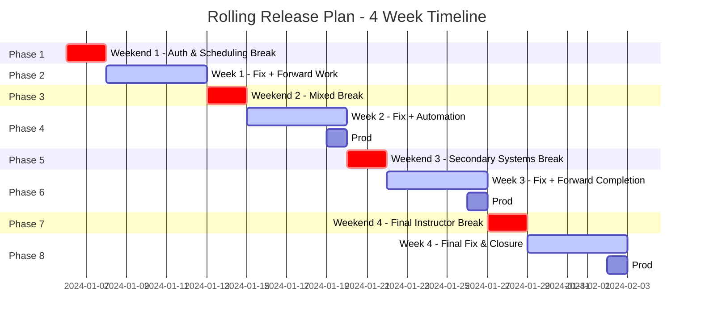

# Rolling Release Plan

## Core Working Rules

- **Dev + QA** always run in parallel
- **Each weekend** = breaking / stress testing
- **Each weekday** = fixing + automation + forward work
- **If a system is fixed early**, it is:
  - Re-tested (lighter break attempt)
  - Gradually moved to automation
- **Next system work starts** before previous one is fully done
- **Prod deployment** always happens after the previous phase is stable
- **More confidence over time** → less break intensity for older systems

---

## Phase Overview Timeline

---

## Phase Breakdown

### Phase 1: Weekend 1 – Auth & Scheduling (Hard Break)

**Objective:** Break core systems aggressively.

- **Weekend Activities:**
  - Break Authentication hard
  - Break Scheduling hard
  - Manual testing, edge cases

- **Deployment:** Dev + QA only (No Prod)

---

### Phase 2: Week 1 – Fix + Forward Work

**Objective:** Stabilize Auth & Scheduling, start Enrollment & Payment.

- **Weekday Activities:**
  - Fix Auth & Scheduling issues
  - Start moving Auth & Scheduling to automation
  - Simultaneously start working on Enrollment & Payment
  - More focus on Payment logic
  - Prep test data, flows, failure cases

- **End of Week Status:**
  - Auth & Scheduling should be mostly stable
  - Enrollment & Payment partially implemented / hardened

---

### Phase 3: Weekend 2 – Mixed Break

**Objective:** Re-validate old systems, stress new ones.

- **Weekend Activities:**
  - Light break on Auth & Scheduling (less than previous weekend)
  - Hard break on Enrollment
  - Very hard break on Payment

- **Deployment:** Dev + QA only

---

### Phase 4: Week 2 – Fix + Automation + Confidence

**Objective:** Lock core systems.

- **Weekday Activities:**
  - Fix issues from:
    - Light Auth & Scheduling breaks
    - Heavy Enrollment & Payment breaks
  - Increase automation:
    - Auth & Scheduling → mostly automated
    - Enrollment → partial automation
  - Razorpay / platform integration continues

- **Deployment:** Prod deployment of Auth & Scheduling (after stable confidence)

---

### Phase 5: Weekend 3 – Secondary Systems Break

**Objective:** Shift focus forward.

- **Weekend Activities:**
  - Very light sanity break on:
    - Auth
    - Scheduling
    - Enrollment
    - Payment
  - Hard break on:
    - Student Management
    - Communication flows

---

### Phase 6: Week 3 – Fix + Forward Completion

**Objective:** Expand platform stability.

- **Weekday Activities:**
  - Fix Student Management & Communication issues
  - Automation:
    - Core 4 systems → high coverage
    - Student systems → partial
  - Start Task Management & Resource Management

- **Deployment:** Prod deployment of Enrollment & Payment (after stable confidence)

---

### Phase 7: Weekend 4 – Final Instructor-Side Break

**Objective:** Final validation.

- **Weekend Activities:**
  - Light regression break on all previous systems
  - Hard break on:
    - Task Management
    - Resource Management

---

### Phase 8: Week 4 – Final Fix & Closure

**Objective:** Instructor side fully production-ready.

- **Weekday Activities:**
  - Fix final issues
  - Full regression
  - Final automation polish

- **Deployment:**
  - Prod deployment of Student Management + Communication
  - Prod deployment of Task & Resource Management

---

## Optional Phase: Student-Side

If required, the same rolling model applies:

- Weekend break
- Weekday fix + forward work
- Prod after confidence

---

## Final Expectation Statement

- **If things move smoothly:** Timelines compress naturally
- **If breaking reveals deep issues:** Fixing weeks expand and prod shifts

### This model ensures:

✅ **No idle time**  
✅ **Continuous forward progress**  
✅ **Safe, staged production releases**

---

## Key Metrics

| Phase | Duration | Systems | Break Intensity | Deployment |
|-------|----------|---------|----------------|------------|
| Phase 1 | Weekend 1 | Auth, Scheduling | Hard | Dev + QA |
| Phase 2 | Week 1 | Auth, Scheduling, Enrollment, Payment | Fix + Forward | Dev + QA |
| Phase 3 | Weekend 2 | All 4 systems | Mixed (Light to Very Hard) | Dev + QA |
| Phase 4 | Week 2 | All 4 systems | Fix + Automation | **Prod: Auth & Scheduling** |
| Phase 5 | Weekend 3 | All + Student, Communication | Very Light to Hard | Dev + QA |
| Phase 6 | Week 3 | All systems | Fix + Forward | **Prod: Enrollment & Payment** |
| Phase 7 | Weekend 4 | All systems | Light to Hard | Dev + QA |
| Phase 8 | Week 4 | All systems | Final Fix | **Prod: All Remaining** |

---

*Document generated from Rolling Release Plan*

